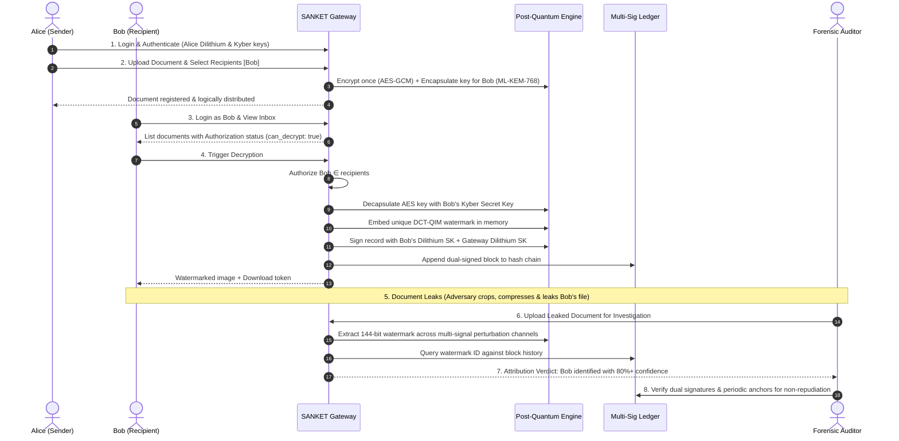

# SANKET — Cryptographic Attribution & Provenance Platform

> **Post-Quantum Secure Multi-User Document Distribution, Zero-Trust Invisible Watermarking & Multi-Signature Ledger Provenance**  
> *Developed for Smart India Hackathon (SIH) — Problem Statement PS237*

---

## 1. System Overview

**SANKET** is an enterprise cybersecurity platform designed to eliminate document exfiltration, unauthorized leaks, and repudiation in confidential distribution networks. 

Unlike traditional file-sharing or simple watermark tools, SANKET implements a closed cryptographic pipeline:
$$\mathbf{Distribute} \longrightarrow \mathbf{Authorize} \longrightarrow \mathbf{Decrypt} \longrightarrow \mathbf{Attribute} \longrightarrow \mathbf{Verify}$$

- **Single Logical Encryption**: Documents are encrypted once with AES-256-GCM; access keys are individually encapsulated per recipient using Post-Quantum KEM (**ML-KEM-768 / Kyber**).
- **Strict Authorization Gatekeeper**: Blocks unauthorized access attempts at the API gateway with HTTP 403.
- **Zero-Leak Invisible Watermarking**: In-memory decryption embeds a unique DCT-QIM watermark with session nonces, resilient against compression, cropping, noise, and geometric rotation attacks.
- **Multi-Signature Ledger Consensus**: Every decryption session requires dual digital signatures (**ML-DSA-65 / Dilithium**) from both the recipient and the system gateway.
- **Forensic Attribution Engine**: Extracts embedded watermarks from suspect documents and correlates with the ledger to provide mathematical non-repudiation and court-admissible proof.

---

## 2. Architecture & Pipeline


---

## 3. End-to-End User Flow (8-Stage Lifecycle)



---

## 4. Core Technologies & Technical Specifications

| Component | Technology / Algorithm | Specification / Details |
| :--- | :--- | :--- |
| **Key Encapsulation** | NIST ML-KEM-768 (Kyber768) | Post-quantum KEM (`pqcrypto`); 1,184-byte PK, 2,400-byte SK, 1,088-byte CT |
| **Digital Signatures** | NIST ML-DSA-65 (Dilithium3) | Post-quantum signature (`pqcrypto`); 1,952-byte PK, 4,032-byte SK, 3,309-byte Sig |
| **Payload Encryption**| AES-256-GCM | Authenticated symmetric cipher with 96-bit random nonce |
| **Watermarking** | 2D DCT-QIM on Y-channel | Mid-frequency coefficients `(2,2),(3,1),(1,3),(2,3)` with adaptive delta $38-62$ |
| **Payload Format** | 144 bits (128-bit ID + 16-bit CRC) | 2-zone spread spectrum, 24 votes/bit, dedicated `(4,2)` sync template |
| **Ledger Consensus** | Dual-Signed Hashchain | Minimum 2 signatures required (Recipient + Gateway), periodic secondary anchors |
| **Backend Service** | FastAPI + Uvicorn | Python 3.12 asynchronous REST API with IP rate limiting & request tracing |
| **Frontend UI** | React + Vite + Tailwind CSS | Workflow-driven 6-screen interface with authenticated Blob downloads |

---

## 5. Workflow Screens (Frontend)

The frontend is structured into 6 focused workflow screens:

1. **Identity & Authentication**: Select active persona (`@alice`, `@bob`, `@charlie`, `@system`), inspect Dilithium/Kyber public key fingerprints, and switch credentials.
2. **Send Document**: Upload PNG document, choose authorized recipients, and execute single logical encryption.
3. **Inbox**: View received documents with instant authorization status badges (`Authorized Recipient`, `Access Restricted`, `Sender Record`).
4. **Decrypt & Watermark**: Trigger authorized post-quantum decryption, inspect unique DCT-QIM watermark ID and dual signatures, and download the watermarked asset.
5. **Leak Verification**: Upload a suspicious/tampered document to extract the watermark, view the attribution verdict, and review confidence metrics.
6. **Ledger Viewer**: Inspect the multi-signature hash chain, verify block linkage, and validate periodic anchor checkpoints.

---

## 6. Quick Start & Installation

### Prerequisites
- Python 3.11+ or 3.12+ (64-bit)
- Node.js 18+ & npm

### 1. Install Dependencies
```bash
# Backend dependencies (including Post-Quantum pqcrypto)
pip install -r requirements.txt

# Frontend dependencies
cd frontend
npm install
cd ..
```

### 2. Launch Backend API Server (Listening on all LAN interfaces)
```bash
python -m uvicorn api.server:app --host 0.0.0.0 --port 8000 --reload
```
- API Docs: `http://localhost:8000/docs`
- Default API Key: `sanket-admin-key-2026`
- Database: Embedded SQLite with WAL mode (`data/sanket.db`)

### 3. Launch Frontend Dashboard (LAN Accessible)
```bash
cd frontend
npx vite --host
```
- Local Application: `http://localhost:5173/`
- Multi-Device LAN Access: `http://<YOUR_LAN_IP>:5173/` (e.g. `http://192.168.1.4:5173/`)

---

## 7. Verification & Automated Demos

### A. Run 24-Step Adversarial Robustness Test
Validates resilience against JPEG compression (Q50-Q90), noise (sigma 3-15), cropping (10-20%), rotation skew, false-positive rejection, and ledger tamper attacks:
```bash
python main.py demo
```

### C. CLI Document Operations
```bash
# Distribute document to recipients
python main.py send data/uploads/sample.png --recipients bob,charlie

# Inspect inbox as Bob
python main.py inbox --user bob
```

---

## 8. REST API Reference

| Endpoint | Method | Purpose | Auth Headers |
| :--- | :--- | :--- | :--- |
| `/auth/users` | `GET` | List registered user identities and PQC public keys | `X-API-KEY` |
| `/auth/login` | `POST` | Switch active identity session | `X-API-KEY` |
| `/send` | `POST` | Single logical encryption & document distribution | `X-API-KEY`, `X-User-ID` |
| `/inbox` | `GET` | List documents for current user with access checks | `X-API-KEY`, `X-User-ID` |
| `/decrypt` | `POST` | Authorized Kyber decryption, DCT-QIM watermark & dual signing | `X-API-KEY`, `X-User-ID` |
| `/download/decrypted/{f}`| `GET` | Authenticated watermarked image download | `X-API-KEY` / Browser link |
| `/verify` | `POST` | Forensic watermark extraction & identity attribution | `X-API-KEY` |
| `/ledger` | `GET` | Audit ledger integrity, multi-sigs, and periodic anchors | `X-API-KEY` |
| `/demo-flow` | `POST` | 1-Click execution of full 8-stage provenance demo | `X-API-KEY` |

---

## 9. Security & Compliance Notes

1. **Zero Key Transmission**: Recipient private keys are stored locally on node filesystems (`data/keys/{user_id}/`) and never transmitted across the network.
2. **Access Control Enforcement**: Attempted decryptions by non-recipients are intercepted at the server entry point with HTTP 403 before any cryptographic operations occur.
3. **Double Anchor Consensus**: Ledger tampering is detected by both continuous block linkage (`previous_hash`) and periodic cumulative snapshot anchors (`anchors.json`), preventing history rewrites.

---

## 10. License

Developed for the **Smart India Hackathon (SIH)** under Problem Statement **PS237**.
