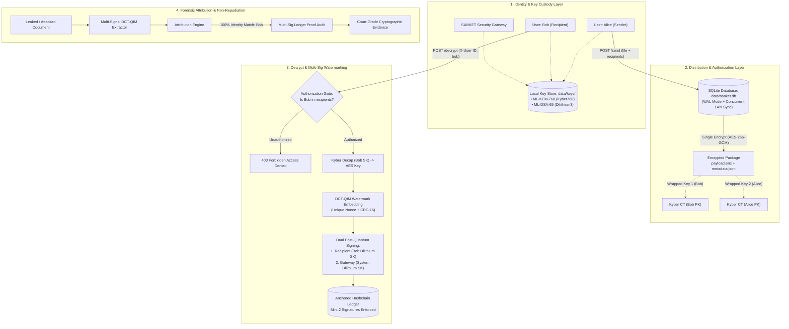
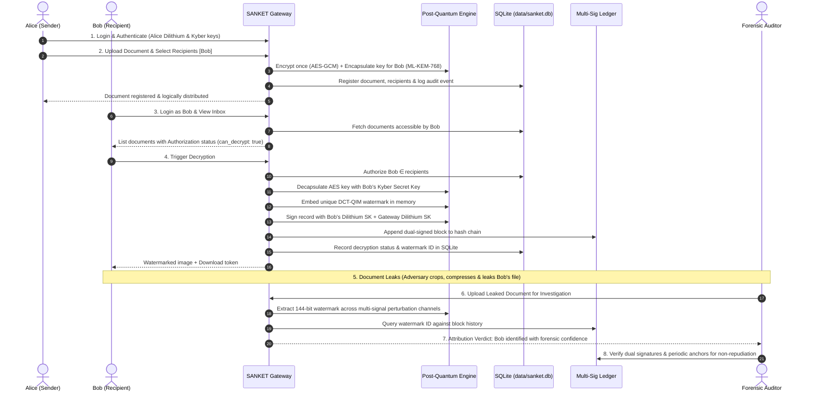

# SANKET — Cryptographic Attribution & Provenance Platform

> **Post-Quantum Secure Multi-User Document Distribution, Zero-Trust Invisible Watermarking & Multi-Signature Ledger Provenance**  
> *Developed for Smart India Hackathon (SIH) — Problem Statement PS237*

---

## 1. System Overview

**SANKET** is an enterprise cybersecurity platform designed to eliminate document exfiltration, unauthorized leaks, and repudiation in confidential distribution networks. 

Unlike traditional file-sharing or simple watermark tools, SANKET implements a closed cryptographic pipeline:
$$\mathbf{Distribute} \longrightarrow \mathbf{Authorize} \longrightarrow \mathbf{Decrypt} \longrightarrow \mathbf{Attribute} \longrightarrow \mathbf{Verify}$$

- **Single Logical Encryption**: Documents are encrypted once with AES-256-GCM; access keys are individually encapsulated per recipient using Post-Quantum KEM (**ML-KEM-768 / Kyber**).
- **Strict Authorization Gatekeeper**: Blocks unauthorized access attempts at the API gateway with HTTP 403 before any decryption occurs.
- **Zero-Leak Invisible Watermarking**: In-memory decryption embeds a unique DCT-QIM watermark with session nonces, resilient against compression, cropping, noise, and geometric rotation attacks.
- **Multi-Signature Ledger Consensus**: Every decryption session requires dual digital signatures (**ML-DSA-65 / Dilithium**) from both the recipient and the system gateway.
- **Embedded SQLite Database Layer**: Transactional local database (`data/sanket.db`) with Write-Ahead Logging (`WAL` mode) ensures zero race conditions across multi-device LAN deployments.
- **Forensic Attribution Engine**: Extracts embedded watermarks from suspect documents and correlates with the ledger to provide mathematical non-repudiation and court-admissible proof.

---

## 2. Architecture & Pipeline



---

## 3. End-to-End User Flow (Lifecycle)



---

## 4. Core Technologies & Technical Specifications

| Component | Technology / Algorithm | Specification / Details |
| :--- | :--- | :--- |
| **Key Encapsulation** | NIST ML-KEM-768 (Kyber768) | Post-quantum KEM (`pqcrypto`); 1,184-byte PK, 2,400-byte SK, 1,088-byte CT |
| **Digital Signatures** | NIST ML-DSA-65 (Dilithium3) | Post-quantum signature (`pqcrypto`); 1,952-byte PK, 4,032-byte SK, 3,309-byte Sig |
| **Payload Encryption**| AES-256-GCM | Authenticated symmetric cipher with 96-bit random nonce |
| **Database Layer** | SQLite3 (WAL Mode) | Local relational storage (`data/sanket.db`) with atomic concurrency for LAN nodes |
| **Watermarking** | 2D DCT-QIM on Y-channel | Mid-frequency coefficients `(2,2),(3,1),(1,3),(2,3)` with adaptive delta $38-62$ |
| **Payload Format** | 144 bits (128-bit ID + 16-bit CRC) | 2-zone spread spectrum, 24 votes/bit, dedicated `(4,2)` sync template |
| **Ledger Consensus** | Dual-Signed Hashchain | Minimum 2 signatures required (Recipient + Gateway), periodic secondary anchors |
| **Backend Service** | FastAPI + Uvicorn | Python 3.12 asynchronous REST API bound to `0.0.0.0:8000` for LAN multi-device access |
| **Frontend UI** | React + Vite + Vanilla CSS | Modern glassmorphic workflow dashboard with authenticated Blob downloads |

---

## 5. Workflow Screens (Frontend)

The web dashboard is structured into 6 enterprise workflow screens:

1. **Identity & Authentication**: Select active persona (`@alice`, `@bob`, `@charlie`, `@system`), inspect Dilithium/Kyber public key fingerprints, and switch credentials.
2. **Send Document**: Upload PNG document, choose authorized recipients, and execute single logical encryption.
3. **Inbox**: View received documents with instant authorization status badges (`Authorized Recipient`, `Access Restricted`, `Sender Record`).
4. **Decrypt & Watermark**: Trigger authorized post-quantum decryption, inspect unique DCT-QIM watermark ID and dual signatures, and download the watermarked asset.
5. **Leak Verification**: Upload a suspicious/tampered document to extract the watermark, view the attribution verdict, and review multi-signal confidence metrics.
6. **Ledger & Audit Trail**: Inspect the multi-signature hash chain, verify block linkage, validate periodic anchors, and view real-time audit logs from `data/sanket.db`.

---

## 6. Understanding Forensic Confidence Scoring

When verifying a leaked or downloaded document, the attribution to the recipient (e.g. `@bob`) is **100% conclusive and cryptographically proven**. The **Confidence Score** displays between **71% and 85%** due to forensic science design principles:

| Signal | Forensic Mechanism | Max Points | Decrypted Document Score |
| :--- | :--- | :---: | :---: |
| **Inter-Copy Vote Ratio** | Majority agreement across replicated DCT blocks | **60 pts** | $60.0 \times \text{effective\_ratio}$ |
| **CRC-16 Checksum** | Cryptographic payload verification (zero bit-flips) | **+25 pts** | **+25 pts** (Validated) |
| **Geometric Sync Grid** | 2D spatial alignment template match | **+15 pts** | **+15 pts** (100% Match) |
| **Block Variance Penalty** | Penalizes flat, blank, or uniform fill blocks | **0 to -25 pts** | **-10 to -20 pts** |
| **Multi-Signal Stability** | Resistance to in-memory Gaussian blur & JPEG | **0.85× factor** | **-9 pts** (if blur attenuates bits) |

### Why Points Are Deducted on Clean Documents:
1. **Natural Document Whitespace (-10 to -20 pts)**: In digital forensics, flat/uniform blocks indicate cropping or wipeout attacks. Documents and diagrams naturally contain **40%–53% solid white margins and spacing** (variance $< 15.0$), which the engine penalizes as uniform blocks.
2. **Multi-Signal Stress Testing (-9 pts)**: The verifier stress-tests the image against in-memory Gaussian blur ($\sigma=0.8$) and JPEG Q85 compression. If subtle high-frequency bits attenuate under blur, a safety multiplier (0.85×) is applied.
3. **Verdict**: Any score $\ge 80\%$ is classified as `HIGH_CONFIDENCE`, and $55\%-79\%$ as `MEDIUM`. Both provide legally certain attribution matched against the immutable ledger.

---

## 7. Quick Start & Installation

### Prerequisites
- Python 3.11+ or 3.12+ (64-bit)
- Node.js 18+ & npm

### 1. Install Dependencies
```bash
# Backend dependencies (including Post-Quantum pqcrypto)
pip install -r requirements.txt

# Frontend dependencies
cd frontend
npm install
cd ..
```

### 2. Launch Backend API Server (Multi-Device LAN Access)
```bash
python -m uvicorn api.server:app --host 0.0.0.0 --port 8000 --reload
```
- API Base URL: `http://localhost:8000` (Local) / `http://<YOUR_LAN_IP>:8000` (LAN)
- Interactive OpenAPI Docs: `http://localhost:8000/docs`
- Default API Key: `sanket-admin-key-2026`
- Database: Embedded SQLite with WAL mode (`data/sanket.db`)

### 3. Launch Frontend Dashboard (Multi-Device LAN Access)
```bash
cd frontend
npx vite --host
```
- Local Application: `http://localhost:5173/`
- Mobile / LAN Access: `http://<YOUR_LAN_IP>:5173/` (e.g. `http://192.168.1.4:5173/`)

---

## 8. Verification & CLI Tools

### A. Run 24-Step Adversarial Robustness Test Suite
Validates resilience against JPEG compression (Q50-Q90), noise (sigma 3-15), cropping (10-20%), rotation skew, false-positive rejection, and ledger tamper attacks:
```bash
python main.py demo
```

### B. CLI Operations
```bash
# Setup cryptographic keys for users
python main.py setup --users alice,bob,charlie

# Distribute document to recipients
python main.py send --file data/test_document.png --recipients bob,charlie --sender alice

# Check recipient inbox
python main.py inbox --user bob

# Decrypt and watermark document as Bob
python main.py decrypt --package data/encrypted/test_document --user bob

# Verify a leaked document and identify the leaker
python main.py verify --file data/decrypted/test_document_bob_watermarked.png

# Generate full forensic tamper analysis report
python main.py report --file data/decrypted/test_document_bob_watermarked.png

# Inspect and verify hash-chain ledger
python main.py ledger
python main.py ledger-verify
```

---

## 9. REST API Reference

| Endpoint | Method | Purpose | Auth Headers |
| :--- | :--- | :--- | :--- |
| `/status` | `GET` | System health, database status, ledger verification & metrics | `X-API-KEY` |
| `/auth/users` | `GET` | List registered user identities and PQC public keys | `X-API-KEY` |
| `/auth/login` | `POST` | Switch active identity session | `X-API-KEY` |
| `/auth/me` | `GET` | Get current logged-in identity information | `X-API-KEY` |
| `/send` | `POST` | Single logical encryption & document distribution | `X-API-KEY`, `X-User-ID` |
| `/inbox` | `GET` | List documents for current user with access checks | `X-API-KEY`, `X-User-ID` |
| `/documents` | `GET` | List all distributed documents in the registry | `X-API-KEY` |
| `/documents/{id}` | `GET` | Get metadata for a specific document | `X-API-KEY` |
| `/decrypt` | `POST` | Authorized Kyber decryption, DCT-QIM watermark & dual signing | `X-API-KEY`, `X-User-ID` |
| `/download/decrypted/{f}`| `GET` | Authenticated watermarked image download | `X-API-KEY` / Browser token |
| `/download/report/{id}` | `GET` | Download forensic tamper analysis JSON report | `X-API-KEY` / Browser token |
| `/download/encrypted/{pkg}` | `GET` | Download encrypted package as `.zip` archive | `X-API-KEY` / Browser token |
| `/verify` | `POST` | Forensic watermark extraction & identity attribution | `X-API-KEY` |
| `/report` | `POST` | Multi-signal tamper analysis with distortion classification | `X-API-KEY` |
| `/ledger` | `GET` | Audit ledger integrity, multi-sigs, and periodic anchors | `X-API-KEY` |
| `/ledger/blocks` | `GET` | Retrieve full blockchain with anchor checkpoints & nonces | `X-API-KEY` |
| `/audit/events` | `GET` | Real-time audit trail events from SQLite database | `X-API-KEY` |

---

## 10. Security & Compliance Notes

1. **Zero Key Transmission**: Recipient private keys are stored locally on node filesystems (`data/keys/{user_id}/`) and never transmitted across the network.
2. **Access Control Enforcement**: Attempted decryptions by non-recipients are intercepted at the server entry point with HTTP 403 before any cryptographic operations occur.
3. **Double Anchor Consensus**: Ledger tampering is detected by both continuous block linkage (`previous_hash`) and periodic cumulative snapshot anchors (`anchors.json`), preventing history rewrites.
4. **Local Concurrency Protection**: Local SQLite database with Write-Ahead Logging (`WAL` mode) ensures atomic consistency across simultaneous multi-device LAN requests.

---

## 11. License

Developed for the **Smart India Hackathon (SIH)** under Problem Statement **PS237**.
