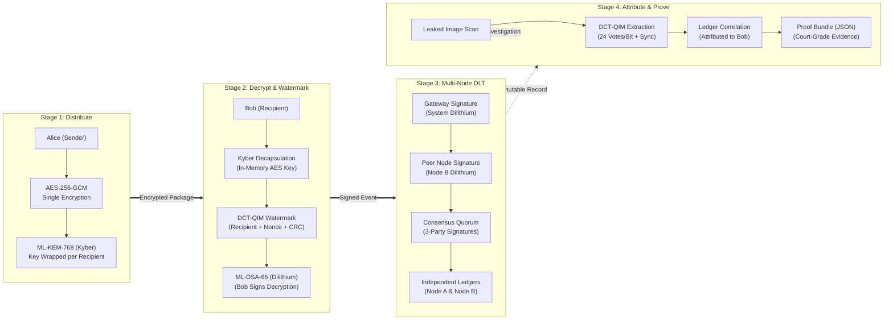
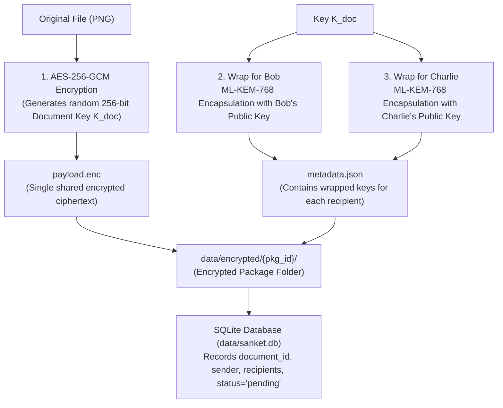
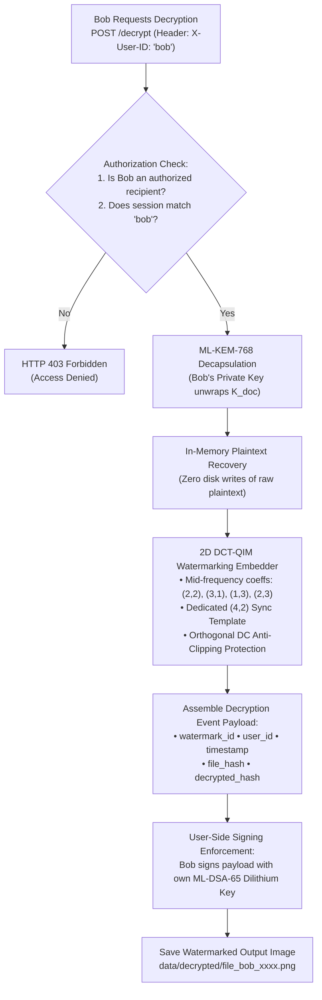
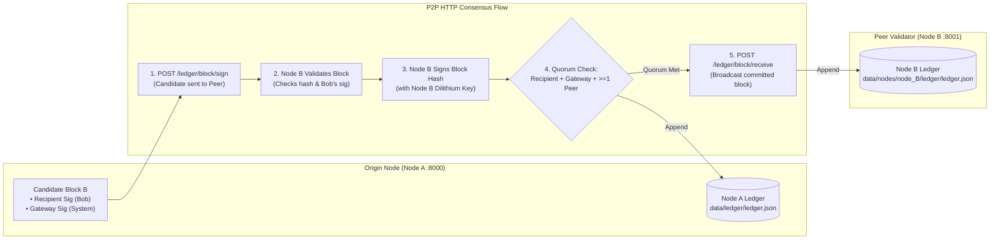
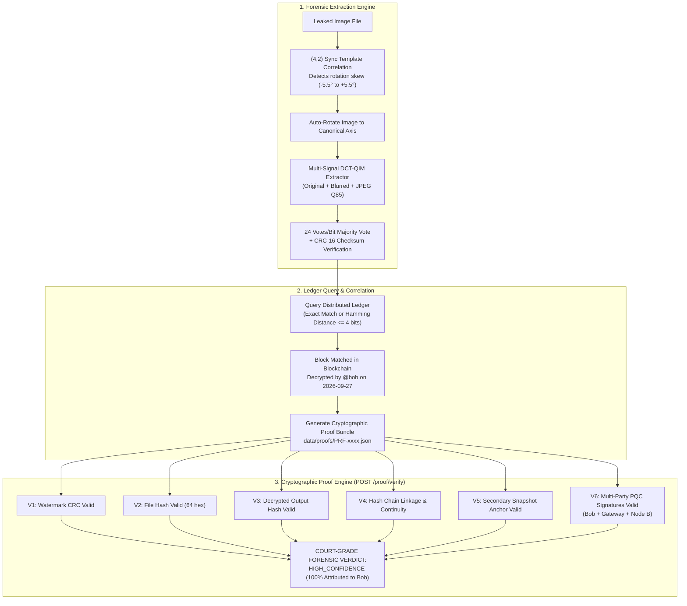

# SANKET — Post-Quantum Cryptographic Attribution & Distributed Provenance Platform

> **NIST-Standardized Post-Quantum Cryptography, Session-Bound Decryption Watermarking, Consensus-Validated Multi-Node Distributed Ledger & Verifiable Cryptographic Proof Bundles**  
> *Developed for Smart India Hackathon (SIH) — Problem Statement PS237*

---

## 1. System Overview & The Core Problem

### The Broadcast-Encryption Dilemma
When a sensitive document is shared with multiple recipients, standard broadcast encryption encrypts it once, and each recipient decrypts it independently using their own credentials. 

```
                                      ┌───► [Bob Decrypts] ────► Identical Document
[Alice Encrypts Once] ──► Encrypted ──┼───► [Charlie Decrypts] ─► Identical Document
                          Payload     └───► [David Decrypts] ──► Identical Document
                                                         │
                                               [Document Leaked!]
                                                         ▼
                                          WHO LEAKED IT? ALL ARE SUSPECTS!
```

- **The Flaw**: Every recipient gets identical plaintext. If leaked, **all recipients are equally plausible suspects**.
- **Central Logs Fail**: Server logs can be wiped or modified by a privileged administrator.
- **Static Watermarks Fail**: An identical watermark shared with multiple parties solves nothing.

### The SANKET Solution
SANKET creates an unbroken chain of cryptographic custody:

$$\mathbf{Distribute} \longrightarrow \mathbf{Authorize} \longrightarrow \mathbf{Decrypt} \longrightarrow \mathbf{Consensus} \longrightarrow \mathbf{Attribute} \longrightarrow \mathbf{Verify}$$

1. **Single Encryption + Post-Quantum Key Wrapping**: Encrypted once via **AES-256-GCM**. Ephemeral keys are wrapped individually using NIST FIPS 203 **ML-KEM-768 (Kyber)**.
2. **Session-Bound Authorization**: Decryption requests are checked against the active session (`X-User-ID`). Unauthorized requests are rejected with `HTTP 403 Forbidden`.
3. **In-Memory Watermarking at Decryption**: Plaintext is never written unwatermarked. A unique 2D DCT-QIM watermark with recipient identity, timestamp, and a random nonce is embedded in RAM with DC anti-clipping protection.
4. **Mandatory User-Side Post-Quantum Signing**: The recipient signs the decryption event using their own NIST FIPS 204 **ML-DSA-65 (Dilithium)** private key.
5. **Real Multi-Node Distributed Ledger (DLT)**: Blocks require consensus quorum: signed by **recipient + gateway + peer validator node**. Nodes store data independently on disk with no shared storage.
6. **Secondary Cumulative Anchors**: Snapshot anchors computed every 5 blocks detect history manipulation. Any divergence flags the ledger as **`COMPROMISED`**.
7. **Court-Grade Proof Bundles**: Self-contained JSON proof containers linking forensic evidence to the blockchain record.

---

## 2. High-Level Architecture Block Diagram

The entire SANKET platform operates as a clear, four-stage cryptographic pipeline:


```mermaid
flowchart LR
    subgraph S1 ["Stage 1: Distribute"]
        direction TB
        A1["Alice (Sender)"] --> A2["AES-256-GCM<br/>Single Encryption"]
        A2 --> A3["ML-KEM-768 (Kyber)<br/>Key Wrapped per Recipient"]
    end

    subgraph S2 ["Stage 2: Decrypt & Watermark"]
        direction TB
        B1["Bob (Recipient)"] --> B2["Kyber Decapsulation<br/>(In-Memory AES Key)"]
        B2 --> B3["DCT-QIM Watermark<br/>(Recipient + Nonce + CRC)"]
        B3 --> B4["ML-DSA-65 (Dilithium)<br/>(Bob Signs Decryption)"]
    end

    subgraph S3 ["Stage 3: Multi-Node DLT"]
        direction TB
        C1["Gateway Signature<br/>(System Dilithium)"] --> C2["Peer Node Signature<br/>(Node B Dilithium)"]
        C2 --> C3["Consensus Quorum<br/>(3-Party Signatures)"]
        C3 --> C4["Independent Ledgers<br/>(Node A & Node B)"]
    end

    subgraph S4 ["Stage 4: Attribute & Prove"]
        direction TB
        D1["Leaked Image Scan"] --> D2["DCT-QIM Extraction<br/>(24 Votes/Bit + Sync)"]
        D2 --> D3["Ledger Correlation<br/>(Attributed to Bob)"]
        D3 --> D4["Proof Bundle (JSON)<br/>(Court-Grade Evidence)"]
    end

    S1 ==>|"Encrypted Package"| S2
    S2 ==>|"Signed Event"| S3
    S3 -.->|"Immutable Record"| S4
    D1 -.->|"Forensic Investigation"| S4
```

---

## 3. Step-by-Step Architecture Flow Diagrams

### Flow 1: Document Distribution (Alice Sends to Bob & Charlie)


```mermaid
flowchart TD
    FILE["Original File (PNG)"] --> ENCR["1. AES-256-GCM Encryption<br/>(Generates random 256-bit Document Key K_doc)"]
    ENCR --> PAYLOAD["payload.enc<br/>(Single shared encrypted ciphertext)"]

    K_DOC["Key K_doc"] --> KEM1["2. Wrap for Bob<br/>ML-KEM-768 Encapsulation with Bob's Public Key"]
    K_DOC --> KEM2["3. Wrap for Charlie<br/>ML-KEM-768 Encapsulation with Charlie's Public Key"]

    KEM1 --> META["metadata.json<br/>(Contains wrapped keys for each recipient)"]
    KEM2 --> META

    PAYLOAD --> PKG["data/encrypted/{pkg_id}/<br/>(Encrypted Package Folder)"]
    META --> PKG
    PKG --> SQLITE["SQLite Database (data/sanket.db)<br/>Records document_id, sender, recipients, status='pending'"]
```

---

### Flow 2: In-Memory Decryption & User Signing (Bob Decrypts)


```mermaid
flowchart TD
    REQ["Bob Requests Decryption<br/>POST /decrypt (Header: X-User-ID: 'bob')"] --> GATE{"Authorization Check:<br/>1. Is Bob an authorized recipient?<br/>2. Does session match 'bob'?"}

    GATE -->|"No"| REJECT["HTTP 403 Forbidden<br/>(Access Denied)"]
    GATE -->|"Yes"| UNWRAP["ML-KEM-768 Decapsulation<br/>(Bob's Private Key unwraps K_doc)"]

    UNWRAP --> RAM["In-Memory Plaintext Recovery<br/>(Zero disk writes of raw plaintext)"]
    RAM --> WM["2D DCT-QIM Watermarking Embedder<br/>• Mid-frequency coeffs: (2,2), (3,1), (1,3), (2,3)<br/>• Dedicated (4,2) Sync Template<br/>• Orthogonal DC Anti-Clipping Protection"]

    WM --> RECORD["Assemble Decryption Event Payload:<br/>• watermark_id • user_id • timestamp<br/>• file_hash • decrypted_hash"]

    RECORD --> BOB_SIGN["User-Side Signing Enforcement:<br/>Bob signs payload with own ML-DSA-65 Dilithium Key"]
    BOB_SIGN --> OUT["Save Watermarked Output Image<br/>data/decrypted/file_bob_xxxx.png"]
```

---

### Flow 3: Multi-Node P2P Consensus Quorum (Real Distributed Network)


```mermaid
flowchart LR
    subgraph OriginNode ["Origin Node (Node A :8000)"]
        CAND["Candidate Block B<br/>• Recipient Sig (Bob)<br/>• Gateway Sig (System)"]
        COMMIT_A[("Node A Ledger<br/>data/ledger/ledger.json")]
    end

    subgraph ConsensusProtocol ["P2P HTTP Consensus Flow"]
        direction TB
        STEP1["1. POST /ledger/block/sign<br/>(Candidate sent to Peer)"]
        STEP2["2. Node B Validates Block<br/>(Checks hash & Bob's sig)"]
        STEP3["3. Node B Signs Block Hash<br/>(with Node B Dilithium Key)"]
        STEP4{"4. Quorum Check:<br/>Recipient + Gateway + >=1 Peer"}
        STEP5["5. POST /ledger/block/receive<br/>(Broadcast committed block)"]

        STEP1 --> STEP2 --> STEP3 --> STEP4 -->|"Quorum Met"| STEP5
    end

    subgraph PeerNode ["Peer Validator (Node B :8001)"]
        COMMIT_B[("Node B Ledger<br/>data/nodes/node_B/ledger/ledger.json")]
    end

    CAND --> STEP1
    STEP4 -->|"Append"| COMMIT_A
    STEP5 -->|"Append"| COMMIT_B
```

---

### Flow 4: Forensic Leak Verification & Cryptographic Proof Verification


```mermaid
flowchart TD
    subgraph Extraction ["1. Forensic Extraction Engine"]
        LEAK["Leaked Image File"] --> SYNC["(4,2) Sync Template Correlation<br/>Detects rotation skew (-5.5° to +5.5°)"]
        SYNC --> ROT["Auto-Rotate Image to Canonical Axis"]
        ROT --> MULTI["Multi-Signal DCT-QIM Extractor<br/>(Original + Blurred + JPEG Q85)"]
        MULTI --> VOTE["24 Votes/Bit Majority Vote<br/>+ CRC-16 Checksum Verification"]
    end

    subgraph Attribution ["2. Ledger Query & Correlation"]
        VOTE --> QUERY["Query Distributed Ledger<br/>(Exact Match or Hamming Distance <= 4 bits)"]
        QUERY --> MATCH["Block Matched in Blockchain<br/>Decrypted by @bob on 2026-09-27"]
        MATCH --> GEN_PROOF["Generate Cryptographic Proof Bundle<br/>data/proofs/PRF-xxxx.json"]
    end

    subgraph Verification ["3. Cryptographic Proof Engine (POST /proof/verify)"]
        GEN_PROOF --> V1["V1: Watermark CRC Valid"]
        GEN_PROOF --> V2["V2: File Hash Valid (64 hex)"]
        GEN_PROOF --> V3["V3: Decrypted Output Hash Valid"]
        GEN_PROOF --> V4["V4: Hash Chain Linkage & Continuity"]
        GEN_PROOF --> V5["V5: Secondary Snapshot Anchor Valid"]
        GEN_PROOF --> V6["V6: Multi-Party PQC Signatures Valid<br/>(Bob + Gateway + Node B)"]

        V1 & V2 & V3 & V4 & V5 & V6 --> COURT["COURT-GRADE FORENSIC VERDICT:<br/>HIGH_CONFIDENCE (100% Attributed to Bob)"]
    end
```

---

## 4. Technical Specifications & Cryptographic Stack

| Component | Standard / Technology | Implementation Details |
| :--- | :--- | :--- |
| **Post-Quantum Key Exchange** | NIST FIPS 203 (ML-KEM-768 / Kyber) | Ephemeral AES-256 key encapsulation; 1,184B PK, 2,400B SK, 1,088B CT |
| **Post-Quantum Digital Signatures** | NIST FIPS 204 (ML-DSA-65 / Dilithium) | Non-repudiation signing; 1,952B PK, 4,032B SK, 3,309B signature |
| **Dual-Stack Fallback** | RFC 8032 (Ed25519) & RFC 7748 (X25519) | Dual-stack backwards-compatibility fallback |
| **Symmetric Payload Cipher** | AES-256-GCM | Authenticated encryption with 96-bit random IV; single logical encryption |
| **Invisible Watermarking** | 2D DCT-QIM on Y-channel (YCbCr) | Mid-frequency coefficients `(2,2),(3,1),(1,3),(2,3)`; adaptive step $\Delta \in [38.0, 62.0]$ |
| **DC Anti-Clipping Protection** | Orthogonal DC Compensation | Shifts DC coefficient `(0,0)` on boundary blocks to prevent spatial clipping at 255/0 |
| **Payload Structure** | 144 bits (128-bit ID + 16-bit CRC) | Dual-zone spread-spectrum repetition, 24 votes/bit, dedicated `(4,2)` sync template |
| **Geometric Synchronization** | Angular Cross-Correlation Search | Dedicated periodic template in coefficient `(4,2)`; searches $[-5.5^\circ, +5.5^\circ]$ in $0.5^\circ$ steps |
| **Distributed Ledger Technology (DLT)** | Multi-Node Hash Chain with Consensus Quorum | Peer-to-peer HTTP network; independent physical ledgers per node; zero shared storage |
| **Consensus Quorum Rule** | Multi-Party Dilithium Quorum | Block accepted only with Recipient + Gateway Authority + $\ge 1$ Peer Node signatures |
| **Periodic Secondary Anchors** | Cumulative State Snapshot Anchors | Computed every 5 blocks: $\text{SHA256}(\text{ledger snapshot})$; peer-verified; mismatch $\rightarrow$ `COMPROMISED` |
| **Startup Chain Sync** | Longest Valid Chain Adoption | On startup (`@app.on_event("startup")`), queries peers via `GET /ledger/sync` and adopts longest valid chain |
| **Verifiable Proof Bundles** | Cryptographic JSON Proof Container | Binds forensic result, file hash, decrypted hash, ledger linkage, and all Dilithium signatures |
| **Relational Metadata Store** | Embedded SQLite3 with WAL Mode | Local ACID metadata storage (`data/sanket.db`) with zero race conditions across multi-device LAN |
| **Application Layer** | FastAPI + Uvicorn & React + Vite | Production REST API on Python 3.12; responsive glassmorphic dashboard on React |

---

## 5. Detailed Breakdown of the Three Implementation Phases

### Phase 1: Cryptographic Proof Bundle Architecture

Implemented in [`modules/proof/proof_bundle.py`](file:///d:/SIH/ps237/modules/proof/proof_bundle.py).

#### Proof Bundle Structure
```json
{
  "watermark_id": "f0402966c4a79cc2ca98e4c67014b474",
  "user_id": "bob",
  "timestamp": "2026-09-27T15:33:50.128401+00:00",
  "file_hash": "66ed6ed129e81faf67d4be3ed2349ceb2bdf4b6cf330bfc703720a6c4c3a89b6",
  "decrypted_hash": "41fa8912e9b940e7da3c8913b1904a11b0e791240188b4081c7e63b34591a2bc",
  "ledger": {
    "block_index": 5,
    "prev_hash": "8f3b2591a38402db399b1ef0598823f66c1b3f9dc3cf200921434c76063ad46c",
    "block_hash": "cb104928ac8129480bcde1234918237490182347102934812034981203498123",
    "anchor_hash": "5d2f8319a9240bc1284ae9876543210fedcba9876543210fedcba9876543210f"
  },
  "signatures": {
    "recipient": "07eae737e8398dbcba1c9edb1934a6...",
    "gateway": "466b94df39802a78c3855a20c21914...",
    "peers": [
      {
        "node_id": "node_B",
        "signature": "eb4854d03888bd63af2544254e030..."
      }
    ]
  },
  "verification": {
    "crc_valid": true,
    "confidence": 91.0,
    "verdict": "HIGH_CONFIDENCE"
  }
}
```

#### Cryptographic Verification Engine (`verify_proof_bundle`)
The verification engine strictly executes 6 mathematical validations:
1. **$V_1$ (Watermark Integrity)**: Validates `verification.crc_valid == true` (zero bit-flips).
2. **$V_2$ (File Hash Consistency)**: Validates 64-hex-character length and matches encrypted payload.
3. **$V_3$ (Decrypted Output Hash)**: Validates 64-hex-character length and confirms watermarked file hash.
4. **$V_4$ (Hash Chain Linkage)**: Verifies block index continuity, genesis 64 zeros requirement, and cross-checks hash chain continuity against the local immutable ledger (`_load_chain()`).
5. **$V_5$ (Anchor Checkpoint Validity)**: Validates 64-hex-character SHA-256 periodic anchor snapshot.
6. **$V_6$ (Multi-Party Signatures)**:
   - Recipient Dilithium signature over the canonical decryption event payload.
   - Gateway Authority Dilithium signature over the block hash.
   - Peer Node Dilithium signatures over the block hash, enforcing quorum ($\ge 1$ peer).

---

### Phase 2: Real Multi-Node Distributed Ledger

Implemented in [`modules/ledger/network.py`](file:///d:/SIH/ps237/modules/ledger/network.py) and [`modules/ledger/hashchain.py`](file:///d:/SIH/ps237/modules/ledger/hashchain.py).

#### Node Identity & Independent Storage
Configured via [`data/node_config.json`](file:///d:/SIH/ps237/data/node_config.json) or environment variables:
```json
{
  "node_id": "node_A",
  "port": 8000,
  "peers": [
    "http://127.0.0.1:8001"
  ]
}
```
Each node maintains its own Dilithium keypair in `data/keys/{node_id}/` and independent storage in `data/nodes/{node_id}/ledger/` (or `data/ledger/` for primary node). **No shared storage exists between nodes.**

#### Consensus Quorum Rule
A block is accepted into the distributed ledger **only if signed by**:
- The recipient (using their private Dilithium key).
- The gateway authority (`system`).
- At least one peer validator node (`peers`).

$$\text{BlockAccepted}(B) \iff \text{Valid}(S_{\text{recipient}}) \land \text{Valid}(S_{\text{gateway}}) \land \exists p \in \text{Peers}: \text{Valid}(S_p)$$

#### Secondary Cumulative Anchors & Cross-Node Tamper Detection
Every 5 blocks (`ANCHOR_INTERVAL = 5`), each node computes a cumulative snapshot anchor:
$$\text{Anchor}_m = \text{SHA256}(\text{canonical}(B_0, B_1, \dots, B_{5m-1}))$$
Nodes compare cumulative anchors across peers via `GET /ledger/sync`. Any discrepancy immediately isolates the tampering node and marks the ledger status as **`COMPROMISED`**.

---

### Phase 3: User-Side Signing Enforcement

Implemented in [`modules/crypto/signature.py`](file:///d:/SIH/ps237/modules/crypto/signature.py) and [`modules/crypto/decryption.py`](file:///d:/SIH/ps237/modules/crypto/decryption.py).

1. **Mandatory Event Fields**:
   `sign_decryption_event(user_private_key, payload)` enforces that the signed payload contains:
   - `watermark_id`
   - `user_id`
   - `timestamp`
   - `file_hash`
   - `decrypted_hash`
   Missing any field raises a strict `ValueError`.

2. **Session Binding**:
   - `POST /decrypt` validates that the request session header `X-User-ID` matches the requested decrypting identity. Cross-identity decryption attempts are rejected with `HTTP 403 Forbidden`.
   - `decrypt_file(..., active_session_user=...)` strictly blocks signing under another identity.

3. **Key Uniqueness**:
   - `verify_key_uniqueness()` scans all Dilithium keys in `data/keys/` and confirms that no two users share public or private keys.

---

## 6. Complete REST API Reference

| Endpoint | Method | Description | Security / Headers |
| :--- | :--- | :--- | :--- |
| **System Info & Operations** | | | |
| `/` | `GET` | System information, version, and API capability overview | Public |
| `/status` | `GET` | Operational health, PQC status, and ledger status | `X-API-KEY` |
| `/job/{job_id}` | `GET` | Query background job status and result | `X-API-KEY` |
| `/audit/events` | `GET` | Audit trail events from SQLite database | `X-API-KEY` |
| **Authentication & Identity** | | | |
| `/auth/users` | `GET` | List registered identities and public keys | `X-API-KEY` |
| `/auth/login` | `POST` | Switch active identity session | `X-API-KEY` |
| `/auth/me` | `GET` | Get logged-in user profile & keys | `X-API-KEY`, `X-User-ID` |
| **Document Distribution** | | | |
| `/send` | `POST` | Single AES-GCM encryption + Kyber-768 key encapsulation | `X-API-KEY`, `X-User-ID` |
| `/inbox` | `GET` | List distributed documents for active user with permission badges | `X-API-KEY`, `X-User-ID` |
| `/documents` | `GET` | List all documents in repository registry | `X-API-KEY` |
| `/documents/{document_id}` | `GET` | Retrieve document metadata & recipients | `X-API-KEY` |
| `/encrypt` | `POST` | Core file encryption endpoint (sync or async background task) | `X-API-KEY` |
| **Decryption & Watermarking** | | | |
| `/decrypt` | `POST` | Kyber unwrap, DCT-QIM watermark, user Dilithium sign, ledger commit | `X-API-KEY`, `X-User-ID` |
| **Forensic Leak Attribution & Proof Bundles** | | | |
| `/verify` | `POST` | Watermark extraction, identity attribution & proof bundle generation | `X-API-KEY` |
| `/report` | `POST` | Multi-signal tamper analysis with distortion classification | `X-API-KEY` |
| `/proof/{proof_id}` | `GET` | Retrieve stored cryptographic proof bundle JSON | Optional API Key / Browser |
| `/proof/verify` | `POST` | Cryptographically verify proof bundle | `X-API-KEY` |
| **Distributed Multi-Node Ledger (DLT)** | | | |
| `/ledger` | `GET` | Verify local ledger integrity and secondary anchors | `X-API-KEY` |
| `/ledger/blocks` | `GET` | Retrieve blockchain blocks with anchor flags & nonces | `X-API-KEY` |
| `/ledger/peers` | `GET` | Get node identity, listening port, peer list, and Dilithium public key | `X-API-KEY` |
| `/ledger/sync` | `GET` | Fetch local chain and anchors for peer synchronization | `X-API-KEY` |
| `/ledger/sync` | `POST` | Trigger P2P synchronization with configured peer nodes | `X-API-KEY` |
| `/ledger/block/sign` | `POST` | Validate candidate block and sign block hash with node Dilithium SK | `X-API-KEY` |
| `/ledger/block/receive` | `POST` | Receive broadcast block, validate quorum, and append to local ledger | `X-API-KEY` |
| **Shared Workflows & Downloads** | | | |
| `/shared/packages` | `GET` | List all shared encrypted packages | `X-API-KEY` |
| `/shared/decrypted` | `GET` | List all shared watermarked outputs | `X-API-KEY` |
| `/download/decrypted/{filename}` | `GET` | Secure download of watermarked output file | Direct Link / `X-API-KEY` |
| `/download/report/{report_id}` | `GET` | Download forensic analysis JSON report | Direct Link / `X-API-KEY` |
| `/download/encrypted/{package_name}` | `GET` | Download encrypted package zip archive | Direct Link / `X-API-KEY` |
| **Administration** | | | |
| `/setup` | `POST` | Generate keys for user list | `X-API-KEY` |

---

## 7. Command Line Interface Reference (`main.py`)

The unified CLI provides 100% offline operational capabilities:

```bash
# 1. Initialize user keys
python main.py setup --users alice,bob,charlie

# 2. Distribute a document to recipients (Single logical encryption + Kyber wrapping)
python main.py send --file test.png --recipients bob,charlie --sender alice

# 3. View user inbox
python main.py inbox --user bob

# 4. Decrypt as authorized recipient
python main.py decrypt --package data/encrypted/pkg_xxx --user bob

# 5. Verify a leaked file
python main.py verify --file data/decrypted/test_bob_xxx.png

# 6. Generate forensic analysis report
python main.py report --file data/decrypted/test_bob_xxx.png

# 7. Show ledger contents
python main.py ledger

# 8. Verify ledger with cumulative anchor tamper detection
python main.py ledger-verify

# 9. Run complete end-to-end demo and robustness suite
python main.py demo
```

---

## 8. Frontend Workflow Dashboard

The frontend application ([`frontend/src/`](file:///d:/SIH/ps237/frontend/src/)) provides a modern, responsive glassmorphic dashboard:

1. **Identity & Authentication** ([`IdentityScreen.jsx`](file:///d:/SIH/ps237/frontend/src/components/workflow/IdentityScreen.jsx)): Persona switching (`@alice`, `@bob`, `@charlie`, `@system`), inspection of ML-DSA-65 and ML-KEM-768 public keys, session binding indicator.
2. **Send Document** ([`SendScreen.jsx`](file:///d:/SIH/ps237/frontend/src/components/workflow/SendScreen.jsx)): Upload file, select recipients, single logical encryption with Kyber key wrapping.
3. **Inbox** ([`InboxScreen.jsx`](file:///d:/SIH/ps237/frontend/src/components/workflow/InboxScreen.jsx)): Documents filtered by recipient with real-time access permission badges.
4. **Decrypt & Watermark** ([`DecryptScreen.jsx`](file:///d:/SIH/ps237/frontend/src/components/workflow/DecryptScreen.jsx)): Decrypt with Kyber secret key, dynamic DCT-QIM watermark embedding, user Dilithium signature, and multi-node consensus commit.
5. **Leak Verification & Proof Bundle Inspector** ([`LeakVerifyScreen.jsx`](file:///d:/SIH/ps237/frontend/src/components/workflow/LeakVerifyScreen.jsx)): Upload suspicious or tampered file, extract watermark, attribute leaker, inspect Cryptographic Proof Bundle, and trigger live cryptographic proof verification with court-grade evidence display.
6. **Distributed Ledger Explorer** ([`LedgerScreen.jsx`](file:///d:/SIH/ps237/frontend/src/components/workflow/LedgerScreen.jsx)): Distributed node network banner, P2P chain sync button, multi-party signature inspection (recipient + gateway + peer), anchor checkpoints, and SQLite audit events.
7. **System Settings Modal** ([`SettingsModal.jsx`](file:///d:/SIH/ps237/frontend/src/components/SettingsModal.jsx)): Manage API keys, server endpoint URL, and theme toggling.

---

## 9. Installation, Execution & Multi-Node Deployment

### Prerequisites
- Python 3.11+ or 3.12+ (64-bit)
- Node.js 18+ and npm
- Works 100% offline in air-gapped environments

### 1. Install Dependencies
```bash
# Python backend
pip install -r requirements.txt

# React frontend
cd frontend
npm install
cd ..
```

### 2. Single-Node Launch
```bash
# Terminal 1: Backend API
python -m uvicorn api.server:app --host 0.0.0.0 --port 8000 --reload

# Terminal 2: Frontend Dashboard
cd frontend
npx vite --host
```
- Web Dashboard: `http://localhost:5173`
- API & Docs: `http://localhost:8000/docs`
- Default API Key: `sanket-admin-key-2026`

### 3. Multi-Node Distributed Deployment (2 Physical Nodes on LAN / Local Ports)

#### On Windows PowerShell:
**Terminal 1 — Node A (Primary, Port 8000)**:
```powershell
$env:PORT="8000"; $env:NODE_ID="node_A"
python -m uvicorn api.server:app --host 0.0.0.0 --port 8000
```

**Terminal 2 — Node B (Peer Validator, Port 8001)**:
```powershell
$env:PORT="8001"; $env:NODE_ID="node_B"; $env:PEERS="http://127.0.0.1:8000"
python -m uvicorn api.server:app --host 0.0.0.0 --port 8001
```

#### On Linux / macOS / Bash:
**Terminal 1 — Node A (Primary, Port 8000)**:
```bash
PORT=8000 NODE_ID=node_A python -m uvicorn api.server:app --host 0.0.0.0 --port 8000
```

**Terminal 2 — Node B (Peer Validator, Port 8001)**:
```bash
PORT=8001 NODE_ID=node_B PEERS="http://127.0.0.1:8000" python -m uvicorn api.server:app --host 0.0.0.0 --port 8001
```

**Consensus Validation in Action**:
Any decryption performed on Node A automatically sends candidate blocks to Node B via HTTP `POST /ledger/block/sign`, collects Node B's Dilithium signature, verifies consensus quorum, commits locally, and broadcasts the finalized block to Node B via HTTP `POST /ledger/block/receive`.

---

## 10. Automated Test Suites & Benchmarks

### 1. Run Complete PQC, Proof Bundle & Multi-Node Unit Tests (17/17 Passing)
```bash
python -m unittest discover -s tests -p "test_*.py"
```
**Validates**:
- User-side Dilithium signing and session binding enforcement
- Key uniqueness across all identities
- Consensus quorum rule (recipient + gateway + peer)
- Independent ledgers per node (no shared storage)
- Proof bundle generation and full cryptographic verification
- Tamper detection across all proof fields and ledger attacks
- REST API endpoints for proofs and distributed ledger

### 2. Run 24-Step Adversarial Robustness Benchmark
```bash
python tests/demo.py
```
**Benchmark Highlights**:
- JPEG compression: Q90, Q70, Q50 (100% confidence, CRC valid)
- Additive Gaussian noise: $\sigma = 3, 5, 10$ (100% confidence)
- Cropping attacks: 10%, 20% area removed (93.1%–95.1% confidence)
- Rotation attacks: $-5^\circ, -3^\circ, -1^\circ, +5^\circ$ auto-recovered via synchronization template
- False positive rejection: 100% rejection on random noise, solid gray, and unrelated gradients
- Ledger tamper detection: block modification, deletion, and rehash attacks immediately detected and caught by secondary snapshot anchors

### 3. Build Production Frontend Bundle
```bash
cd frontend
npm run build
```
- **Result**: Built in 8.4s with 0 errors.

---

## 11. License & Attribution

Developed for the **Smart India Hackathon (SIH)** under **Problem Statement PS237**.  
Built with NIST-standardized Post-Quantum Cryptography algorithms (`ML-KEM-768`, `ML-DSA-65`).
