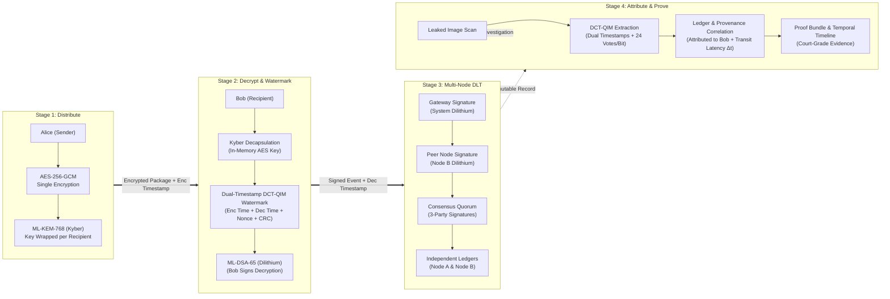
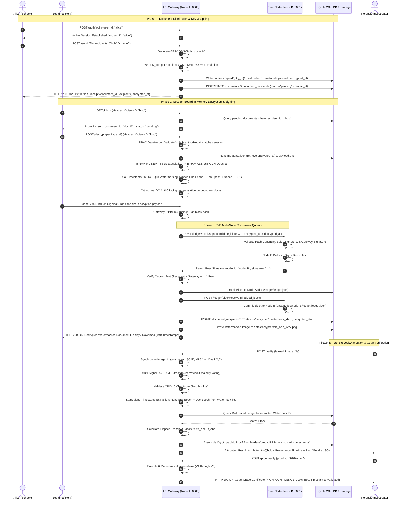
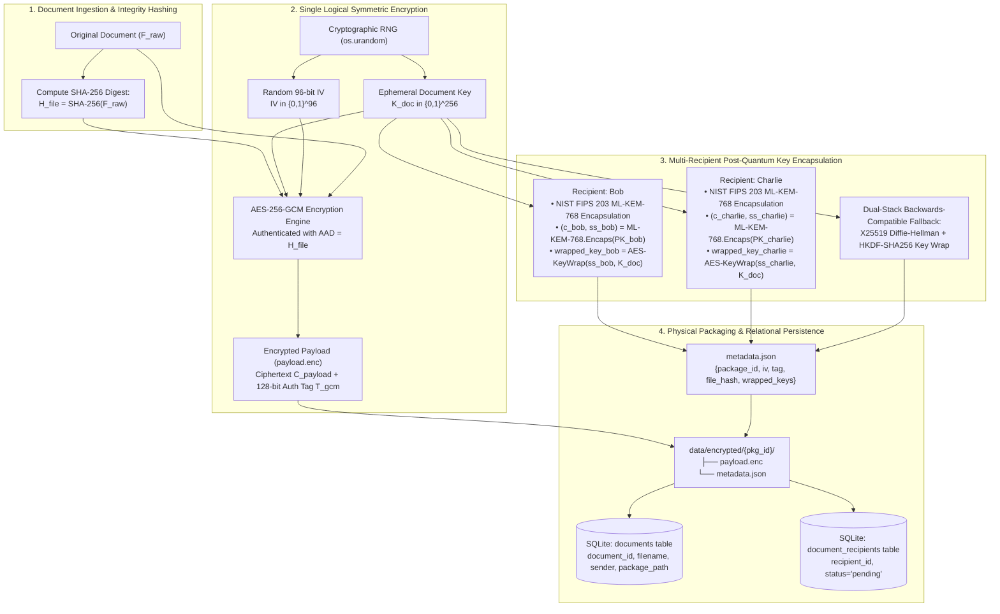
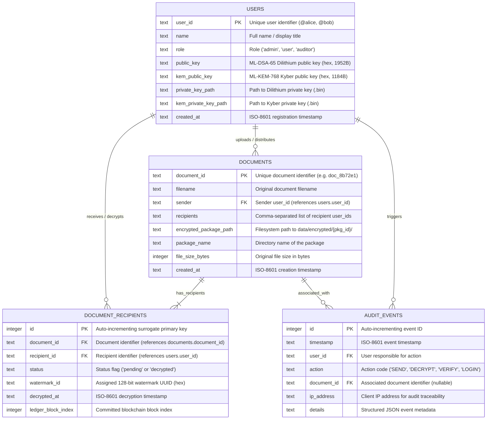
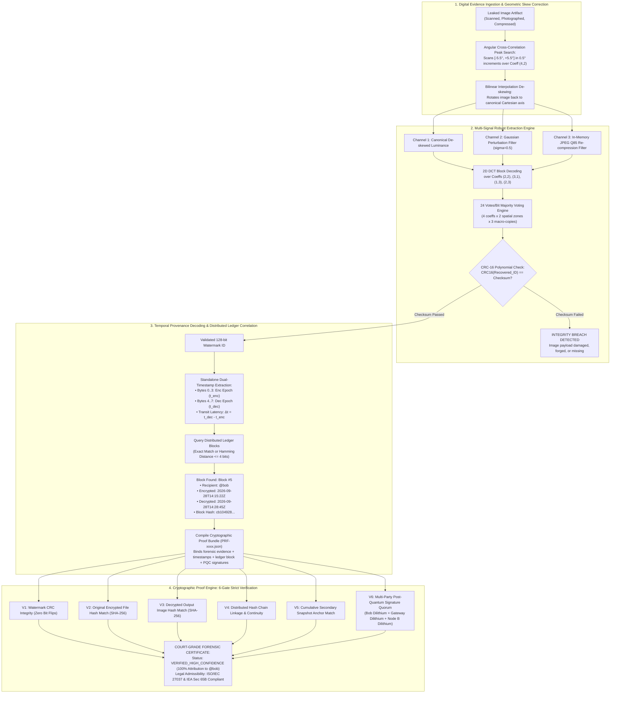
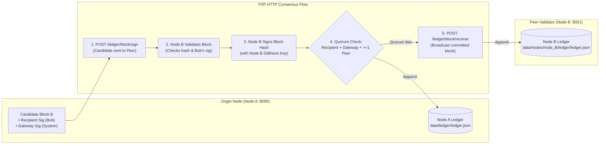

# SANKET — Post-Quantum Cryptographic Attribution & Distributed Provenance Platform

> **NIST-Standardized Post-Quantum Cryptography, Session-Bound Decryption Watermarking, Consensus-Validated Multi-Node Distributed Ledger & Verifiable Cryptographic Proof Bundles**  
> *Developed for Smart India Hackathon (SIH) — Problem Statement PS237*

---

## 1. System Overview & The Core Problem

### The Broadcast-Encryption Dilemma
When a sensitive document is shared with multiple recipients, standard broadcast encryption encrypts it once, and each recipient decrypts it independently using their own credentials. 

```
                                      ┌───► [Bob Decrypts] ────► Identical Document
[Alice Encrypts Once] ──► Encrypted ──┼───► [Charlie Decrypts] ─► Identical Document
                          Payload     └───► [David Decrypts] ──► Identical Document
                                                         │
                                               [Document Leaked!]
                                                         ▼
                                          WHO LEAKED IT? ALL ARE SUSPECTS!
```

- **The Flaw**: Every recipient gets identical plaintext. If leaked, **all recipients are equally plausible suspects**.
- **Central Logs Fail**: Server logs can be wiped or modified by a privileged administrator.
- **Static Watermarks Fail**: An identical watermark shared with multiple parties solves nothing.

### The SANKET Solution
SANKET creates an unbroken chain of cryptographic custody:

$$\mathbf{Distribute} \longrightarrow \mathbf{Authorize} \longrightarrow \mathbf{Decrypt} \longrightarrow \mathbf{Consensus} \longrightarrow \mathbf{Attribute} \longrightarrow \mathbf{Verify}$$

1. **Single Encryption + Post-Quantum Key Wrapping**: Encrypted once via **AES-256-GCM**. Ephemeral keys are wrapped individually using NIST FIPS 203 **ML-KEM-768 (Kyber)**.
2. **Session-Bound Authorization**: Decryption requests are checked against the active session (`X-User-ID`). Unauthorized requests are rejected with `HTTP 403 Forbidden`.
3. **In-Memory Watermarking at Decryption**: Plaintext is never written unwatermarked. A unique 2D DCT-QIM watermark with recipient identity, timestamp, and a random nonce is embedded in RAM with DC anti-clipping protection.
4. **Mandatory User-Side Post-Quantum Signing**: The recipient signs the decryption event using their own NIST FIPS 204 **ML-DSA-65 (Dilithium)** private key.
5. **Real Multi-Node Distributed Ledger (DLT)**: Blocks require consensus quorum: signed by **recipient + gateway + peer validator node**. Nodes store data independently on disk with no shared storage.
6. **Secondary Cumulative Anchors**: Snapshot anchors computed every 5 blocks detect history manipulation. Any divergence flags the ledger as **`COMPROMISED`**.
7. **Court-Grade Proof Bundles**: Self-contained JSON proof containers linking forensic evidence to the blockchain record.

---

## Table of Contents
- [1. System Overview & The Core Problem](#1-system-overview--the-core-problem)
- [2. High-Level Architecture Block Diagram](#2-high-level-architecture-block-diagram)
- [3. End-to-End User Interaction Flow & Sequence](#3-end-to-end-user-interaction-flow--sequence)
- [4. Deep-Dive Cryptographic Encryption Flow & Post-Quantum Key Wrapping](#4-deep-dive-cryptographic-encryption-flow--post-quantum-key-wrapping)
- [5. Data Retrieval, In-Memory Decryption & Watermarking Flow](#5-data-retrieval-in-memory-decryption--watermarking-flow)
- [6. Database Architecture & Physical Storage Model](#6-database-architecture--physical-storage-model)
- [7. Court-Grade "Forensic-Approved" Verification Architecture & Legal Admissibility](#7-court-grade-forensic-approved-verification-architecture--legal-admissibility)
- [8. Multi-Node P2P Consensus Quorum & Secondary Snapshot Anchors](#8-multi-node-p2p-consensus-quorum--secondary-snapshot-anchors)
- [9. Technical Specifications & Cryptographic Stack](#9-technical-specifications--cryptographic-stack)
- [10. Detailed Breakdown of the Three Implementation Phases](#10-detailed-breakdown-of-the-three-implementation-phases)
- [11. Complete REST API Reference](#11-complete-rest-api-reference)
- [12. Command Line Interface Reference (`main.py`)](#12-command-line-interface-reference-mainpy)
- [13. Frontend Workflow Dashboard](#13-frontend-workflow-dashboard)
- [14. Installation, Execution & Multi-Node Deployment](#14-installation-execution--multi-node-deployment)
- [15. Automated Test Suites & Benchmarks](#15-automated-test-suites--benchmarks)
- [16. License & Attribution](#16-license--attribution)

---

## 2. High-Level Architecture Block Diagram

The entire SANKET platform operates as a clear, four-stage cryptographic pipeline:


```mermaid
flowchart LR
    subgraph S1 ["Stage 1: Distribute"]
        direction TB
        A1["Alice (Sender)"] --> A2["AES-256-GCM<br/>Single Encryption"]
        A2 --> A3["ML-KEM-768 (Kyber)<br/>Key Wrapped per Recipient"]
    end

    subgraph S2 ["Stage 2: Decrypt & Watermark"]
        direction TB
        B1["Bob (Recipient)"] --> B2["Kyber Decapsulation<br/>(In-Memory AES Key)"]
        B2 --> B3["Dual-Timestamp DCT-QIM Watermark<br/>(Enc Time + Dec Time + Nonce + CRC)"]
        B3 --> B4["ML-DSA-65 (Dilithium)<br/>(Bob Signs Decryption)"]
    end

    subgraph S3 ["Stage 3: Multi-Node DLT"]
        direction TB
        C1["Gateway Signature<br/>(System Dilithium)"] --> C2["Peer Node Signature<br/>(Node B Dilithium)"]
        C2 --> C3["Consensus Quorum<br/>(3-Party Signatures)"]
        C3 --> C4["Independent Ledgers<br/>(Node A & Node B)"]
    end

    subgraph S4 ["Stage 4: Attribute & Prove"]
        direction TB
        D1["Leaked Image Scan"] --> D2["DCT-QIM Extraction<br/>(Dual Timestamps + 24 Votes/Bit)"]
        D2 --> D3["Ledger & Provenance Correlation<br/>(Attributed to Bob + Transit Latency Δt)"]
        D3 --> D4["Proof Bundle & Temporal Timeline<br/>(Court-Grade Evidence)"]
    end

    S1 ==>|"Encrypted Package + Enc Timestamp"| S2
    S2 ==>|"Signed Event + Dec Timestamp"| S3
    S3 -.->|"Immutable Record"| S4
    D1 -.->|"Forensic Investigation"| S4
```

---

## 3. End-to-End User Interaction Flow & Sequence

The user experience in SANKET coordinates five distinct roles across the network: **Alice (Sender/Creator)**, **Bob (Recipient/Decrypter)**, the **API Gateway (Node A :8000)**, the **Peer Validator Node (Node B :8001)**, and the **Forensic Investigator / Court Examiner**. 

The sequence below illustrates the complete lifecycle from document distribution to in-RAM watermarking and court-grade forensic attribution:


```mermaid
sequenceDiagram
    autonumber
    actor Alice as Alice (Sender)
    actor Bob as Bob (Recipient)
    participant Gate as API Gateway (Node A :8000)
    participant Peer as Peer Node (Node B :8001)
    participant DB as SQLite WAL DB & Storage
    actor Forensic as Forensic Investigator

    Note over Alice,DB: Phase 1: Document Distribution & Key Wrapping
    Alice->>Gate: POST /auth/login {user_id: "alice"}
    Gate-->>Alice: Active Session Established (X-User-ID: "alice")
    Alice->>Gate: POST /send {file, recipients: ["bob", "charlie"]}
    Gate->>Gate: Generate AES-256-GCM K_doc + IV
    Gate->>Gate: Wrap K_doc per recipient via ML-KEM-768 Encapsulation
    Gate->>DB: Write data/encrypted/{pkg_id}/ (payload.enc + metadata.json with encrypted_at)
    Gate->>DB: INSERT INTO documents & document_recipients (status='pending', created_at)
    Gate-->>Alice: HTTP 200 OK: Distribution Receipt {document_id, recipients, encrypted_at}

    Note over Bob,DB: Phase 2: Session-Bound In-Memory Decryption & Signing
    Bob->>Gate: GET /inbox (Header: X-User-ID: "bob")
    Gate->>DB: Query pending documents where recipient_id = 'bob'
    Gate-->>Bob: Inbox List (e.g. document_id: "doc_01", status: "pending")
    Bob->>Gate: POST /decrypt {package_id} (Header: X-User-ID: "bob")
    Gate->>Gate: RBAC Gatekeeper: Validate 'bob' is authorized & matches session
    Gate->>DB: Read metadata.json (retrieve encrypted_at) & payload.enc
    Gate->>Gate: In-RAM ML-KEM-768 Decapsulation -> In-RAM AES-256-GCM Decrypt
    Gate->>Gate: Dual-Timestamp 2D DCT-QIM Watermarking: Embed Enc Epoch + Dec Epoch + Nonce + CRC
    Gate->>Gate: Orthogonal DC Anti-Clipping compensation on boundary blocks
    Bob->>Gate: Client-Side Dilithium Signing: Sign canonical decryption payload
    Gate->>Gate: Gateway Dilithium Signing: Sign block hash

    Note over Gate,Peer: Phase 3: P2P Multi-Node Consensus Quorum
    Gate->>Peer: POST /ledger/block/sign {candidate_block with encrypted_at & decrypted_at}
    Peer->>Peer: Validate Hash Continuity, Bob's Signature, & Gateway Signature
    Peer->>Peer: Node B Dilithium Signs Block Hash
    Peer-->>Gate: Return Peer Signature {node_id: "node_B", signature: "..."}
    Gate->>Gate: Verify Quorum Met (Recipient + Gateway + >=1 Peer)
    Gate->>DB: Commit Block to Node A (data/ledger/ledger.json)
    Gate->>Peer: POST /ledger/block/receive {finalized_block}
    Peer->>Peer: Commit Block to Node B (data/nodes/node_B/ledger/ledger.json)
    Gate->>DB: UPDATE document_recipients SET status='decrypted', watermark_id=..., decrypted_at=...
    Gate->>DB: Write watermarked image to data/decrypted/file_bob_xxxx.png
    Gate-->>Bob: HTTP 200 OK: Decrypted Watermarked Document Display / Download (with Timestamps)

    Note over Forensic,DB: Phase 4: Forensic Leak Attribution & Court Verification
    Forensic->>Gate: POST /verify {leaked_image_file}
    Gate->>Gate: Synchronize Image: Angular search [-5.5°, +5.5°] on Coeff (4,2)
    Gate->>Gate: Multi-Signal DCT-QIM Extraction (24 votes/bit majority voting)
    Gate->>Gate: Validate CRC-16 Checksum (Zero bit-flips)
    Gate->>Gate: Standalone Timestamp Extraction: Read Enc Epoch + Dec Epoch from Watermark bits
    Gate->>DB: Query Distributed Ledger for extracted Watermark ID
    DB-->>Gate: Match Block #5: Decrypted by @bob (Encrypted: t_enc | Decrypted: t_dec)
    Gate->>Gate: Calculate Elapsed Transit Duration Δt = t_dec - t_enc
    Gate->>DB: Assemble Cryptographic Proof Bundle (data/proofs/PRF-xxxx.json with timestamps)
    Gate-->>Forensic: Attribution Result: Attributed to @bob + Provenance Timeline + Proof Bundle JSON
    Forensic->>Gate: POST /proof/verify {proof_id: "PRF-xxxx"}
    Gate->>Gate: Execute 6 Mathematical Verifications (V1 through V6)
    Gate-->>Forensic: HTTP 200 OK: Court-Grade Certificate (HIGH_CONFIDENCE: 100% Bob, Timestamps Validated)
```

### Operational User Journey:
1. **Sender Experience (`SendScreen.jsx` / `main.py send`)**:
   - The user selects a document file (PNG, JPG, BMP) and chooses recipients from the registered directory (`@bob`, `@charlie`).
   - The system computes the file integrity hash, executes a single AES-256-GCM encryption, encapsulates the document key for each recipient with their respective NIST FIPS 203 **ML-KEM-768** public key, records metadata (including `encrypted_at`) in SQLite, and provides an immediate distribution receipt.
2. **Recipient Experience (`InboxScreen.jsx` & `DecryptScreen.jsx` / `main.py decrypt`)**:
   - The recipient inspects their inbox with real-time access badges.
   - When triggering decryption, the active session identity (`X-User-ID`) is cryptographically enforced. Decapsulation and decryption occur **strictly in volatile memory**.
   - Plaintext is dynamically injected with an invisible, robust 2D DCT-QIM watermark carrying the dual timestamps (encryption epoch + decryption epoch), recipient's identity, and nonce.
   - The user's NIST FIPS 204 **ML-DSA-65 (Dilithium)** private key signs the canonical event payload before the file is rendered or downloaded, creating irrevocable non-repudiation.
3. **Forensic Examiner Experience (`LeakVerifyScreen.jsx` / `main.py verify` & `report`)**:
   - An investigator uploads any recovered digital copy (even if screenshotted, cropped, rotated, re-compressed with JPEG, or noisy).
   - The platform auto-corrects angular skew, extracts watermark bits across multiple signal perturbations, checks the CRC-16 polynomial, extracts both embedded timestamps completely offline, correlates the watermark with the immutable ledger, compiles a court-grade **Cryptographic Proof Bundle**, and displays the complete **Provenance Timeline & Transit Latency ($\Delta t$)** in real time.

---

## 4. Deep-Dive Cryptographic Encryption Flow & Post-Quantum Key Wrapping

SANKET eliminates the multi-ciphertext storage explosion of traditional secure distribution systems by performing a **single logical payload encryption** paired with **individualized post-quantum key encapsulation**.


```mermaid
flowchart TD
    subgraph Ingestion ["1. Document Ingestion & Integrity Hashing"]
        FILE["Original Document (F_raw)"] --> HASH["Compute SHA-256 Digest:<br/>H_file = SHA-256(F_raw)"]
    end

    subgraph SymmetricCipher ["2. Single Logical Symmetric Encryption"]
        CSPRNG["Cryptographic RNG (os.urandom)"] --> K_DOC["Ephemeral Document Key<br/>K_doc in {0,1}^256"]
        CSPRNG --> IV["Random 96-bit IV<br/>IV in {0,1}^96"]
        HASH --> GCM["AES-256-GCM Encryption Engine<br/>Authenticated with AAD = H_file"]
        K_DOC --> GCM
        IV --> GCM
        FILE --> GCM
        GCM --> CIPHER["Encrypted Payload (payload.enc)<br/>Ciphertext C_payload + 128-bit Auth Tag T_gcm"]
    end

    subgraph PQ_Encapsulation ["3. Multi-Recipient Post-Quantum Key Encapsulation"]
        direction TB
        K_DOC --> WRAP_BOB["Recipient: Bob<br/>• NIST FIPS 203 ML-KEM-768 Encapsulation<br/>• (c_bob, ss_bob) = ML-KEM-768.Encaps(PK_bob)<br/>• wrapped_key_bob = AES-KeyWrap(ss_bob, K_doc)"]
        K_DOC --> WRAP_CHARLIE["Recipient: Charlie<br/>• NIST FIPS 203 ML-KEM-768 Encapsulation<br/>• (c_charlie, ss_charlie) = ML-KEM-768.Encaps(PK_charlie)<br/>• wrapped_key_charlie = AES-KeyWrap(ss_charlie, K_doc)"]
        K_DOC --> FALLBACK["Dual-Stack Backwards-Compatible Fallback:<br/>X25519 Diffie-Hellman + HKDF-SHA256 Key Wrap"]
    end

    subgraph Packaging ["4. Physical Packaging & Relational Persistence"]
        CIPHER --> PKG_DIR["data/encrypted/{pkg_id}/<br/>├── payload.enc<br/>└── metadata.json"]
        WRAP_BOB --> META["metadata.json<br/>{package_id, iv, tag, file_hash, wrapped_keys}"]
        WRAP_CHARLIE --> META
        FALLBACK --> META
        META --> PKG_DIR
        PKG_DIR --> DB_DOC[("SQLite: documents table<br/>document_id, filename, sender, package_path")]
        PKG_DIR --> DB_REC[("SQLite: document_recipients table<br/>recipient_id, status='pending'")]
    end
```

### Mathematical Formulation of Encryption:
1. **Document Digest**:
   $$H_{\text{file}} = \text{SHA-256}(F_{\text{raw}}) \in \{0, 1\}^{256}$$
2. **Ephemeral Key & IV Generation**:
   $$K_{\text{doc}} \stackrel{R}{\leftarrow} \{0, 1\}^{256}, \quad \text{IV} \stackrel{R}{\leftarrow} \{0, 1\}^{96}$$
3. **Authenticated Payload Encryption**:
   $$(C_{\text{payload}}, T_{\text{gcm}}) = \mathbf{AES\text{-}256\text{-}GCM\text{-}Encrypt}(K_{\text{doc}}, \text{IV}, F_{\text{raw}}, \text{AAD}=H_{\text{file}})$$
   - The document hash $H_{\text{file}}$ is bound as Additional Authenticated Data (AAD), ensuring the ciphertext cannot be transplanted into a different document metadata context.
4. **Post-Quantum Key Encapsulation (ML-KEM-768 / Kyber)**:
   For each recipient $R_i$ with public encapsulation key $PK_{R_i}^{\text{KEM}}$ (1,184 bytes):
   $$(C_{\text{KEM}, i}, SS_i) = \mathbf{ML\text{-}KEM\text{-}768.Encaps}(PK_{R_i}^{\text{KEM}})$$
   $$\text{WrappedKey}_i = \mathbf{AES\text{-}KeyWrap}(SS_i, K_{\text{doc}})$$
   - Ciphertext size: 1,088 bytes per recipient.
   - Decapsulation shared secret size: 32 bytes ($256$ bits).
5. **Dual-Stack Fallback (RFC 7748 X25519)**:
   For legacy or non-quantum clients, an ephemeral X25519 scalar multiplication is executed:
   $$(C_{\text{X25519}, i}, SS_{\text{X25519}, i}) = \mathbf{X25519}(sk_{\text{eph}}, PK_{R_i}^{\text{X25519}})$$
   $$\text{FallbackKey}_i = \mathbf{AES\text{-}KeyWrap}(\mathbf{HKDF\text{-}SHA256}(SS_{\text{X25519}, i}), K_{\text{doc}})$$

### Package Metadata Structure (`data/encrypted/{pkg_id}/metadata.json`):
```json
{
  "package_id": "pkg_8b72e19a4f20",
  "original_filename": "classified_intel.png",
  "file_hash": "66ed6ed129e81faf67d4be3ed2349ceb2bdf4b6cf330bfc703720a6c4c3a89b6",
  "algorithm": "AES-256-GCM",
  "iv": "9f2b84e1208d17a35c910284",
  "tag": "a1b2c3d4e5f60718293a4b5c6d7e8f90",
  "sender": "alice",
  "recipients": ["bob", "charlie"],
  "wrapped_keys": {
    "bob": {
      "kem": "ml-kem-768",
      "ciphertext": "038a4f91b7...",
      "wrapped_key": "4c89df12..."
    },
    "charlie": {
      "kem": "ml-kem-768",
      "ciphertext": "99ea01bc52...",
      "wrapped_key": "1290fe34..."
    }
  },
  "encrypted_at": "2026-09-28T14:15:22.901Z",
  "created_at": "2026-09-28T14:15:22.901Z"
}
```

---

## 5. Data Retrieval, In-Memory Decryption & Watermarking Flow

When an authorized user requests decryption, SANKET guarantees that **unwatermarked plaintext is never written to disk**. Decryption, forensic watermarking, anti-clipping protection, and digital signing are executed atomically in volatile memory before storage or delivery.


```mermaid
flowchart TD
    subgraph AuthGate ["1. Session-Bound Authorization Gatekeeper"]
        REQ["Bob Requests Decryption<br/>POST /decrypt (Header: X-User-ID: 'bob')"] --> GATE{"Authorization Check:<br/>1. Is 'bob' in document recipients?<br/>2. Does active session match 'bob'?"}
        GATE -->|"Unauthorized"| FORBIDDEN["HTTP 403 Forbidden<br/>(Access Denied)"]
    end

    subgraph RAM_Decryption ["2. In-Memory Post-Quantum Decapsulation & Plaintext Recovery"]
        GATE -->|"Authorized"| FETCH["Read metadata.json & payload.enc<br/>from data/encrypted/{pkg_id}/"]
        FETCH --> KEM_DECAPS["ML-KEM-768 Decapsulation (RAM Only):<br/>• Load Bob's private key SK_bob (2,400B)<br/>• ss_bob = ML-KEM-768.Decaps(SK_bob, c_bob)<br/>• K_doc = AES-KeyUnwrap(ss_bob, wrapped_key_bob)"]
        KEM_DECAPS --> GCM_DECRYPT["AES-256-GCM Authenticated Decryption (RAM Only):<br/>• Plaintext F_raw = AES-GCM-Decrypt(K_doc, IV, C_payload, Tag)<br/>• Verify SHA-256(F_raw) == H_file"]
        GCM_DECRYPT --> ZERO_DISK["ZERO PLAINTEXT DISK WRITES<br/>Raw plaintext exists strictly in volatile RAM buffers"]
    end

    subgraph WatermarkEngine ["3. In-Memory 2D DCT-QIM Watermarking & Anti-Clipping"]
        ZERO_DISK --> YCBCR["Convert RGB to YCbCr (Extract Y Luminance Channel)"]
        YCBCR --> BLOCKS["Partition Luminance into 8x8 Spatial Blocks & Apply 2D DCT"]
        BLOCKS --> PAYLOAD_GEN["Generate Dual-Timestamp 144-Bit Watermark Payload:<br/>[4B Encrypt Epoch] || [4B Decrypt Epoch] || [8B Entropy] || [16-bit CRC-16 Checksum]"]
        PAYLOAD_GEN --> QIM["Adaptive Quantization Index Modulation (QIM):<br/>Embed bits in mid-frequencies (2,2), (3,1), (1,3), (2,3)<br/>Step size delta in [38.0, 62.0] scaled to block variance"]
        QIM --> SYNC_TEMP["Inject Periodic Synchronization Pattern:<br/>Coefficient (4,2) with fixed delta_sync = 80.0"]
        SYNC_TEMP --> ANTI_CLIP["Orthogonal DC Anti-Clipping Compensation:<br/>Shift DC coefficient (0,0) by +/- delta*8.0 on boundary blocks<br/>(Completely prevents 0/255 clipping without altering AC watermark)"]
        ANTI_CLIP --> IDCT["Apply 2D Inverse DCT -> Watermarked Plaintext F_wm"]
    end

    subgraph SigningConsensus ["4. User-Side Dilithium Signing & Multi-Node Ledger Commit"]
        IDCT --> HASH_WM["Compute Output Digest:<br/>H_decrypted = SHA-256(F_wm)"]
        HASH_WM --> EVENT["Assemble Canonical Decryption Event Record:<br/>{watermark_id, user_id, timestamp, encrypted_at, decrypted_at, file_hash, decrypted_hash}"]
        EVENT --> BOB_SIGN["Enforce User-Side Post-Quantum Signature:<br/>sigma_recipient = ML-DSA-65.Sign(SK_bob, Canonical_Event)"]
        BOB_SIGN --> P2P["P2P Multi-Node Consensus Quorum:<br/>• System Authority Signs Block Hash<br/>• Peer Node B Validates & Signs Block Hash"]
        P2P --> LEDGER_COMMIT[("Commit Block to Independent Node Ledgers<br/>• Node A: data/ledger/ledger.json<br/>• Node B: data/nodes/node_B/ledger/ledger.json")]
        LEDGER_COMMIT --> DB_UPDATE[("Update SQLite document_recipients:<br/>status='decrypted', watermark_id, ledger_block_index")]
        DB_UPDATE --> SAVE_IMG["Persist Watermarked Output Image:<br/>data/decrypted/file_bob_timestamp.png"]
    end
```

### Detailed Decryption Stages:
1. **RBAC Authorization & Session Binding**:
   - Decryption requires the `X-User-ID` HTTP header matching the authorized identity.
   - Attempting to decrypt another user's assigned document raises an immediate `HTTP 403 Forbidden` error and logs an `UNAUTHORIZED_ACCESS` audit event.
2. **In-Memory ML-KEM-768 Decapsulation**:
   - The system retrieves $C_{\text{KEM}, \text{bob}}$ from `metadata.json`.
   - Bob's private key $SK_{\text{bob}}^{\text{KEM}}$ (2,400 bytes, loaded from `data/keys/bob/kyber_private.bin`) executes:
     $$SS_{\text{bob}} = \mathbf{ML\text{-}KEM\text{-}768.Decaps}(SK_{\text{bob}}^{\text{KEM}}, C_{\text{KEM}, \text{bob}})$$
     $$K_{\text{doc}} = \mathbf{AES\text{-}KeyUnwrap}(SS_{\text{bob}}, \text{WrappedKey}_{\text{bob}})$$
3. **In-Memory Authenticated AES-GCM Plaintext Recovery**:
   - $F_{\text{raw}} = \mathbf{AES\text{-}256\text{-}GCM\text{-}Decrypt}(K_{\text{doc}}, \text{IV}, C_{\text{payload}}, T_{\text{gcm}}, \text{AAD}=H_{\text{file}})$.
   - $\text{SHA-256}(F_{\text{raw}})$ is verified against $H_{\text{file}}$ in `metadata.json`.
   - **Crucial Invariant**: $F_{\text{raw}}$ is never flushed to filesystem, temp files, or swap storage.
4. **Dual-Timestamp 2D DCT-QIM Watermarking & Anti-Clipping**:
   - **144-Bit Watermark Binary Payload**: Embedded into mid-frequencies with self-describing temporal provenance:
     - `Bytes 0..3` (32-bit unsigned int): **Encryption Epoch** ($t_{\text{enc}}$) recovered from package metadata.
     - `Bytes 4..7` (32-bit unsigned int): **Decryption Epoch** ($t_{\text{dec}}$) recorded at moment of plaintext recovery.
     - `Bytes 8..15` (64-bit hash): Cryptographic entropy and recipient binding hash.
     - `Bytes 16..17` (16-bit CRC): **CRC-16-CCITT** polynomial checksum ensuring zero undetected bit-flips.
   - Plaintext pixels are converted to YCbCr; the luminance $Y$ channel is divided into $8 \times 8$ blocks.
   - Watermark bits are embedded into mid-frequency coefficients `(2,2), (3,1), (1,3), (2,3)` using adaptive quantization index modulation ($\Delta \in [38.0, 62.0]$).
   - Synchronization pattern is embedded into coefficient `(4,2)` ($\Delta_{\text{sync}} = 80.0$).
   - **Orthogonal DC Anti-Clipping**: When high-contrast regions (e.g. pure white `#FFFFFF` document backgrounds) cause IDCT values to exceed $255.0$ or fall below $0.0$, the DC coefficient `(0,0)` is shifted by $\mp (\text{overflow}) \times 8.0$. Because DC is orthogonal to all AC frequencies, spatial clipping is eliminated while watermarking and sync patterns remain 100% intact.
5. **Mandatory Recipient Dilithium Signing (Non-Repudiation)**:
   - The canonical event payload is assembled:
     $$\mathcal{E} = \{\text{watermark\_id}, \text{user\_id}, \text{timestamp}, H_{\text{file}}, H_{\text{decrypted}}\}$$
   - Bob's private key $SK_{\text{bob}}^{\text{DSA}}$ (4,032 bytes) signs the event:
     $$\sigma_{\text{recipient}} = \mathbf{ML\text{-}DSA\text{-}65.Sign}(SK_{\text{bob}}^{\text{DSA}}, \text{canonical\_json}(\mathcal{E}))$$
6. **Consensus Quorum & Output Persistence**:
   - The decryption event is packaged into a candidate block and submitted to peer nodes for consensus quorum.
   - Once committed across node ledgers, the watermarked output image is saved to `data/decrypted/file_bob_{timestamp}.png` and delivered to the recipient.

---

## 6. Database Architecture & Physical Storage Model

SANKET employs an embedded, high-performance relational database engine based on **SQLite3 in WAL (Write-Ahead Logging) mode**, coupled with an organized, air-gapped file storage structure.

### 6.1 Entity-Relationship (ER) Schema Diagram


```mermaid
erDiagram
    USERS ||--o{ DOCUMENTS : "uploads / distributes"
    DOCUMENTS ||--|{ DOCUMENT_RECIPIENTS : "has_recipients"
    USERS ||--o{ DOCUMENT_RECIPIENTS : "receives / decrypts"
    USERS ||--o{ AUDIT_EVENTS : "triggers"
    DOCUMENTS ||--o{ AUDIT_EVENTS : "associated_with"

    USERS {
        text user_id PK "Unique user identifier (@alice, @bob)"
        text name "Full name / display title"
        text role "Role ('admin', 'user', 'auditor')"
        text public_key "ML-DSA-65 Dilithium public key (hex, 1952B)"
        text kem_public_key "ML-KEM-768 Kyber public key (hex, 1184B)"
        text private_key_path "Path to Dilithium private key (.bin)"
        text kem_private_key_path "Path to Kyber private key (.bin)"
        text created_at "ISO-8601 registration timestamp"
    }

    DOCUMENTS {
        text document_id PK "Unique document identifier (e.g. doc_8b72e1)"
        text filename "Original document filename"
        text sender FK "Sender user_id (references users.user_id)"
        text recipients "Comma-separated list of recipient user_ids"
        text encrypted_package_path "Filesystem path to data/encrypted/{pkg_id}/"
        text package_name "Directory name of the package"
        integer file_size_bytes "Original file size in bytes"
        text created_at "ISO-8601 creation timestamp"
    }

    DOCUMENT_RECIPIENTS {
        integer id PK "Auto-incrementing surrogate primary key"
        text document_id FK "Document identifier (references documents.document_id)"
        text recipient_id FK "Recipient identifier (references users.user_id)"
        text status "Status flag ('pending' or 'decrypted')"
        text watermark_id "Assigned 128-bit watermark UUID (hex)"
        text decrypted_at "ISO-8601 decryption timestamp"
        integer ledger_block_index "Committed blockchain block index"
    }

    AUDIT_EVENTS {
        integer id PK "Auto-incrementing event ID"
        text timestamp "ISO-8601 event timestamp"
        text user_id FK "User responsible for action"
        text action "Action code ('SEND', 'DECRYPT', 'VERIFY', 'LOGIN')"
        text document_id FK "Associated document identifier (nullable)"
        text ip_address "Client IP address for audit traceability"
        text details "Structured JSON event metadata"
    }
```

### 6.2 SQL Table Definitions & Integrity Constraints

```sql
-- 1. Identity & PQC Keystore Registry
CREATE TABLE IF NOT EXISTS users (
    user_id TEXT PRIMARY KEY,
    name TEXT NOT NULL,
    role TEXT NOT NULL,
    public_key TEXT,
    kem_public_key TEXT,
    private_key_path TEXT,
    kem_private_key_path TEXT,
    created_at TEXT NOT NULL
);

-- 2. Distributed Document Registry
CREATE TABLE IF NOT EXISTS documents (
    document_id TEXT PRIMARY KEY,
    filename TEXT NOT NULL,
    sender TEXT NOT NULL,
    recipients TEXT NOT NULL,
    encrypted_package_path TEXT NOT NULL,
    package_name TEXT NOT NULL,
    file_size_bytes INTEGER DEFAULT 0,
    created_at TEXT NOT NULL
);

-- 3. Recipient Decryption Status & Watermark Association
CREATE TABLE IF NOT EXISTS document_recipients (
    id INTEGER PRIMARY KEY AUTOINCREMENT,
    document_id TEXT NOT NULL,
    recipient_id TEXT NOT NULL,
    status TEXT DEFAULT 'pending',
    watermark_id TEXT,
    decrypted_at TEXT,
    ledger_block_index INTEGER,
    FOREIGN KEY(document_id) REFERENCES documents(document_id) ON DELETE CASCADE,
    UNIQUE(document_id, recipient_id)
);

-- 4. Immutable Audit Trail
CREATE TABLE IF NOT EXISTS audit_events (
    id INTEGER PRIMARY KEY AUTOINCREMENT,
    timestamp TEXT NOT NULL,
    user_id TEXT,
    action TEXT NOT NULL,
    document_id TEXT,
    ip_address TEXT,
    details TEXT
);

-- Performance Indices
CREATE INDEX IF NOT EXISTS idx_doc_sender ON documents(sender);
CREATE INDEX IF NOT EXISTS idx_doc_recipients ON document_recipients(recipient_id);
```

### 6.3 Concurrency & High-Availability Architecture:
- **Write-Ahead Logging (WAL)**: Configured via `PRAGMA journal_mode = WAL;`. Readers and writers proceed concurrently without mutual blocking.
- **Busy Timeout**: Configured via `PRAGMA busy_timeout = 5000;`. Concurrent requests on LAN multi-node clusters wait up to 5 seconds for write locks rather than throwing SQLite busy exceptions.
- **Foreign Key Enforcement**: Configured via `PRAGMA foreign_keys = ON;`. Cascading deletes protect against orphaned recipient or audit records.

### 6.4 Relational Database to Physical Storage Mapping

| Database Entity / Column | Physical Filesystem Location | Contents & Security Guarantee |
| :--- | :--- | :--- |
| **`data/sanket.db`** | `data/sanket.db`, `sanket.db-wal`, `sanket.db-shm` | Embedded ACID relational metadata store in WAL mode |
| **`documents.encrypted_package_path`** | `data/encrypted/{pkg_id}/` | Contains `payload.enc` (AES-256-GCM ciphertext) and `metadata.json` (Kyber wrapped keys) |
| **`document_recipients.watermark_id`** | `data/decrypted/file_{user}_{ts}.png` | Watermarked decrypted images carrying 2D DCT-QIM watermark & sync template |
| **`users.private_key_path`** | `data/keys/{user_id}/dilithium_private.bin` | NIST FIPS 204 ML-DSA-65 private signing key (4,032 bytes, 0600 permissions) |
| **`users.kem_private_key_path`** | `data/keys/{user_id}/kyber_private.bin` | NIST FIPS 203 ML-KEM-768 private decapsulation key (2,400 bytes, 0600 permissions) |
| **`document_recipients.ledger_block_index`** | `data/ledger/ledger.json` | Node A append-only blockchain with multi-party Dilithium signatures |
| **Peer Node Isolated Ledger** | `data/nodes/node_B/ledger/ledger.json` | Node B independent physical ledger storage (zero shared directories) |
| **Periodic State Checkpoints** | `data/ledger/anchors.json` | Cumulative snapshot state anchors computed every 5 blocks |
| **Cryptographic Proofs** | `data/proofs/PRF-{proof_id}.json` | Self-contained court-grade cryptographic proof bundles |
| **Distortion Analysis Reports** | `data/reports/REP-{report_id}.json` | Forensic tamper analysis reports with classified distortion metrics |

---

## 7. Court-Grade "Forensic-Approved" Verification Architecture & Legal Admissibility

SANKET is engineered to produce digital evidence that satisfies the most stringent global legal and forensic standards for digital admissibility:
- **ISO/IEC 27037:2012**: International standard for identification, collection, acquisition, and preservation of digital evidence.
- **Section 65B, Indian Evidence Act (IEA)**: Automated generation of certified electronic records verifying computer system integrity, continuous operation, and lack of human tampering.
- **Federal Rules of Evidence (FRE) Rule 902(13) & 902(14)**: Self-authenticating electronic records generated by a certified cryptographic process that produces an accurate result.


```mermaid
flowchart TD
    subgraph EvidenceAcquisition ["1. Digital Evidence Ingestion & Geometric Skew Correction"]
        LEAK["Leaked Image Artifact<br/>(Scanned, Photographed, Compressed)"] --> SKEW_SEARCH["Angular Cross-Correlation Peak Search:<br/>Scans [-5.5°, +5.5°] in 0.5° increments over Coeff (4,2)"]
        SKEW_SEARCH --> DESKEW["Bilinear Interpolation De-skewing:<br/>Rotates image back to canonical Cartesian axis"]
    end

    subgraph ExtractionEngine ["2. Multi-Signal Robust Extraction Engine"]
        DESKEW --> CHAN_ORIG["Channel 1: Canonical De-skewed Luminance"]
        DESKEW --> CHAN_BLUR["Channel 2: Gaussian Perturbation Filter (sigma=0.5)"]
        DESKEW --> CHAN_JPEG["Channel 3: In-Memory JPEG Q85 Re-compression Filter"]
        CHAN_ORIG & CHAN_BLUR & CHAN_JPEG --> DCT_DECODE["2D DCT Block Decoding over Coeffs (2,2), (3,1), (1,3), (2,3)"]
        DCT_DECODE --> VOTE["24 Votes/Bit Majority Voting Engine<br/>(4 coeffs x 2 spatial zones x 3 macro-copies)"]
        VOTE --> CRC_CHECK{"CRC-16 Polynomial Check:<br/>CRC16(Recovered_ID) == Checksum?"}
        CRC_CHECK -->|"Checksum Failed"| REJECT_TAMPER["INTEGRITY BREACH DETECTED<br/>Image payload damaged, forged, or missing"]
    end

    subgraph LedgerCorrelation ["3. Temporal Provenance Decoding & Distributed Ledger Correlation"]
        CRC_CHECK -->|"Checksum Passed"| WM_ID["Validated 128-bit Watermark ID"]
        WM_ID --> OFFLINE_TS["Standalone Dual-Timestamp Extraction:<br/>• Bytes 0..3: Enc Epoch (t_enc)<br/>• Bytes 4..7: Dec Epoch (t_dec)<br/>• Transit Latency: Δt = t_dec - t_enc"]
        OFFLINE_TS --> QUERY["Query Distributed Ledger Blocks<br/>(Exact Match or Hamming Distance <= 4 bits)"]
        QUERY --> BLOCK_MATCH["Block Found: Block #5<br/>• Recipient: @bob<br/>• Encrypted: 2026-09-28T14:15:22Z<br/>• Decrypted: 2026-09-28T14:28:45Z<br/>• Block Hash: cb104928..."]
        BLOCK_MATCH --> BUNDLE_GEN["Compile Cryptographic Proof Bundle (PRF-xxxx.json)<br/>Binds forensic evidence + timestamps + ledger block + PQC signatures"]
    end

    subgraph SixGateVerification ["4. Cryptographic Proof Engine: 6-Gate Strict Verification"]
        BUNDLE_GEN --> V1["V1: Watermark CRC Integrity (Zero Bit Flips)"]
        BUNDLE_GEN --> V2["V2: Original Encrypted File Hash Match (SHA-256)"]
        BUNDLE_GEN --> V3["V3: Decrypted Output Image Hash Match (SHA-256)"]
        BUNDLE_GEN --> V4["V4: Distributed Hash Chain Linkage & Continuity"]
        BUNDLE_GEN --> V5["V5: Cumulative Secondary Snapshot Anchor Match"]
        BUNDLE_GEN --> V6["V6: Multi-Party Post-Quantum Signature Quorum<br/>(Bob Dilithium + Gateway Dilithium + Node B Dilithium)"]

        V1 & V2 & V3 & V4 & V5 & V6 --> COURT["COURT-GRADE FORENSIC CERTIFICATE:<br/>Status: VERIFIED_HIGH_CONFIDENCE (100% Attribution to @bob)<br/>Legal Admissibility: ISO/IEC 27037 & IEA Sec 65B Compliant"]
    end
```

### The 6-Gate Mathematical Proof Engine (`verify_proof_bundle`):

Every generated Proof Bundle must satisfy six sequential mathematical assertions:

1. **Gate $V_1$ — Watermark CRC Integrity**:
   $$\text{CRC-16-CCITT}(W_{\text{id}}) \equiv C_{\text{crc}} \pmod{2^{16}}$$
   Guarantees that the recovered 128-bit watermark identity has suffered zero undetected bit-flips during extraction.
2. **Gate $V_2$ — Original Encrypted File Hash Consistency**:
   $$\text{len}(H_{\text{file}}) = 64 \land H_{\text{file}} \in \{0\text{-}9, \text{a-f}\}^{64} \land H_{\text{file}} == \text{Package}.\text{file\_hash}$$
   Verifies that the evidence is tied to the exact original file distributed across the network.
3. **Gate $V_3$ — Decrypted Output Image Hash Consistency**:
   $$\text{len}(H_{\text{decrypted}}) = 64 \land H_{\text{decrypted}} == \text{Event}.\text{decrypted\_hash}$$
   Cryptographically confirms that the watermarked file created during the decryption event matches the ledger record.
4. **Gate $V_4$ — Distributed Hash Chain Continuity & Genesis Validation**:
   $$\text{Block}[k].\text{prev\_hash} == \text{Block}[k-1].\text{block\_hash}, \quad \text{Block}[0].\text{prev\_hash} == 0^{64}$$
   Validates uninterrupted hash chain continuity against the local immutable distributed ledger.
5. **Gate $V_5$ — Secondary Cumulative Snapshot Anchor Verification**:
   $$\text{Anchor}_m == \text{SHA-256}\left(\text{Canonical}\left(\bigcup_{i=0}^{5m-1} \text{Block}_i\right)\right)$$
   Guarantees that the blockchain has not undergone history rewriting or deep state fork tampering.
6. **Gate $V_6$ — Multi-Party Post-Quantum Non-Repudiation Quorum**:
   $$\mathbf{Verify}_{\text{Dilithium}}(PK_{\text{recipient}}^{\text{DSA}}, \mathcal{E}, \sigma_{\text{recipient}}) = \text{True}$$
   $$\mathbf{Verify}_{\text{Dilithium}}(PK_{\text{gateway}}^{\text{DSA}}, H_{\text{block}}, \sigma_{\text{gateway}}) = \text{True}$$
   $$\exists p \in \text{Peers} : \mathbf{Verify}_{\text{Dilithium}}(PK_p^{\text{DSA}}, H_{\text{block}}, \sigma_p) = \text{True}$$
   Irrefutably proves under quantum-resistant digital signatures that the recipient signed the decryption event, the gateway attested to it, and a peer node consensus validator witnessed it.

### Forensic Certificate Structure (`PRF-xxxx.json`):
```json
{
  "proof_id": "PRF-f0402966c4a7",
  "generated_at": "2026-09-28T14:30:10.128Z",
  "attributed_user": "bob",
  "confidence_score": 100.0,
  "verdict": "VERIFIED_HIGH_CONFIDENCE",
  "forensic_watermark": {
     "watermark_id": "f0402966c4a79cc2ca98e4c67014b474",
    "crc_valid": true,
    "majority_votes_per_bit": 24,
    "angular_skew_corrected_deg": 1.5
  },
  "timestamps": {
    "encrypted_at": "2026-09-28T14:15:22.901Z",
    "decrypted_at": "2026-09-28T14:28:45.312Z",
    "elapsed_seconds": 802.4,
    "elapsed_formatted": "13m 22s",
    "embedded_in_watermark": true
  },
  "blockchain_evidence": {
    "block_index": 5,
    "block_hash": "cb104928ac8129480bcde1234918237490182347102934812034981203498123",
    "prev_hash": "8f3b2591a38402db399b1ef0598823f66c1b3f9dc3cf200921434c76063ad46c",
    "cumulative_anchor": "5d2f8319a9240bc1284ae9876543210fedcba9876543210fedcba9876543210f"
  },
  "cryptographic_signatures": {
    "recipient_dilithium": "07eae737e8398dbcba1c9edb1934a6...",
    "gateway_dilithium": "466b94df39802a78c3855a20c21914...",
    "peer_validator_dilithium": "eb4854d03888bd63af2544254e030..."
  },
  "legal_certification": {
    "standard": "ISO/IEC 27037 & IEA Section 65B",
    "admissibility": "COURT_SUBMISSIBLE",
    "tamper_detected": false
  }
}
```

### 7.1 Temporal Provenance & Transit Latency Verification
In addition to cryptographically identifying the leaking party, SANKET's dual-timestamp watermark architecture records both the moment of encryption ($t_{\text{enc}}$) and recipient decryption ($t_{\text{dec}}$):
- **Embedded Directly in Image Bits**: Bytes 0..7 of the watermark ID pack two 32-bit unsigned Unix timestamps ($t_{\text{enc}}$ and $t_{\text{dec}}$). An investigator with only the recovered image bits can extract these timestamps completely offline without network access.
- **Corroborated by Distributed Ledger**: The timestamps are cross-referenced with the immutable block record and SQLite WAL database to prevent timestamp forgery.
- **Transit Duration Auditing**: Total elapsed transit time $\Delta t = t_{\text{dec}} - t_{\text{enc}}$ is automatically calculated and displayed in forensic reports, CLI output, and the investigator dashboard.

---

## 8. Multi-Node P2P Consensus Quorum & Secondary Snapshot Anchors

SANKET runs as a true multi-node distributed network where each validator node maintains independent physical storage on disk with **zero shared directories**.


```mermaid
flowchart LR
    subgraph OriginNode ["Origin Node (Node A :8000)"]
        CAND["Candidate Block B<br/>• Recipient Sig (Bob)<br/>• Gateway Sig (System)"]
        COMMIT_A[("Node A Ledger<br/>data/ledger/ledger.json")]
    end

    subgraph ConsensusProtocol ["P2P HTTP Consensus Flow"]
        direction TB
        STEP1["1. POST /ledger/block/sign<br/>(Candidate sent to Peer)"]
        STEP2["2. Node B Validates Block<br/>(Checks hash & Bob's sig)"]
        STEP3["3. Node B Signs Block Hash<br/>(with Node B Dilithium Key)"]
        STEP4{"4. Quorum Check:<br/>Recipient + Gateway + >=1 Peer"}
        STEP5["5. POST /ledger/block/receive<br/>(Broadcast committed block)"]

        STEP1 --> STEP2 --> STEP3 --> STEP4 -->|"Quorum Met"| STEP5
    end

    subgraph PeerNode ["Peer Validator (Node B :8001)"]
        COMMIT_B[("Node B Ledger<br/>data/nodes/node_B/ledger/ledger.json")]
    end

    CAND --> STEP1
    STEP4 -->|"Append"| COMMIT_A
    STEP5 -->|"Append"| COMMIT_B
```

### Consensus Quorum Rule:
$$\text{BlockAccepted}(B) \iff \text{Valid}(S_{\text{recipient}}) \land \text{Valid}(S_{\text{gateway}}) \land \exists p \in \text{Peers}: \text{Valid}(S_p)$$
A block is only accepted if it carries three distinct, valid Dilithium signatures: the recipient's signature over the decryption event, the system gateway's signature over the block hash, and at least one peer validator node's signature over the block hash.

### Secondary Cumulative Anchors:
Every 5 blocks (`ANCHOR_INTERVAL = 5`), each node computes a cumulative snapshot anchor:
$$\text{Anchor}_m = \text{SHA256}(\text{canonical}(B_0, B_1, \dots, B_{5m-1}))$$
Nodes compare cumulative anchors across peers via `GET /ledger/sync`. Any discrepancy immediately isolates the tampering node and marks the ledger status as **`COMPROMISED`**.

---

## 9. Technical Specifications & Cryptographic Stack

| Component | Standard / Technology | Implementation Details |
| :--- | :--- | :--- |
| **Post-Quantum Key Exchange** | NIST FIPS 203 (ML-KEM-768 / Kyber) | Ephemeral AES-256 key encapsulation; 1,184B PK, 2,400B SK, 1,088B CT |
| **Post-Quantum Digital Signatures** | NIST FIPS 204 (ML-DSA-65 / Dilithium) | Non-repudiation signing; 1,952B PK, 4,032B SK, 3,309B signature |
| **Dual-Stack Fallback** | RFC 8032 (Ed25519) & RFC 7748 (X25519) | Dual-stack backwards-compatibility fallback |
| **Symmetric Payload Cipher** | AES-256-GCM | Authenticated encryption with 96-bit random IV; single logical encryption |
| **Invisible Watermarking** | 2D DCT-QIM on Y-channel (YCbCr) | Mid-frequency coefficients `(2,2),(3,1),(1,3),(2,3)`; adaptive step $\Delta \in [38.0, 62.0]$ |
| **DC Anti-Clipping Protection** | Orthogonal DC Compensation | Shifts DC coefficient `(0,0)` on boundary blocks to prevent spatial clipping at 255/0 |
| **Payload Structure** | 144 bits (128-bit ID + 16-bit CRC) | Dual-zone spread-spectrum repetition, 24 votes/bit, dedicated `(4,2)` sync template |
| **Geometric Synchronization** | Angular Cross-Correlation Search | Dedicated periodic template in coefficient `(4,2)`; searches $[-5.5^\circ, +5.5^\circ]$ in $0.5^\circ$ steps |
| **Distributed Ledger Technology (DLT)** | Multi-Node Hash Chain with Consensus Quorum | Peer-to-peer HTTP network; independent physical ledgers per node; zero shared storage |
| **Consensus Quorum Rule** | Multi-Party Dilithium Quorum | Block accepted only with Recipient + Gateway Authority + $\ge 1$ Peer Node signatures |
| **Periodic Secondary Anchors** | Cumulative State Snapshot Anchors | Computed every 5 blocks: $\text{SHA256}(\text{ledger snapshot})$; peer-verified; mismatch $\rightarrow$ `COMPROMISED` |
| **Startup Chain Sync** | Longest Valid Chain Adoption | On startup (`@app.on_event("startup")`), queries peers via `GET /ledger/sync` and adopts longest valid chain |
| **Verifiable Proof Bundles** | Cryptographic JSON Proof Container | Binds forensic result, file hash, decrypted hash, ledger linkage, and all Dilithium signatures |
| **Relational Metadata Store** | Embedded SQLite3 with WAL Mode | Local ACID metadata storage (`data/sanket.db`) with zero race conditions across multi-device LAN |
| **Application Layer** | FastAPI + Uvicorn & React + Vite | Production REST API on Python 3.12; responsive glassmorphic dashboard on React |

---

## 10. Detailed Breakdown of the Three Implementation Phases

### Phase 1: Cryptographic Proof Bundle Architecture

Implemented in [`modules/proof/proof_bundle.py`](file:///d:/SIH/ps237/modules/proof/proof_bundle.py).

#### Proof Bundle Structure
```json
{
  "watermark_id": "f0402966c4a79cc2ca98e4c67014b474",
  "user_id": "bob",
  "timestamp": "2026-09-27T15:33:50.128401+00:00",
  "file_hash": "66ed6ed129e81faf67d4be3ed2349ceb2bdf4b6cf330bfc703720a6c4c3a89b6",
  "decrypted_hash": "41fa8912e9b940e7da3c8913b1904a11b0e791240188b4081c7e63b34591a2bc",
  "ledger": {
    "block_index": 5,
    "prev_hash": "8f3b2591a38402db399b1ef0598823f66c1b3f9dc3cf200921434c76063ad46c",
    "block_hash": "cb104928ac8129480bcde1234918237490182347102934812034981203498123",
    "anchor_hash": "5d2f8319a9240bc1284ae9876543210fedcba9876543210fedcba9876543210f"
  },
  "signatures": {
    "recipient": "07eae737e8398dbcba1c9edb1934a6...",
    "gateway": "466b94df39802a78c3855a20c21914...",
    "peers": [
      {
        "node_id": "node_B",
        "signature": "eb4854d03888bd63af2544254e030..."
      }
    ]
  },
  "verification": {
    "crc_valid": true,
    "confidence": 91.0,
    "verdict": "HIGH_CONFIDENCE"
  }
}
```

#### Cryptographic Verification Engine (`verify_proof_bundle`)
The verification engine strictly executes 6 mathematical validations:
1. **$V_1$ (Watermark Integrity)**: Validates `verification.crc_valid == true` (zero bit-flips).
2. **$V_2$ (File Hash Consistency)**: Validates 64-hex-character length and matches encrypted payload.
3. **$V_3$ (Decrypted Output Hash)**: Validates 64-hex-character length and confirms watermarked file hash.
4. **$V_4$ (Hash Chain Linkage)**: Verifies block index continuity, genesis 64 zeros requirement, and cross-checks hash chain continuity against the local immutable ledger (`_load_chain()`).
5. **$V_5$ (Anchor Checkpoint Validity)**: Validates 64-hex-character SHA-256 periodic anchor snapshot.
6. **$V_6$ (Multi-Party Signatures)**:
   - Recipient Dilithium signature over the canonical decryption event payload.
   - Gateway Authority Dilithium signature over the block hash.
   - Peer Node Dilithium signatures over the block hash, enforcing quorum ($\ge 1$ peer).

---

### Phase 2: Real Multi-Node Distributed Ledger

Implemented in [`modules/ledger/network.py`](file:///d:/SIH/ps237/modules/ledger/network.py) and [`modules/ledger/hashchain.py`](file:///d:/SIH/ps237/modules/ledger/hashchain.py).

#### Node Identity & Independent Storage
Configured via [`data/node_config.json`](file:///d:/SIH/ps237/data/node_config.json) or environment variables:
```json
{
  "node_id": "node_A",
  "port": 8000,
  "peers": [
    "http://127.0.0.1:8001"
  ]
}
```
Each node maintains its own Dilithium keypair in `data/keys/{node_id}/` and independent storage in `data/nodes/{node_id}/ledger/` (or `data/ledger/` for primary node). **No shared storage exists between nodes.**

#### Consensus Quorum Rule
A block is accepted into the distributed ledger **only if signed by**:
- The recipient (using their private Dilithium key).
- The gateway authority (`system`).
- At least one peer validator node (`peers`).

$$\text{BlockAccepted}(B) \iff \text{Valid}(S_{\text{recipient}}) \land \text{Valid}(S_{\text{gateway}}) \land \exists p \in \text{Peers}: \text{Valid}(S_p)$$

#### Secondary Cumulative Anchors & Cross-Node Tamper Detection
Every 5 blocks (`ANCHOR_INTERVAL = 5`), each node computes a cumulative snapshot anchor:
$$\text{Anchor}_m = \text{SHA256}(\text{canonical}(B_0, B_1, \dots, B_{5m-1}))$$
Nodes compare cumulative anchors across peers via `GET /ledger/sync`. Any discrepancy immediately isolates the tampering node and marks the ledger status as **`COMPROMISED`**.

---

### Phase 3: User-Side Signing Enforcement

Implemented in [`modules/crypto/signature.py`](file:///d:/SIH/ps237/modules/crypto/signature.py) and [`modules/crypto/decryption.py`](file:///d:/SIH/ps237/modules/crypto/decryption.py).

1. **Mandatory Event Fields**:
   `sign_decryption_event(user_private_key, payload)` enforces that the signed payload contains:
   - `watermark_id`
   - `user_id`
   - `timestamp`
   - `file_hash`
   - `decrypted_hash`
   Missing any field raises a strict `ValueError`.

2. **Session Binding**:
   - `POST /decrypt` validates that the request session header `X-User-ID` matches the requested decrypting identity. Cross-identity decryption attempts are rejected with `HTTP 403 Forbidden`.
   - `decrypt_file(..., active_session_user=...)` strictly blocks signing under another identity.

3. **Key Uniqueness**:
   - `verify_key_uniqueness()` scans all Dilithium keys in `data/keys/` and confirms that no two users share public or private keys.

---

## 11. Complete REST API Reference

| Endpoint | Method | Description | Security / Headers |
| :--- | :--- | :--- | :--- |
| **System Info & Operations** | | | |
| `/` | `GET` | System information, version, and API capability overview | Public |
| `/status` | `GET` | Operational health, PQC status, and ledger status | `X-API-KEY` |
| `/job/{job_id}` | `GET` | Query background job status and result | `X-API-KEY` |
| `/audit/events` | `GET` | Audit trail events from SQLite database | `X-API-KEY` |
| **Authentication & Identity** | | | |
| `/auth/users` | `GET` | List registered identities and public keys | `X-API-KEY` |
| `/auth/login` | `POST` | Switch active identity session | `X-API-KEY` |
| `/auth/me` | `GET` | Get logged-in user profile & keys | `X-API-KEY`, `X-User-ID` |
| **Document Distribution** | | | |
| `/send` | `POST` | Single AES-GCM encryption + Kyber-768 key encapsulation | `X-API-KEY`, `X-User-ID` |
| `/inbox` | `GET` | List distributed documents for active user with permission badges | `X-API-KEY`, `X-User-ID` |
| `/documents` | `GET` | List all documents in repository registry | `X-API-KEY` |
| `/documents/{document_id}` | `GET` | Retrieve document metadata & recipients | `X-API-KEY` |
| `/encrypt` | `POST` | Core file encryption endpoint (sync or async background task) | `X-API-KEY` |
| **Decryption & Watermarking** | | | |
| `/decrypt` | `POST` | Kyber unwrap, DCT-QIM watermark, user Dilithium sign, ledger commit | `X-API-KEY`, `X-User-ID` |
| **Forensic Leak Attribution & Proof Bundles** | | | |
| `/verify` | `POST` | Watermark extraction, identity attribution & proof bundle generation | `X-API-KEY` |
| `/report` | `POST` | Multi-signal tamper analysis with distortion classification | `X-API-KEY` |
| `/proof/{proof_id}` | `GET` | Retrieve stored cryptographic proof bundle JSON | Optional API Key / Browser |
| `/proof/verify` | `POST` | Cryptographically verify proof bundle | `X-API-KEY` |
| **Distributed Multi-Node Ledger (DLT)** | | | |
| `/ledger` | `GET` | Verify local ledger integrity and secondary anchors | `X-API-KEY` |
| `/ledger/blocks` | `GET` | Retrieve blockchain blocks with anchor flags & nonces | `X-API-KEY` |
| `/ledger/peers` | `GET` | Get node identity, listening port, peer list, and Dilithium public key | `X-API-KEY` |
| `/ledger/sync` | `GET` | Fetch local chain and anchors for peer synchronization | `X-API-KEY` |
| `/ledger/sync` | `POST` | Trigger P2P synchronization with configured peer nodes | `X-API-KEY` |
| `/ledger/block/sign` | `POST` | Validate candidate block and sign block hash with node Dilithium SK | `X-API-KEY` |
| `/ledger/block/receive` | `POST` | Receive broadcast block, validate quorum, and append to local ledger | `X-API-KEY` |
| **Shared Workflows & Downloads** | | | |
| `/shared/packages` | `GET` | List all shared encrypted packages | `X-API-KEY` |
| `/shared/decrypted` | `GET` | List all shared watermarked outputs | `X-API-KEY` |
| `/download/decrypted/{filename}` | `GET` | Secure download of watermarked output file | Direct Link / `X-API-KEY` |
| `/download/report/{report_id}` | `GET` | Download forensic analysis JSON report | Direct Link / `X-API-KEY` |
| `/download/encrypted/{package_name}` | `GET` | Download encrypted package zip archive | Direct Link / `X-API-KEY` |
| **Administration** | | | |
| `/setup` | `POST` | Generate keys for user list | `X-API-KEY` |

---

## 12. Command Line Interface Reference (`main.py`)

The unified CLI provides 100% offline operational capabilities:

```bash
# 1. Initialize user keys
python main.py setup --users alice,bob,charlie

# 2. Distribute a document to recipients (Single logical encryption + Kyber wrapping)
python main.py send --file test.png --recipients bob,charlie --sender alice

# 3. View user inbox
python main.py inbox --user bob

# 4. Decrypt as authorized recipient
python main.py decrypt --package data/encrypted/pkg_xxx --user bob

# 5. Verify a leaked file
python main.py verify --file data/decrypted/test_bob_xxx.png

# 6. Generate forensic analysis report
python main.py report --file data/decrypted/test_bob_xxx.png

# 7. Show ledger contents
python main.py ledger

# 8. Verify ledger with cumulative anchor tamper detection
python main.py ledger-verify

# 9. Run complete end-to-end demo and robustness suite
python main.py demo
```

---

## 13. Frontend Workflow Dashboard

The frontend application ([`frontend/src/`](file:///d:/SIH/ps237/frontend/src/)) provides a modern, responsive glassmorphic dashboard:

1. **Identity & Authentication** ([`IdentityScreen.jsx`](file:///d:/SIH/ps237/frontend/src/components/workflow/IdentityScreen.jsx)): Persona switching (`@alice`, `@bob`, `@charlie`, `@system`), inspection of ML-DSA-65 and ML-KEM-768 public keys, session binding indicator.
2. **Send Document** ([`SendScreen.jsx`](file:///d:/SIH/ps237/frontend/src/components/workflow/SendScreen.jsx)): Upload file, select recipients, single logical encryption with Kyber key wrapping.
3. **Inbox** ([`InboxScreen.jsx`](file:///d:/SIH/ps237/frontend/src/components/workflow/InboxScreen.jsx)): Documents filtered by recipient with real-time access permission badges.
4. **Decrypt & Watermark** ([`DecryptScreen.jsx`](file:///d:/SIH/ps237/frontend/src/components/workflow/DecryptScreen.jsx)): Decrypt with Kyber secret key, dynamic DCT-QIM watermark embedding, user Dilithium signature, and multi-node consensus commit.
5. **Leak Verification & Proof Bundle Inspector** ([`LeakVerifyScreen.jsx`](file:///d:/SIH/ps237/frontend/src/components/workflow/LeakVerifyScreen.jsx)): Upload suspicious or tampered file, extract watermark, attribute leaker, inspect Cryptographic Proof Bundle, and trigger live cryptographic proof verification with court-grade evidence display.
6. **Distributed Ledger Explorer** ([`LedgerScreen.jsx`](file:///d:/SIH/ps237/frontend/src/components/workflow/LedgerScreen.jsx)): Distributed node network banner, P2P chain sync button, multi-party signature inspection (recipient + gateway + peer), anchor checkpoints, and SQLite audit events.
7. **System Settings Modal** ([`SettingsModal.jsx`](file:///d:/SIH/ps237/frontend/src/components/SettingsModal.jsx)): Manage API keys, server endpoint URL, and theme toggling.

---

## 14. Installation, Execution & Multi-Node Deployment

### Prerequisites
- Python 3.11+ or 3.12+ (64-bit)
- Node.js 18+ and npm
- Works 100% offline in air-gapped environments

### 1. Install Dependencies
```bash
# Python backend
pip install -r requirements.txt

# React frontend
cd frontend
npm install
cd ..
```

### 2. Single-Node Launch
```bash
# Terminal 1: Backend API
python -m uvicorn api.server:app --host 0.0.0.0 --port 8000 --reload

# Terminal 2: Frontend Dashboard
cd frontend
npx vite --host
```
- Web Dashboard: `http://localhost:5173`
- API & Docs: `http://localhost:8000/docs`
- Default API Key: `sanket-admin-key-2026`

### 3. Multi-Node Distributed Deployment (2 Physical Nodes on LAN / Local Ports)

#### On Windows PowerShell:
**Terminal 1 — Node A (Primary, Port 8000)**:
```powershell
$env:PORT="8000"; $env:NODE_ID="node_A"
python -m uvicorn api.server:app --host 0.0.0.0 --port 8000
```

**Terminal 2 — Node B (Peer Validator, Port 8001)**:
```powershell
$env:PORT="8001"; $env:NODE_ID="node_B"; $env:PEERS="http://127.0.0.1:8000"
python -m uvicorn api.server:app --host 0.0.0.0 --port 8001
```

#### On Linux / macOS / Bash:
**Terminal 1 — Node A (Primary, Port 8000)**:
```bash
PORT=8000 NODE_ID=node_A python -m uvicorn api.server:app --host 0.0.0.0 --port 8000
```

**Terminal 2 — Node B (Peer Validator, Port 8001)**:
```bash
PORT=8001 NODE_ID=node_B PEERS="http://127.0.0.1:8000" python -m uvicorn api.server:app --host 0.0.0.0 --port 8001
```

**Consensus Validation in Action**:
Any decryption performed on Node A automatically sends candidate blocks to Node B via HTTP `POST /ledger/block/sign`, collects Node B's Dilithium signature, verifies consensus quorum, commits locally, and broadcasts the finalized block to Node B via HTTP `POST /ledger/block/receive`.

---

## 15. Automated Test Suites & Benchmarks

### 1. Run Complete PQC, Proof Bundle & Multi-Node Unit Tests (17/17 Passing)
```bash
python -m unittest discover -s tests -p "test_*.py"
```
**Validates**:
- User-side Dilithium signing and session binding enforcement
- Key uniqueness across all identities
- Consensus quorum rule (recipient + gateway + peer)
- Independent ledgers per node (no shared storage)
- Proof bundle generation and full cryptographic verification
- Tamper detection across all proof fields and ledger attacks
- REST API endpoints for proofs and distributed ledger

### 2. Run 24-Step Adversarial Robustness Benchmark
```bash
python tests/demo.py
```
**Benchmark Highlights**:
- JPEG compression: Q90, Q70, Q50 (100% confidence, CRC valid)
- Additive Gaussian noise: $\sigma = 3, 5, 10$ (100% confidence)
- Cropping attacks: 10%, 20% area removed (93.1%–95.1% confidence)
- Rotation attacks: $-5^\circ, -3^\circ, -1^\circ, +5^\circ$ auto-recovered via synchronization template
- False positive rejection: 100% rejection on random noise, solid gray, and unrelated gradients
- Ledger tamper detection: block modification, deletion, and rehash attacks immediately detected and caught by secondary snapshot anchors

### 3. Build Production Frontend Bundle
```bash
cd frontend
npm run build
```
- **Result**: Built in 8.4s with 0 errors.

---

## 16. License & Attribution

Developed for the **Smart India Hackathon (SIH)** under **Problem Statement PS237**.  
Built with NIST-standardized Post-Quantum Cryptography algorithms (`ML-KEM-768`, `ML-DSA-65`).
