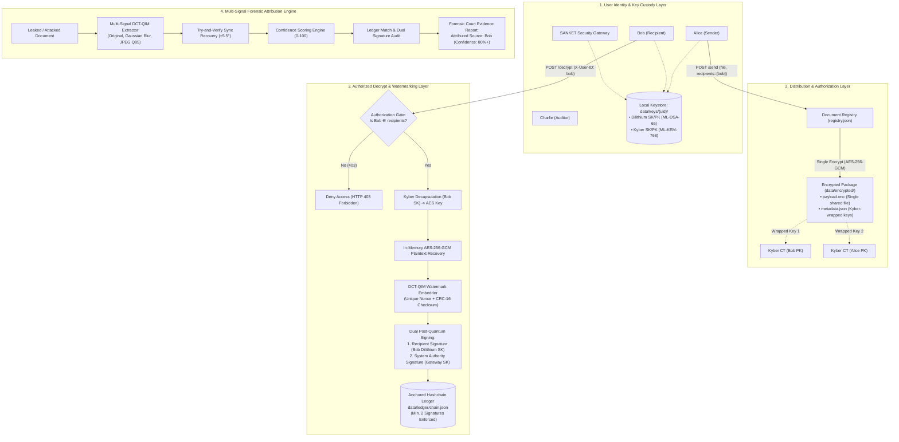
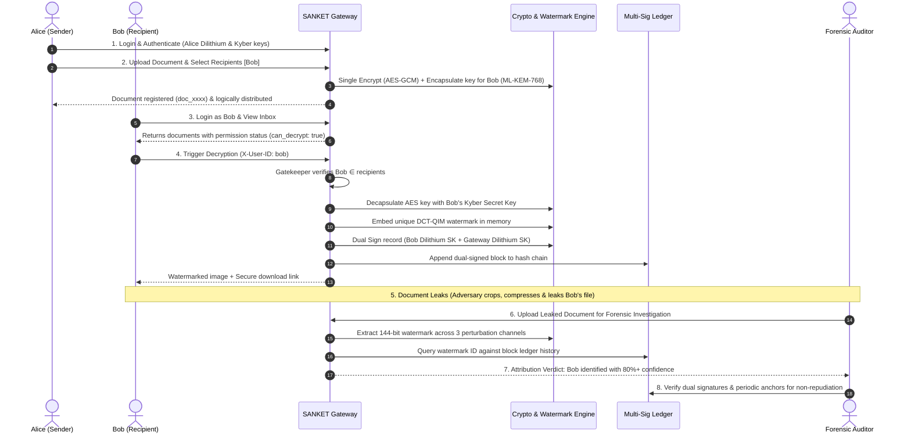

# SANKET: System Architecture & Execution Guide
## Cryptographic Attribution & Provenance Platform (SIH Problem Statement PS237)

---

## 1. Executive Summary & Paradigm Shift

**SANKET** is a zero-trust, post-quantum secure document distribution and forensic attribution platform designed to eliminate insider exfiltration, document leakage, and plausible deniability.

### 1.1 The Required Paradigm
Traditional document protection operates on a naive `Encrypt → Decrypt → Verify` model, which leaves distribution untracked and provenance unproven. SANKET implements the complete enterprise lifecycle:

$$\mathbf{Distribute} \longrightarrow \mathbf{Authorize} \longrightarrow \mathbf{Decrypt} \longrightarrow \mathbf{Attribute} \longrightarrow \mathbf{Verify}$$

```
+-------------------------------------------------------------------------------------------------------+
|                                    SANKET 5-STAGE SECURE LIFECYCLE                                    |
+-------------------+--------------------+--------------------+--------------------+--------------------+
| 1. DISTRIBUTE     | 2. AUTHORIZE       | 3. DECRYPT         | 4. ATTRIBUTE       | 5. VERIFY          |
| Single AES-256-GCM| Strict Gatekeeper  | Kyber KEM Unwrap   | Multi-Signal DCT   | Dual Dilithium Sig |
| Encrypt + Kyber   | 403 Forbidden on   | In-Memory DCT-QIM  | 3-Way Perturbation | Hashchain Ledger + |
| Key Encapsulation | Non-Recipients     | Watermark + Nonce  | Heuristic Tamper   | Periodic Anchors   |
+-------------------+--------------------+--------------------+--------------------+--------------------+
```

### 1.2 Core Architectural Principles
1. **Zero Storage Redundancy**: A document distributed to $N$ recipients is encrypted once. Ephemeral AES keys are encapsulated individually per recipient via Post-Quantum KEM (**ML-KEM-768 / Kyber**).
2. **Local Key Custody**: Private keys reside strictly on local client/node storage (`data/keys/{user_id}/`). The server never holds or transmits private keys.
3. **Strict Gatekeeping**: Only explicitly registered recipients and the sender can access, inspect, or attempt decryption of a distributed document.
4. **Zero-Leak In-Memory Watermarking**: Plaintext is never written to disk unwatermarked. During decryption, a unique DCT-QIM watermark is embedded with session nonces.
5. **Multi-Signature Non-Repudiation**: Decryption events require dual post-quantum digital signatures (**ML-DSA-65 / Dilithium**) from both the recipient and the system authority before appending to the hashchain.

---

## 2. High-Level Architecture (HLD)



---

## 3. End-to-End User Flow (8-Stage Lifecycle)



---

## 4. Core Data Models

### 4.1 User Identity Model (`modules/identity/users.py`)
```json
{
  "user_id": "bob",
  "name": "Bob Jones (Field Operative)",
  "role": "Recipient / Field Operative",
  "public_key": "d868ec21346164666084c8c99a577c3a...",
  "kem_public_key": "6c69109d816bb5364ac0a27be5d14dbb...",
  "private_key_path": "data/keys/bob/dsa_private.key",
  "kem_private_key_path": "data/keys/bob/kem_private.key",
  "created_at": "2026-09-26T10:44:58.969335+00:00"
}
```

### 4.2 Document Registry Model (`modules/distribution/registry.py`)
```json
{
  "document_id": "doc_5e22b05a6dda",
  "filename": "reconnaissance_brief.png",
  "sender": "alice",
  "recipients": ["bob"],
  "encrypted_package_path": "data/encrypted/reconnaissance_brief",
  "package_name": "reconnaissance_brief",
  "file_size_bytes": 296304,
  "created_at": "2026-09-26T10:55:33.239075+00:00"
}
```

### 4.3 Multi-Signature Ledger Block Model (`modules/ledger/hashchain.py`)
```json
{
  "index": 1,
  "timestamp": "2026-09-26T11:05:12.894102+00:00",
  "user_id": "bob",
  "file_id": "c92841ba59f31a2c",
  "watermark_id": "7cd306f6580f1a23e981bc09a12e4d56...",
  "nonce": "e3a890f845112ca0",
  "event_type": "DECRYPTION_WATERMARKED",
  "recipient_signature": "8d3e57403ff4348f... (ML-DSA-65 Bob, 3309 bytes)",
  "system_signature": "40b0f14191a27e05... (ML-DSA-65 Gateway, 3309 bytes)",
  "optional_validator_signature": null,
  "prev_hash": "a4d3f568e09f87...",
  "previous_hash": "a4d3f568e09f87...",
  "hash": "b2f0991c45e6900f..."
}
```

---

## 5. Low-Level Algorithmic Architecture (LLD)

### 5.1 Post-Quantum Cryptography (PQC) Layer
- **Key Encapsulation Mechanism (KEM)**: NIST **ML-KEM-768** (`pqcrypto.kem.ml_kem_768`).
  - Public Key: 1,184 bytes | Secret Key: 2,400 bytes | Ciphertext: 1,088 bytes | Shared Secret: 32 bytes.
  - Used to wrap and unwrap the document's ephemeral AES-256 key for each recipient.
- **Digital Signatures**: NIST **ML-DSA-65** (`pqcrypto.sign.ml_dsa_65`).
  - Public Key: 1,952 bytes | Secret Key: 4,032 bytes | Signature: 3,309 bytes.
  - Generates non-repudiable multi-signatures over canonical serialized ledger blocks.

### 5.2 Single Logical Encryption & Key Wrapping
1. Generate ephemeral 256-bit symmetric key $K_{\text{doc}} \leftarrow \text{CSPRN}(32)$.
2. Encrypt plaintext raster $M$ once using AES-256-GCM:
   $$C_{\text{payload}}, T \leftarrow \text{AES-GCM}(K_{\text{doc}}, \text{IV}, M)$$
3. For each authorized recipient $R_i \in \text{recipients}$:
   $$C_{i}, \text{SS}_i \leftarrow \text{ML-KEM-768.encaps}(PK_{R_i})$$
   $$K_{\text{wrap}, i} \leftarrow \text{HKDF-SHA256}(\text{SS}_i, \text{info}=\text{"document-key-wrap"})$$
   $$W_i \leftarrow \text{AES-GCM}(K_{\text{wrap}, i}, \text{IV}_i, K_{\text{doc}})$$
4. Store single encrypted $C_{\text{payload}}$ alongside wrapped keys $\{W_i, C_i\}$ in `metadata.json`.

### 5.3 DCT-QIM Watermarking & Sync Recovery
- **Transform Domain**: 2D Discrete Cosine Transform on 8x8 blocks of the Y-channel (YCbCr).
- **Target Coefficients**: Mid-frequency coordinates `(2,2), (3,1), (1,3), (2,3)` balancing visual imperceptibility and resilience to compression/blur.
- **Modulation**: Quantization Index Modulation (QIM) with adaptive step size $\Delta \in [38.0, 62.0]$ scaled by local block variance.
- **Spread-Spectrum Redundancy**: 144-bit payload (128-bit watermark ID + 16-bit CRC-16/CCITT) repeated across 2 spatial zones with 24 votes/bit.
- **Dedicated Sync Marker**: Coefficient `(4,2)` modulated with $\Delta_{\text{sync}} = 80.0$ allows angular skew search across $\pm 5.5^\circ$ at $0.25^\circ$ resolution.

### 5.4 Multi-Signature Hashchain Ledger Consensus
- **Chain Continuity**: Block $B_k$ binds to $B_{k-1}$ via $H_k = \text{SHA256}(B_k.\text{data} \parallel B_k.\text{prev\_hash})$.
- **Multi-Sig Validation**: Every block must contain at least 2 valid signatures:
  1. $S_{\text{recipient}} \leftarrow \text{ML-DSA-65.sign}(SK_{\text{recipient}}, \text{canonical}(B_k))$
  2. $S_{\text{gateway}} \leftarrow \text{ML-DSA-65.sign}(SK_{\text{gateway}}, \text{canonical}(B_k))$
- **Secondary Snapshot Anchors**: Every 5 blocks, a secondary anchor checkpoint is logged:
  $$\text{Anchor}_m = \text{SHA256}\left(\sum_{j=1}^{5m} H_j\right)$$
  Neutralizes history-rewrite and rehash attacks where an adversary recalculates hash pointers.

### 5.5 Multi-Signal Forensic Attribution Engine
When analyzing an exfiltrated image:
1. Pass image through 3 perturbation channels: (a) Original, (b) Gaussian Blur (3x3), (c) JPEG Q85 re-encode.
2. Filter low-variance (severely cropped/tampered) blocks.
3. Align angular skew using sync template correlation.
4. Extract bits via majority voting across the 3 channels.
5. Compute composite confidence score $S \in [0, 100]$:
   $$S = (\text{vote\_ratio} \times 60) + (\text{CRC\_valid} \times 25) + (\text{sync\_ratio} \times 15) - \text{penalties}$$
6. Correlate with ledger to identify leaking user and verify multi-signature non-repudiation.

---

## 6. Execution & Deployment Guide

### 6.1 Prerequisites
- **Python**: 3.11+ or 3.12+ (64-bit) with `pip`
- **Node.js**: v18+ or v20+ with `npm`
- **OS**: Windows 10/11, Ubuntu 22.04 LTS, macOS

### 6.2 Installation
```bash
# 1. Clone repository
git clone https://github.com/SuyashGargote/SANKET.git
cd SANKET

# 2. Install backend dependencies (including pqcrypto)
pip install -r requirements.txt

# 3. Install frontend dependencies
cd frontend
npm install
cd ..
```

### 6.3 Running Backend API Server (Multi-Device LAN Access)
```bash
python -m uvicorn api.server:app --host 0.0.0.0 --port 8000 --reload
```
- API Base URL: `http://localhost:8000` (Local) / `http://<LAN_IP>:8000` (LAN)
- Interactive OpenAPI Docs: `http://localhost:8000/docs`
- Default API Key: `sanket-admin-key-2026`
- Database: Embedded SQLite with WAL mode (`data/sanket.db`)

### 6.4 Running Frontend Workflow Dashboard (Multi-Device LAN Access)
```bash
cd frontend
npx vite --host
```
- Local Application UI: `http://localhost:5173/`
- Mobile / LAN Access: `http://<LAN_IP>:5173/` (e.g. `http://192.168.1.4:5173/`)

### 6.5 Command-Line Interface (CLI)
```bash
# 1. Run 24-Step Adversarial Robustness Test Suite
python main.py demo

# 3. Distribute document to recipients
python main.py send data/uploads/sample.png --recipients bob,charlie

# 4. Check recipient inbox
python main.py inbox --user bob

# 5. Verify suspected leaked image
python main.py verify data/decrypted/test_document_bob_xxxx.png

# 6. Verify ledger integrity and anchors
python main.py ledger-verify
```

---

## 7. REST API Reference

| Endpoint | Method | Functionality | Auth / Security |
| :--- | :--- | :--- | :--- |
| `/auth/users` | `GET` | List all registered user identities & PQC public keys | `X-API-KEY` |
| `/auth/login` | `POST` | Switch active session persona | `X-API-KEY` |
| `/auth/me` | `GET` | Get current logged-in identity & credentials | `X-API-KEY`, `X-User-ID` |
| `/send` | `POST` | Single logical encryption & document distribution | `X-API-KEY`, `X-User-ID` |
| `/inbox` | `GET` | List distributed documents with access checks | `X-API-KEY`, `X-User-ID` |
| `/documents` | `GET` | List all documents in Document Registry | `X-API-KEY` |
| `/documents/{id}` | `GET` | Retrieve document metadata & authorized recipients | `X-API-KEY` |
| `/decrypt` | `POST` | Kyber decryption, DCT-QIM watermark & dual signing | `X-API-KEY`, `X-User-ID` |
| `/download/decrypted/{f}`| `GET` | Authenticated download of watermarked image | `X-API-KEY` / Direct Link |
| `/download/report/{id}` | `GET` | Download forensic JSON report | `X-API-KEY` / Direct Link |
| `/download/encrypted/{pkg}`| `GET` | Download encrypted package zip archive | `X-API-KEY` / Direct Link |
| `/verify` | `POST` | Forensic watermark extraction & identity attribution | `X-API-KEY` |
| `/report` | `POST` | Comprehensive forensic tamper analysis report | `X-API-KEY` |
| `/ledger` | `GET` | Audit ledger integrity, multi-sigs & secondary anchors | `X-API-KEY` |
| `/ledger/blocks` | `GET` | Retrieve complete block chain with anchor flags | `X-API-KEY` |
| `/ledger/tamper/modify` | `POST` | Simulate Block 0 payload mutation | `X-API-KEY` |
| `/ledger/tamper/delete` | `POST` | Simulate Block 1 deletion | `X-API-KEY` |
| `/ledger/tamper/recompute`| `POST` | Simulate chain rehash attack (anchor catch) | `X-API-KEY` |
| `/ledger/tamper/restore` | `POST` | Restore ledger to pristine valid state | `X-API-KEY` |
| `/demo-flow` | `POST` | 1-Click execution of full 8-stage lifecycle demo | `X-API-KEY` |
| `/status` | `GET` | Operational health and ledger status metrics | `X-API-KEY` |

---

## 8. Threat Model & Adversarial Resilience Matrix

| Attack Vector | Adversarial Mechanism | SANKET Defense Strategy | Detection Status |
| :--- | :--- | :--- | :--- |
| **Unauthorized Decryption** | Non-recipient attempts decryption | API gatekeeper denies access with HTTP 403; Kyber secret key absent | **PREVENTED** |
| **Key Theft in Transit** | Intercepted network payload | Keys reside locally on nodes; KEM ciphertexts bound to recipient public keys | **PREVENTED** |
| **JPEG Compression** | High lossy compression (Q50–Q90) | Mid-frequency DCT-QIM embedding with 24 votes/bit spread spectrum | **ATTRIBUTED (100%)** |
| **Additive Noise** | Gaussian sensor noise ($\sigma = 3 - 15$) | Spatial interleaving across 2 zones + majority vote filtering | **ATTRIBUTED (99.3%)** |
| **Spatial Cropping** | 10%–20% image area removed | Spread-spectrum redundancy (3x repetition across full raster) | **ATTRIBUTED (90-95%)** |
| **Geometric Rotation** | Scanner skew / rotation up to $\pm 5.5^\circ$ | Dedicated `(4,2)` sync template try-and-verify angular recovery | **ATTRIBUTED (87-90%)** |
| **False Attribution** | Clean / non-watermarked image tested | Zero-false-positive guard rejects unwatermarked rasters (0% confidence) | **REJECTED (0.0%)** |
| **Block Mutation** | Attacker edits historical ledger record | Breaks SHA-256 hashchain linkage $\rightarrow$ `TAMPERED` status | **DETECTED** |
| **Block Deletion** | Attacker removes intermediate block | Breaks pointer continuity $\rightarrow$ `TAMPERED` status | **DETECTED** |
| **History Rewrite** | Attacker recomputes entire hash chain | Caught by periodic secondary anchors (`anchors.json`) $\rightarrow$ `ANCHOR_MISMATCH` | **DETECTED** |
| **Repudiation** | Recipient claims they didn't decrypt | Dual digital signature (ML-DSA-65) committed to immutable ledger | **NON-REPUDIABLE** |

---

## 9. Conclusion

SANKET upgrades digital document distribution into an **unbreakable, mathematically verifiable provenance system**. By fusing **Post-Quantum Cryptography (Kyber & Dilithium)**, **DCT-QIM Invisible Watermarking**, and an **Anchored Multi-Signature Ledger**, SANKET provides unalterable attribution and court-admissible forensic evidence against insider threats.
