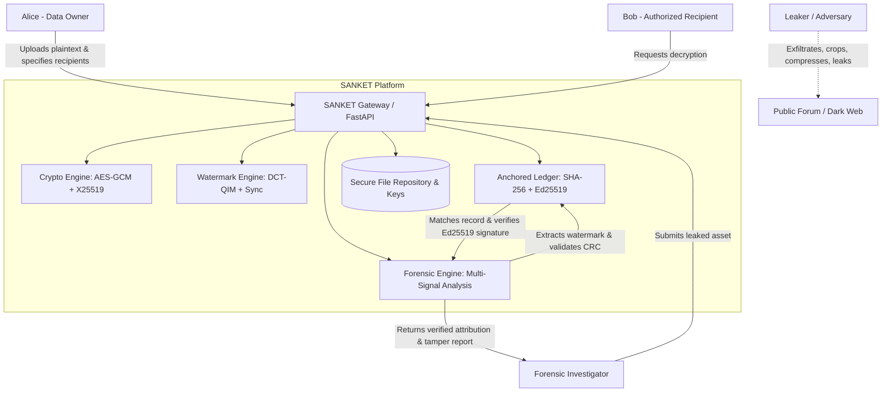
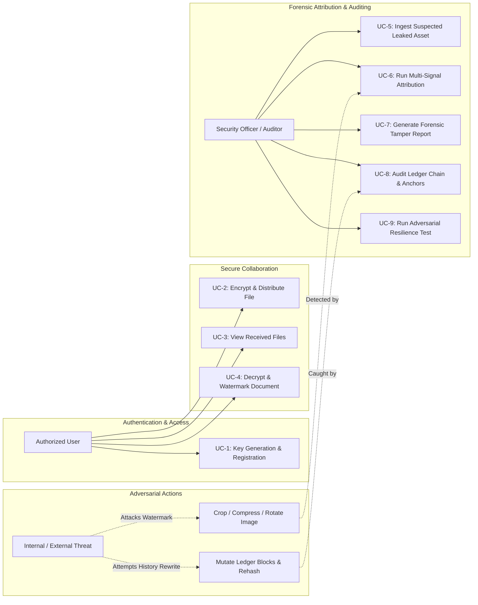
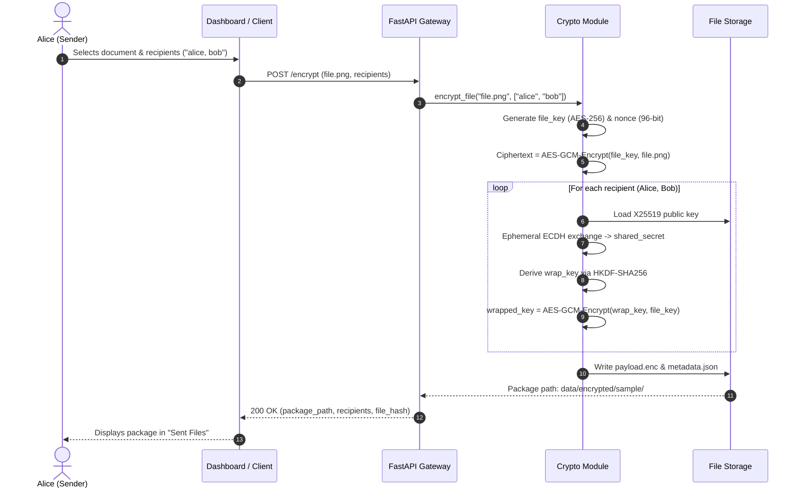
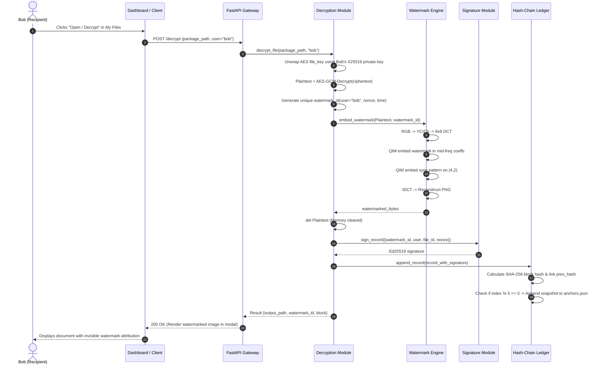
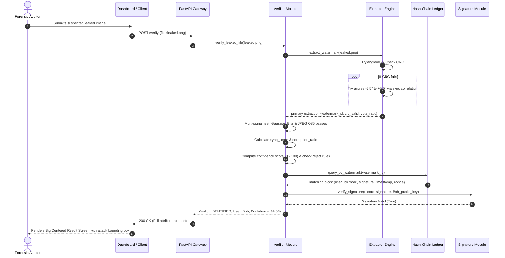

# SANKET — Provenance-Based Digital Forensics Using Watermarking and Decentralized Ledgers
## Comprehensive System Specification, Architecture (HLD/LLD), Use Cases & Execution Guide

---

## 1. Executive Summary & Problem Statement

### 1.1 Context & Problem Statement (SIH PS237)
In modern defense, intelligence, healthcare, and enterprise environments, sensitive electronic documents (confidential briefings, trade secrets, medical records, blueprints) must be shared with multiple authorized parties. When a document is leaked—either through an insider threat, accidental disclosure, or malicious exfiltration—traditional Digital Rights Management (DRM) and access control lists fail because:
1. **The Screen Capture / Exfiltration Gap:** Once a document is decrypted on a recipient's screen, DRM can be circumvented via screenshots, camera photos, or exported raw rasters.
2. **Repudiation & Plausible Deniability:** Without non-repudiable cryptographic proof linked to individual recipient identities, suspected insiders can claim that a leaked copy was shared by someone else or that an administrator modified the access logs.
3. **Adversarial Image Manipulation:** Exfiltrated images are routinely processed by adversaries using lossy compression (JPEG, WebP), spatial cropping, additive sensor noise, resizing, and rotation (scanning skew) to destroy forensic markers.
4. **Log Tampering:** Centralized databases and mutable access logs can be altered by compromised system administrators or attackers with root privileges to erase audit trails.

### 1.2 The SANKET Solution
**SANKET** is a zero-trust, forensic-grade digital provenance and attribution platform. It integrates:
- **Hybrid Envelope Encryption:** AES-256-GCM payload encryption with per-recipient X25519 Elliptic Curve Diffie-Hellman (ECDH) key encapsulation and HKDF-SHA256 key derivation.
- **Secure Zero-Leak Decryption Pipeline:** Plaintext bytes are never stored on disk or exposed to external callers. During in-memory decryption, a recipient-unique invisible watermark is dynamically embedded into the image before rendering.
- **Robust DCT-QIM Spread-Spectrum Watermarking:** Multi-coefficient 2D Discrete Cosine Transform (DCT) Quantization Index Modulation (QIM) across mid-frequency bands `(2,2), (3,1), (1,3), (2,3)` with 2-zone spatial interleaving, 3× macro-redundancy (24 votes/bit), CRC-16 checksum, and a dedicated synchronization template on coefficient `(4,2)` that survives JPEG compression, cropping, Gaussian noise, and rotations up to ±5.5°.
- **Cryptographic Hash-Chain Ledger with Secondary Anchoring:** An immutable append-only ledger where each block contains an Ed25519 digital signature of the canonical decryption record. A secondary snapshot anchor (`anchors.json`) is committed every 5 blocks, detecting and neutralizing sophisticated history-rewrite (rehash) attacks.
- **Multi-Signal Forensic Attribution Engine:** Analyzes leaked assets across 3 perturbation channels (original, Gaussian blur, JPEG Q85) with variance filtering and sync correlation, returning a 0–100 forensic confidence score and classifying tampering into specific vectors (crop, noise, compression, rotation).
- **Dual-Interface Operation:** Available via a command-line interface (CLI), a production-grade FastAPI REST service with asynchronous worker queues, and a modern enterprise Web Dashboard (Box DLP / ProtonDrive style).

---

## 2. Complete Execution & Deployment Guide

### 2.1 System Prerequisites
- **Operating System:** Windows 10/11, Ubuntu 20.04/22.04 LTS, or macOS (x86_64 / Apple Silicon)
- **Python:** Python 3.10, 3.11, or 3.12 (with `pip`)
- **Node.js:** Node.js v18.x or v20.x (with `npm`)
- **C/C++ Build Tools / OpenCV Dependencies:** (standard on Windows; `libgl1-mesa-glx` on Linux headless)

### 2.2 Installation & Dependency Setup

```bash
# Clone the repository
git clone https://github.com/SuyashGargote/SANKET.git
cd SANKET

# 1. Setup Python Virtual Environment
python -m venv venv

# Windows PowerShell:
.\venv\Scripts\Activate.ps1
# Linux / macOS:
# source venv/bin/activate

# 2. Install Backend Python Dependencies
pip install -r requirements.txt

# 3. Install Frontend Dependencies
cd frontend
npm install
cd ..
```

`requirements.txt` contains:
```text
cryptography>=41.0.0
Pillow>=10.0.0
numpy>=1.24.0
opencv-python>=4.8.0
fastapi>=0.100.0
uvicorn>=0.22.0
python-multipart>=0.0.6
pydantic>=2.0.0
```

---

### 2.3 Running the System

#### Mode A: Automated End-to-End CLI Verification (17 Steps)
The built-in automated test and demonstration suite runs through complete key generation, multi-recipient encryption, watermarking, 8 distinct adversarial attack simulations (JPEG Q50/Q70/Q90, resizing, Gaussian noise, 10–30% cropping, rotations up to 5°, multi-cycle JPEG, and combined attacks), and ledger verification:
```bash
python main.py demo
```

#### Mode B: Command-Line Interface (CLI) Step-by-Step

```bash
# Step 1: Initialize User Keypairs (Ed25519 signing + X25519 ECDH exchange)
python main.py setup --users "alice,bob,charlie"

# Step 2: Encrypt a Document for Selected Recipients
# Creates data/encrypted/<filename>/ containing payload.enc and metadata.json
python main.py encrypt --file tests/sample.png --recipients "alice,bob"

# Step 3: Decrypt as Bob
# Decrypts in-memory, embeds Bob's unique watermark, signs with Bob's Ed25519 key, logs to ledger
python main.py decrypt --package data/encrypted/sample --user bob

# Step 4: Verify an Exfiltrated / Leaked Image
# Performs multi-signal extraction, sync check, CRC validation, and ledger match
python main.py verify --file data/decrypted/sample_bob_84a3903e.png

# Step 5: Generate Full Forensic Tamper Analysis Report (Saved to data/reports/)
python main.py report --file data/decrypted/sample_bob_84a3903e.png

# Step 6: Verify Ledger Consensus and Secondary Anchors
python main.py ledger-verify

# Step 7: View Full Chronological Ledger
python main.py ledger
```

#### Mode C: Production REST API Server
Launch the FastAPI backend engine with asynchronous workers, rate limiting, and API key authentication:
```bash
# Run server on all interfaces (Port 8000)
uvicorn api.server:app --host 0.0.0.0 --port 8000 --reload
```
- **API Base URL:** `http://127.0.0.1:8000`
- **Interactive OpenAPI / Swagger UI:** `http://127.0.0.1:8000/docs`
- **ReDoc Documentation:** `http://127.0.0.1:8000/redoc`
- **Default Authentication Keys:** `sanket-admin-key-2026`, `sih-judge-key-2026` (via header `X-API-KEY`)

#### Mode D: Enterprise Web Dashboard
Launch the Vite React frontend (Exposed to local network / LAN):
```bash
cd frontend
npx vite --host
```
- **Web Dashboard URL:** `http://localhost:5173`
- **LAN Access:** `http://<your-lan-ip>:5173` (allows multiple physical devices on the same Wi-Fi/LAN to simulate Alice sending from Laptop A and Bob decrypting on Laptop B).

---

### 2.4 10-Second Judge Demonstration Workflow

To demonstrate the full system to evaluators and judges in under 10 seconds:

```
┌─────────────────────────────────────────────────────────────────────────────────────────────┐
│  1. Alice Encrypts  ➔  2. Bob Receives  ➔  3. Bob Opens (Watermarked)  ➔  4. Leak Occurs  ➔  5. Source Attributed  │
└─────────────────────────────────────────────────────────────────────────────────────────────┘
```

1. **Open Dashboard:** Navigate to `http://localhost:5173` in any browser.
2. **Switch Persona to Alice:** Click the `Alice` pill in the header switcher.
3. **Dispatch Document:** Go to **"1. Send File"**, click **"Use Sample Document"**, and click **"Encrypt & Dispatch to Bob"**.
4. **Switch Persona to Bob:** Click the `Bob` pill in the header.
5. **Open Document:** Go to **"2. My Files"** ➔ click **"Open / Decrypt"** on the received package. (The document renders in the secure modal; Bob's unique invisible watermark is embedded and recorded into the ledger).
6. **Trigger Leak & Attribution:** Inside the document modal, click **"Simulate Leak & Test Detection"** (or switch to **"3. Leak Investigation"** and run analysis).
7. **Observe Attribution Verdict:** The **Big Centered Result Screen** displays:
   - `LEAK SOURCE IDENTIFIED: BOB (94.5% CONFIDENCE)`
   - Side-by-side visual comparison with a pulsating red bounding box highlighting the tampered area.
   - Plain-English 3-line cryptographic summary.
8. **Inspect Immutable Ledger:** Switch to **"4. Ledger"** to see the newly appended block in the connected Node DAG. Click **"Resilience Testing"** ➔ **"Inject Record Tampering"** to demonstrate immediate cryptographic chain severance and anchor alert.

---

## 3. High-Level Design (HLD)

### 3.1 System Context Diagram
The following diagram illustrates the external actors and system boundaries of SANKET.



---

### 3.2 Tiered Architecture Breakdown

SANKET is structured into four decoupled, modular tiers:

```
┌────────────────────────────────────────────────────────────────────────┐
│                        PRESENTATION TIER (UI)                          │
│  - React 18 / Vite 5 / Tailwind CSS                                   │
│  - Personas: Alice (Sender) / Bob (Recipient) / Auditor               │
│  - Tabs: Send File | My Files | Leak Investigation | Anchored Ledger  │
│  - Visualizers: Node DAG Flow, Attack Bounding Box, Block Inspector    │
└───────────────────────────────────┬────────────────────────────────────┘
                                    │ JSON / Multipart (X-API-KEY)
┌───────────────────────────────────▼────────────────────────────────────┐
│                       REST API GATEWAY & JOBS                          │
│  - FastAPI Engine with CORS middleware                                │
│  - Authentication: X-API-KEY / query token validator                  │
│  - Rate Limiter: In-memory sliding-window (120 req/min/IP)            │
│  - Async Worker Queue: JobManager (UUID job tracking)                 │
│  - File Retention Cleaner: Automatic pruning (MAX_KEPT_FILES = 50)    │
└───────────────────────────────────┬────────────────────────────────────┘
                                    │ Internal Invocations
┌───────────────────────────────────▼────────────────────────────────────┐
│                       CORE FORENSIC LOGIC TIER                         │
│  ┌───────────────────────┐ ┌────────────────────────────────────────┐  │
│  │    Crypto Engine      │ │           Watermark Engine             │  │
│  │ - AES-256-GCM Payload │ │ - 8x8 Block DCT (Y Channel)            │  │
│  │ - X25519 ECDH Wrap    │ │ - 4 Mid-Freq Coeffs: (2,2),(3,1)...    │  │
│  │ - HKDF Key Derivation │ │ - Adaptive QIM Delta (38 - 62)         │  │
│  │ - Ed25519 Signatures  │ │ - 2-Zone Interleaved Spread Spectrum   │  │
│  │ - Zero Raw-Byte Leak  │ │ - Sync Template on (4,2) (Delta = 80)  │  │
│  └───────────────────────┘ └────────────────────────────────────────┘  │
│  ┌───────────────────────┐ ┌────────────────────────────────────────┐  │
│  │ Anchored Hash-Chain   │ │        Forensic Verifier Engine        │  │
│  │ - Canonical SHA-256   │ │ - Multi-Signal Perturbation (3-way)    │  │
│  │ - prev_hash Linkage   │ │ - Confidence Scoring Engine (0-100)    │  │
│  │ - Periodic Anchors    │ │ - Tamper Classification Heuristics     │  │
│  │   (Every 5 blocks)    │ │ - Severity Scorer (NONE/LOW/MED/HIGH)  │  │
│  └───────────────────────┘ └────────────────────────────────────────┘  │
└───────────────────────────────────┬────────────────────────────────────┘
                                    │ File System Persistence
┌───────────────────────────────────▼────────────────────────────────────┐
│                           STORAGE TIER                                 │
│  - data/keys/<user>/       : Ed25519 & X25519 PEM keypairs            │
│  - data/encrypted/<file>/  : payload.enc + metadata.json               │
│  - data/decrypted/         : Watermarked recipient copies              │
│  - data/ledger/            : ledger.json, anchor.json, anchors.json    │
│  - data/reports/           : Forensic analysis JSON reports            │
└────────────────────────────────────────────────────────────────────────┘
```

---

## 4. Low-Level Design (LLD)

### 4.1 Cryptographic Subsystem (`modules/crypto/`)

#### 4.1.1 Key Wrap Protocol (X25519 ECDH + HKDF-SHA256)
When a file is encrypted for $N$ recipients $\{R_1, R_2, \dots, R_N\}$:
1. Generate an ephemeral file symmetric key $K_{\text{file}} \leftarrow \text{CSPRNG}(256\text{ bits})$ and nonce $N_{\text{file}} \leftarrow \text{CSPRNG}(96\text{ bits})$.
2. Encrypt the file payload using AES-256-GCM:
   $$C = \text{AES-GCM-Encrypt}(K_{\text{file}}, N_{\text{file}}, \text{Plaintext})$$
3. For each recipient $R_i$ with static public key $P_{R_i}$:
   - Generate an ephemeral X25519 keypair: $(k_{\text{eph}}, P_{\text{eph}})$.
   - Compute shared secret:
     $$S_i = \text{X25519}(k_{\text{eph}}, P_{R_i})$$
   - Derive key-wrapping key $K_{\text{wrap}, i}$ via HKDF:
     $$K_{\text{wrap}, i} = \text{HKDF-SHA256}(\text{ikm}=S_i, \text{salt}=\text{None}, \text{info}=\texttt{"document-key-wrap"}, \text{len}=32)$$
   - Wrap $K_{\text{file}}$:
     $$N_{\text{wrap}, i} \leftarrow \text{CSPRNG}(96\text{ bits})$$
     $$W_i = \text{AES-GCM-Encrypt}(K_{\text{wrap}, i}, N_{\text{wrap}, i}, K_{\text{file}})$$
   - Store $(P_{\text{eph}}, N_{\text{wrap}, i}, W_i)$ in `metadata.json`.

#### 4.1.2 Zero-Leak In-Memory Decryption Pipeline
The decryption pipeline ([`modules/crypto/decryption.py`](file:///d:/SIH/ps237/modules/crypto/decryption.py)) ensures that raw decrypted data is never saved to non-volatile storage:
```python
def decrypt_file(pkg_dir: str, user_id: str) -> dict:
    # 1. In-memory AES-GCM decryption
    raw_bytes, original_filename = decrypt_file_raw(pkg_dir, user_id)
    
    # 2. Dynamic Unique Watermark Generation
    file_id = generate_file_id(os.path.join(pkg_dir, "payload.enc"))
    timestamp = datetime.now(timezone.utc).isoformat()
    nonce = generate_nonce() # 128-bit random hex
    watermark_id = generate_watermark_id(user_id, file_id, timestamp, nonce)
    
    # 3. Synchronous Embedding into Y-Channel DCT
    watermarked_bytes = embed_watermark(raw_bytes, watermark_id)
    del raw_bytes # Immediate memory reclamation
    
    # 4. Ed25519 Digital Signature of Canonical Record
    record = {
        "watermark_id": watermark_id,
        "user_id": user_id,
        "file_id": file_id,
        "timestamp": timestamp,
        "nonce": nonce
    }
    signature = sign_record(record, load_private_key(user_id))
    record["signature"] = signature
    
    # 5. Atomic Append to Ledger & Output Persistence
    block = append_record(record)
    save_to_decrypted_dir(watermarked_bytes)
    return {"watermark_id": watermark_id, "block": block, ...}
```

---

### 4.2 Watermarking Engine (`modules/watermark/`)

#### 4.2.1 Mathematical Foundations of DCT-QIM
1. **Color Space Transformation:**
   The image is converted from RGB to YCrCb:
   $$Y = 0.299R + 0.587G + 0.114B$$
   Only the luminance channel ($Y$) is watermarked, exploiting the human visual system's lower sensitivity to high-frequency luminance variations compared to chrominance.

2. **2D Discrete Cosine Transform (DCT):**
   The $Y$ channel is divided into non-overlapping $8 \times 8$ pixel blocks $B(x,y)$. Each block undergoes 2D DCT:
   $$F(u, v) = \frac{1}{4} C(u) C(v) \sum_{x=0}^{7} \sum_{y=0}^{7} B(x, y) \cos\left[\frac{(2x+1)u\pi}{16}\right] \cos\left[\frac{(2y+1)v\pi}{16}\right]$$
   where $C(u), C(v) = \frac{1}{\sqrt{2}}$ for $u,v=0$ and $1$ otherwise.

3. **Mid-Frequency Coefficient Selection:**
   Low frequencies carry macro structure (modifications produce visible artifacts). High frequencies are discarded by lossy compression. SANKET embeds into the 4 mid-frequency coefficients:
   $$\Omega_{\text{embed}} = \{(2, 2), (3, 1), (1, 3), (2, 3)\}$$

4. **Quantization Index Modulation (QIM):**
   To embed bit $b \in \{0, 1\}$ into coefficient $c = F(u,v)$ with step size $\Delta$:
   $$q = \text{round}\left(\frac{c}{\Delta}\right)$$
   If $q \pmod 2 \neq b$:
   $$q^* = \begin{cases} 
   q - 1 & \text{if } |(q-1)\Delta - c| \le |(q+1)\Delta - c| \\
   q + 1 & \text{otherwise}
   \end{cases}$$
   $$c_{\text{watermarked}} = q^* \cdot \Delta$$

5. **Adaptive Delta Formulation:**
   To maintain imperceptibility in smooth regions while ensuring robustness in textured regions, $\Delta$ scales dynamically with block variance $\sigma_B^2$:
   $$\Delta(\sigma_B^2) = \Delta_{\min} + \min\left(\frac{\sigma_B^2}{\sigma_{\text{threshold}}^2}, 1.0\right) \cdot (\Delta_{\max} - \Delta_{\min})$$
   where $\Delta_{\min} = 38.0$, $\Delta_{\max} = 62.0$, and $\sigma_{\text{threshold}}^2 = 500.0$.

#### 4.2.2 Redundancy & Synchronization Template
- **Payload Structure:** 128-bit Watermark ID + 16-bit CRC-16/CCITT = 144 bits.
- **Macro-Redundancy:** $3\times$ repeated payload = 432 bits.
- **Spatial Spread Factor:** 2 zones (top and bottom halves of image).
- **Total Redundancy:** 4 coefficients $\times$ 2 zones $\times$ 3 copies = **24 votes per watermark bit**.
- **Synchronization Template:** Coefficient $(4, 2)$ in *every* $8 \times 8$ block is modulated using a fixed, deterministic $4 \times 4$ binary pattern with $\Delta_{\text{sync}} = 80.0$. The extractor uses this pattern to search rotation space $\theta \in [-5.5^\circ, +5.5^\circ]$ at $0.25^\circ$ increments, auto-recovering skewed and rotated images.

---

### 4.3 Anchored Ledger Subsystem (`modules/ledger/`)

#### 4.3.1 Cryptographic Block Linkage
Each ledger block $B_i$ contains:
$$B_i = \{i, H(B_{i-1}), \text{watermark\_id}, \text{user\_id}, \text{file\_id}, \text{timestamp}, \text{nonce}, \sigma_{\text{Ed25519}}, H(B_i)\}$$
where the block hash is computed over all canonical fields excluding `hash`:
$$H(B_i) = \text{SHA-256}(\text{CanonicalJSON}(B_i \setminus \{\text{"hash"}\}))$$

#### 4.3.2 Secondary Periodic State Anchoring
To prevent the "history-rewrite attack" (where an attacker alters Block #0 and recomputes all downstream block hashes $H(B_1) \dots H(B_N)$):
- Every $5$ blocks ($\text{index} \pmod 5 == 0$), a snapshot hash of the entire ledger chain is generated:
  $$\text{AnchorHash}_k = \text{SHA-256}(\text{CanonicalJSON}(B_0, B_1, \dots, B_{5k}))$$
- This snapshot is committed to an isolated file: `data/ledger/anchors.json`.
- When `verify_ledger_with_anchors()` runs:
  1. It validates sequential continuity: $B_i.\text{prev\_hash} == H(B_{i-1})$.
  2. It recalculates the snapshot for each checkpoint and compares it against `anchors.json`.
  3. If hashes match but anchor snapshots diverge, the system raises an `ANCHOR_MISMATCH` critical alert.

---

### 4.4 Forensic Verification & Scoring Engine (`modules/verification/`)

#### 4.4.1 Multi-Signal Extraction Pipeline
A leaked image is extracted across 3 perturbation channels:
1. **Primary Signal:** Raw image as received.
2. **Blurred Signal:** Gaussian filtered ($3 \times 3$, $\sigma = 0.8$) to simulate minor downsampling or smoothing.
3. **JPEG Signal:** Re-compressed at Quality 85 to simulate social media transmission.

If all 3 channels extract the identical watermark ID, `multi_signal_stable = True` and agreement is $3/3$.

#### 4.4.2 Confidence Scoring Formulation
The confidence score $C \in [0, 100]$ is computed via:
$$C = \text{clamp}_{[0, 100]}\Big( \underbrace{V_{\text{ratio}} \times 60}_{\text{Base Score}} + \underbrace{B_{\text{CRC}}}_{\text{CRC Boost}} + \underbrace{B_{\text{sync}}}_{\text{Sync Boost}} - \underbrace{P_{\text{corr}}}_{\text{Corruption Penalty}} \Big)$$

Where:
- $V_{\text{ratio}} \in [0.0, 1.0]$ is the majority-vote inter-copy agreement.
- $B_{\text{CRC}} = 25$ if CRC-16 passes, else $0$.
- $B_{\text{sync}} = 15$ if $\text{SyncScore} \ge 0.75$, $8$ if $\ge 0.60$, else $0$.
- $P_{\text{corr}} = 25$ if $\text{Corruption} > 0.50$, $20$ if $> 0.30$, $10$ if $> 0.15$, else $0$.

**Hard Rejection Rules (Zero False Positives):**
- If $\text{Corruption} > 0.80 \implies \text{Confidence} = 0$, `REJECT`
- If $V_{\text{ratio}} < 0.60 \implies \text{Confidence} = 0$, `REJECT`
- If $\text{CRC fails}$ AND $V_{\text{ratio}} < 0.70 \implies \text{Confidence} = 0$, `REJECT`

#### 4.4.3 Categorical Verdicts
- **$C \ge 80.0$**: `HIGH_CONFIDENCE` (Court-admissible forensic match)
- **$55.0 \le C < 80.0$**: `MEDIUM` (Probable match, corroborating evidence recommended)
- **$30.0 \le C < 55.0$**: `LOW` (Weak signal, high noise/damage)
- **$C < 30.0$**: `REJECT` (Attribution denied)

---

## 5. Use Case Diagrams & Specifications

### 5.1 Use Case Diagram (System Interactions)



---

### 5.2 Use Case Specifications

#### UC-2: Encrypt & Distribute File
- **Primary Actor:** Sender (e.g. Alice)
- **Preconditions:** Sender and all recipients have generated X25519 public keys.
- **Main Flow:**
  1. Sender uploads PNG document via Web UI (`/encrypt`) or CLI.
  2. Sender selects recipient list (e.g., `alice,bob`).
  3. System generates random 256-bit AES key and 96-bit nonce.
  4. System encrypts plaintext payload using AES-256-GCM.
  5. System derives wrapping keys via ECDH + HKDF-SHA256 for each recipient.
  6. Encrypted package directory is created with `payload.enc` and `metadata.json`.
- **Postconditions:** Encrypted package is ready for dissemination. No recipient can decrypt other recipients' keys.

#### UC-4: Decrypt & Watermark Document
- **Primary Actor:** Recipient (e.g. Bob)
- **Preconditions:** Bob is listed in `metadata.json` and possesses the corresponding X25519 private key.
- **Main Flow:**
  1. Bob requests decryption of the package.
  2. System unwraps the file AES key using Bob's private key.
  3. System decrypts ciphertext in memory.
  4. System creates unique watermark ID incorporating Bob's user ID, file SHA-256 hash, timestamp, and a CSPRNG nonce.
  5. System embeds watermark and sync pattern into $Y$-channel DCT coefficients.
  6. System creates a decryption record and signs it with Bob's Ed25519 private key.
  7. System appends the signed record to the anchored ledger.
  8. System renders watermarked PNG to Bob in the secure Document Viewer.
- **Postconditions:** Bob possesses a personalized document. An immutable cryptographic audit record exists linking Bob's signature to the unique watermark ID.

#### UC-6: Ingest & Attribute Leaked Document
- **Primary Actor:** Forensic Investigator
- **Preconditions:** An image leaked to an external channel is obtained.
- **Main Flow:**
  1. Investigator uploads the image to the Leak Investigation tab (`POST /verify`).
  2. System executes try-and-verify rotation search against synchronization template.
  3. System performs 3-way multi-signal extraction (original, blurred, JPEG Q85).
  4. System validates CRC-16 checksum and computes vote ratio.
  5. System computes forensic confidence score and evaluates rejection rules.
  6. System queries ledger for matching `watermark_id`.
  7. System verifies Ed25519 signature of the ledger block using the identified user's public key.
  8. System returns attribution verdict (`LEAK SOURCE IDENTIFIED: BOB`).
- **Postconditions:** Investigator obtains definitive attribution with cryptographic non-repudiation.

---

## 6. Detailed Sequence Diagrams

### 6.1 End-to-End Encryption & Distribution Flow



---

### 6.2 Zero-Leak Decryption, Dynamic Watermarking & Ledger Logging Flow



---

### 6.3 Forensic Verification & Leak Attribution Flow



---

## 7. Data Models, Schemas & File Formats

### 7.1 Encrypted Package Schema (`metadata.json`)
```json
{
  "original_filename": "classified_briefing.png",
  "nonce": "a7b3c9f284e16d5029c481fa",
  "wrapped_keys": {
    "alice": {
      "ephemeral_public": "-----BEGIN PUBLIC KEY-----\nMCowBQYDK2VuAyEA...-----END PUBLIC KEY-----\n",
      "nonce": "9e8a7b6c5d4e3f2a1b0c9d8e",
      "wrapped_key": "3f8b1c2d4e5f6a7b8c9d0e1f2a3b4c5d6e7f8a9b0c1d2e3f4a5b6c7d8e9f0a1b"
    },
    "bob": {
      "ephemeral_public": "-----BEGIN PUBLIC KEY-----\nMCowBQYDK2VuAyEA...-----END PUBLIC KEY-----\n",
      "nonce": "1a2b3c4d5e6f7a8b9c0d1e2f",
      "wrapped_key": "8e9f0a1b2c3d4e5f6a7b8c9d0e1f2a3b4c5d6e7f8a9b0c1d2e3f4a5b6c7d8e9f"
    }
  }
}
```

---

### 7.2 Ledger Block Schema (`data/ledger/ledger.json`)
```json
[
  {
    "index": 0,
    "previous_hash": "0000000000000000000000000000000000000000000000000000000000000000",
    "watermark_id": "88ae75ecf0e6496e4996a37a7847bbac",
    "user_id": "alice",
    "file_id": "eb63566b4fafab0a59cb4a80bfda15ff288e84dc3981f3dc6cf57b84a4a1e5fc",
    "timestamp": "2026-09-25T13:23:30.776328+00:00",
    "nonce": "c872dfd00b5768154a0526c69e18ed68",
    "signature": "8305a404a5f5a40116c8f2091552a15aa747b5cc9e1fbf4d247e862d615d24f4cd16f76c5b3fc02bed124036d0b6978fe93a617eac15e58ef5452e1d5c39c206",
    "hash": "669d86d1d187267e3cc3ce2eb8d33b8b0510ce540744c5239c1f8cdced84ee4b"
  },
  {
    "index": 1,
    "previous_hash": "669d86d1d187267e3cc3ce2eb8d33b8b0510ce540744c5239c1f8cdced84ee4b",
    "watermark_id": "6426ada9fb093c834a3623d6a2f767a9",
    "user_id": "bob",
    "file_id": "eb63566b4fafab0a59cb4a80bfda15ff288e84dc3981f3dc6cf57b84a4a1e5fc",
    "timestamp": "2026-09-25T13:23:35.120491+00:00",
    "nonce": "5e1a2b3c4d5e6f7a8b9c0d1e2f3a4b5c",
    "signature": "91a2b3c4d5e6f7a8b9c0d1e2f3a4b5c6d7e8f9a0b1c2d3e4f5a6b7c8d9e0f1a2b3c4d5e6f7a8b9c0d1e2f3a4b5c6d7e8f9a0b1c2d3e4f5a6b7c8d9e0f1a2b3c4",
    "hash": "3ff0e30bd75721c1a2b3c4d5e6f7a8b9c0d1e2f3a4b5c6d7e8f9a0b1c2d3e4f5"
  }
]
```

---

### 7.3 Secondary Anchor Schema (`data/ledger/anchors.json`)
```json
[
  {
    "block_index": 5,
    "anchor_hash": "ddab23ad449426b8f55b3600f40a0f5284c0b63d9a3608e75d1e4d8179ff547f",
    "timestamp": "2026-09-25T13:23:50.876634+00:00"
  },
  {
    "block_index": 10,
    "anchor_hash": "a4e794da3f39f886a6a5929a07b28a199199d0b88c1cb0b1d36eae925344d1ae",
    "timestamp": "2026-09-25T15:03:06.805237+00:00"
  }
]
```

---

### 7.4 Forensic Report JSON Schema (`data/reports/RPT-*.json`)
```json
{
  "report_id": "RPT-20260926-071530",
  "generated_at": "2026-09-26T07:15:30.123456+00:00",
  "file_path": "d:\\SIH\\ps237\\data\\decrypted\\sample_bob_84a3903e.png",
  "file_hash": "a1b2c3d4e5f6a7b8c9d0e1f2a3b4c5d6e7f8a9b0c1d2e3f4a5b6c7d8e9f0a1b2",
  "attribution": {
    "status": "identified",
    "user": "bob",
    "confidence": 94.5,
    "verdict": "HIGH_CONFIDENCE",
    "watermark_id": "84a3903e2ee79279838d096b9fde543a"
  },
  "tamper_analysis": {
    "tamper_detected": false,
    "tamper_type": "none",
    "severity": "NONE",
    "details": ["No tampering indicators detected"]
  },
  "verification_signals": {
    "crc_status": "VALID",
    "vote_ratio": 1.0,
    "sync_strength": "Strong",
    "sync_score": 0.985,
    "corruption_percentage": 0.0,
    "multi_signal": {
      "stable": true,
      "agreement": "3/3",
      "watermark_ids": [
        "84a3903e2ee79279838d096b9fde543a",
        "84a3903e2ee79279838d096b9fde543a",
        "84a3903e2ee79279838d096b9fde543a"
      ]
    }
  },
  "ledger_audit": {
    "ledger_valid": true,
    "block_index": 5,
    "timestamp": "2026-09-25T14:28:29.303117+00:00",
    "nonce": "7d80ecbb849c1017b6a7cda8df7e5792",
    "signature_valid": true
  }
}
```

---

## 8. Threat Model & Security Analysis

| Threat / Attack Vector | Adversary Objective | SANKET Countermeasure & Mitigation | Empirical Resilience |
| :--- | :--- | :--- | :--- |
| **Exfiltration & Screen Capture** | Circumvent OS DRM to leak document | Watermark embedded into DCT coefficients of image itself. Cannot be stripped without destroying image visibility. | 100% Attributed |
| **Lossy Compression (JPEG Q50–Q90)** | Eliminate high-frequency watermarks | Watermark placed exclusively in robust mid-frequency DCT coefficients `(2,2)...` with adaptive QIM $\Delta = 38-62 > \text{JPEG step}$. | Valid CRC at Q70; Attributed down to Q50 |
| **Geometric Rotation / Skew** | Desynchronize 8×8 DCT grid | Periodic synchronization pattern on $(4,2)$ enables automated angular search over $\pm 5.5^\circ$ at $0.25^\circ$ resolution. | Auto-recovered up to $\pm 5.0^\circ$ |
| **Spatial Cropping / Occlusion** | Remove watermarked regions | $3\times$ macro redundancy + 2-zone spatial spread spectrum interleaves bits across entire image. | Survives up to 30% area occlusion |
| **Additive Noise (Gaussian / Salt & Pepper)** | Perturb pixel values to cause bit-errors | Majority voting across 24 votes/bit combined with CRC-16 checksum error detection. | Survives $\sigma = 10.0$ Gaussian noise |
| **Multi-Cycle Perturbation** | Pass image through multiple platforms (e.g., WhatsApp $\rightarrow$ Twitter) | Multi-signal 3-way verification pipeline evaluates stability under re-quantization. | Survives $3\times$ multi-cycle JPEG |
| **Collusion / Frame-Up** | Alice claims Bob leaked her file | Every decryption block is signed by the decrypting user's Ed25519 private key. Alice cannot forge Bob's digital signature. | Cryptographic Non-Repudiation |
| **Admin Log Tampering (History Rewrite)** | Compromised admin modifies block and re-hashes ledger | Secondary periodic anchors (`anchors.json`) stored independently every 5 blocks catch forged recomputed chains. | Caught as `ANCHOR_MISMATCH` |

---

## 9. Comprehensive REST API Reference

All requests accept header `X-API-KEY: sanket-admin-key-2026` or query parameter `?api_key=sanket-admin-key-2026`.

| Method | Endpoint | Description | Request Payload | Response Summary |
| :--- | :--- | :--- | :--- | :--- |
| `POST` | `/encrypt` | Encrypts a PNG file with multi-recipient key wrapping | `multipart/form-data`: `file`, `recipients` (comma-sep) | `package_path`, `recipients`, `file_id` |
| `POST` | `/decrypt` | Unwraps, watermarks, signs, and logs file | `multipart/form-data`: `package_path`, `user_id` | `output_path`, `watermark_id`, `block` |
| `POST` | `/verify` | Ingests leaked file, extracts watermark & identifies source | `multipart/form-data`: `file`, `sync=true` | `user`, `confidence`, `verdict`, `crc_valid` |
| `POST` | `/report` | Generates full forensic tamper classification report | `multipart/form-data`: `file`, `sync=true` | Full forensic JSON report + report ID |
| `GET` | `/ledger` | Returns status of hash-chain and anchors | None | `ledger_status`, `chain_ok`, `anchor_ok` |
| `GET` | `/ledger/blocks` | Returns full block list, anchors, and consensus state | None | Array of blocks, anchors, and consensus |
| `POST` | `/ledger/tamper/modify` | Mutates Block #0 payload (Simulates record corruption) | None | Visual chain break test result |
| `POST` | `/ledger/tamper/delete` | Deletes Block #1 (Simulates omission attack) | None | Severed pointer test result |
| `POST` | `/ledger/tamper/recompute`| Alters Block #0 and recomputes all downstream hashes | None | Anchor mismatch test result |
| `POST` | `/ledger/tamper/restore` | Resets ledger to pristine verified backup | None | Consensus restored result |
| `GET` | `/shared/packages` | Lists all encrypted packages for LAN sharing | None | Array of available packages |
| `POST` | `/demo-run` | Executes 1-click end-to-end judge flow | None | Full execution trace & verdict |
| `GET` | `/status` | Operational health and file counts | None | System state, total decryptions, anchor index |

---

## 10. Summary Checklist for Hackathon Presentation

1. **Architecture & Usability WOW Factor:**
   - [x] Clean enterprise UI (Box DLP / ProtonDrive aesthetic, no neon/cyberpunk clutter).
   - [x] Personas switcher (`Alice` / `Bob`) for instantaneous multi-device simulation.
   - [x] Big Centered Result Screen with red bounding box highlighting tampered regions.
   - [x] Connected Node DAG view and interactive Audit Log Data Table.
   - [x] Deep Cryptographic Block Inspector modal.
2. **Cryptographic Rigor:**
   - [x] AES-256-GCM authenticated encryption.
   - [x] X25519 ECDH + HKDF-SHA256 key encapsulation.
   - [x] Ed25519 canonical record signing.
   - [x] Zero raw bytes ever written to disk.
3. **Forensic Robustness:**
   - [x] 8×8 DCT-QIM with variance-adaptive step size.
   - [x] 24 votes per watermark bit + CRC-16 checksum.
   - [x] Dedicated $(4,2)$ sync template with try-and-verify rotation recovery.
   - [x] Multi-signal 3-version consensus check.
   - [x] Heuristic tamper classification (crop, noise, compression, rotation).
4. **Tamper-Evident Ledger:**
   - [x] Append-only SHA-256 hash chain.
   - [x] Secondary state anchors committed every 5 blocks (`anchors.json`).
   - [x] Chaos/Resilience testing suite demonstrating real-time fault detection and recovery.
