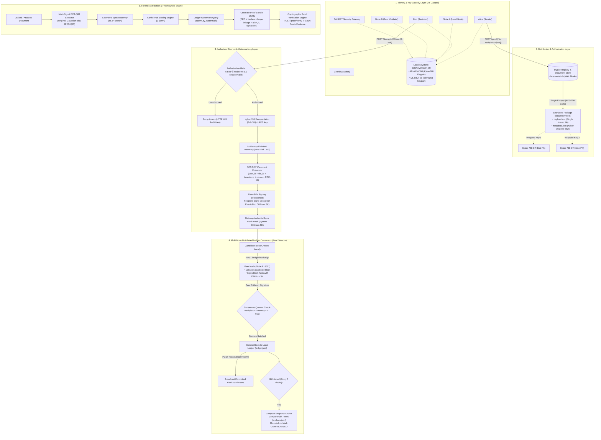
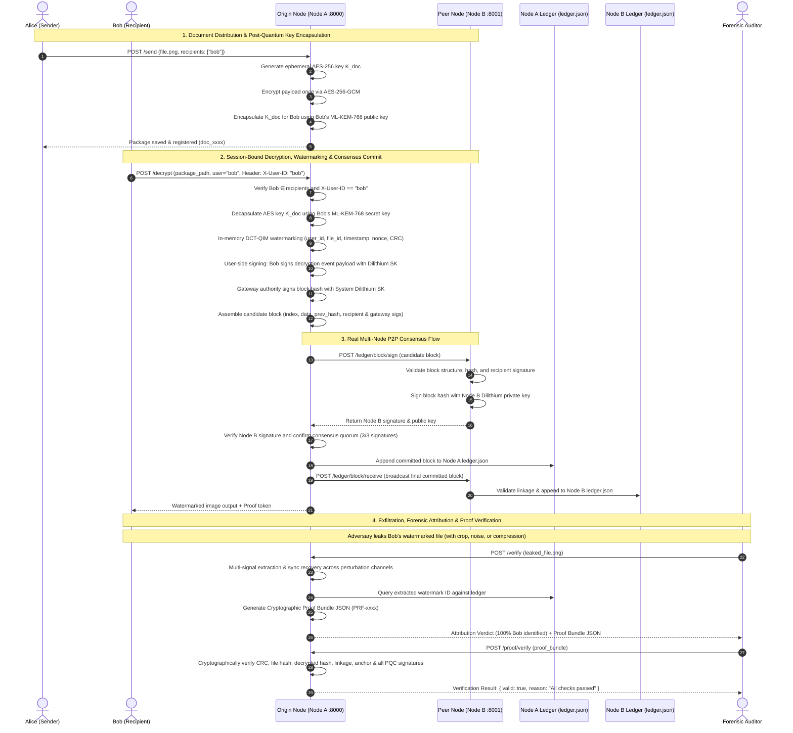

# SANKET: System Architecture & Execution Guide
## Cryptographic Attribution & Distributed Provenance Platform
### Smart India Hackathon (SIH) — Problem Statement PS237

---

## 1. Executive Summary & Problem Formulation

### 1.1 The Distribution Dilemma in Broadcast Encryption
Sensitive documents are routinely distributed under a **broadcast-encrypt, individually-decrypt** paradigm: a sender encrypts a document once and distributes it to a group of authorized recipients, each of whom decrypts it independently with their own credentials.

Under this model:
- The decrypted document is visually and bitwise identical across all recipients.
- When an unauthorized leak occurs, **every recipient who possessed decryption capability is an equally plausible suspect**.
- Access logs maintained on centralized servers are inadequate: privileged administrators can retroactively alter or erase log entries.
- Static watermarks applied prior to distribution fail because an identical watermark distributed to multiple recipients replicates the exact attribution problem it was intended to solve.

### 1.2 The SANKET Solution
SANKET resolves this challenge through an atomic, multi-stage cryptographic pipeline:

$$\mathbf{Distribute} \longrightarrow \mathbf{Authorize} \longrightarrow \mathbf{Decrypt} \longrightarrow \mathbf{Attribute} \longrightarrow \mathbf{Verify}$$

1. **Single Logical Encryption**: Documents are encrypted once using AES-256-GCM. Ephemeral symmetric keys are encapsulated individually for each recipient using NIST-standardized Post-Quantum KEM (**ML-KEM-768 / Kyber**).
2. **Session-Bound Authorization Gatekeeper**: The API gateway authenticates requests and verifies that the active session user matches the requested identity (`X-User-ID`) and is an authorized recipient before permitting cryptographic operations.
3. **Dynamic Watermarking at Moment of Decryption**: Plaintext is never written to disk in unwatermarked form. In-memory decryption dynamically embeds an invisible 2D DCT-QIM watermark bound to the recipient identity, file hash, timestamp, and a cryptographic session nonce.
4. **Mandatory User-Side Post-Quantum Signing**: The recipient must sign the canonical decryption record using their **own private ML-DSA-65 (Dilithium)** key. Any missing required fields immediately abort the operation.
5. **Multi-Node Distributed Ledger (DLT)**: An immutable, multi-node ledger with independent storage per node replaces centralized simulation. Blocks are accepted only upon achieving consensus quorum: signed by **recipient + gateway authority + peer node(s)**.
6. **Cross-Node Anchor Verification**: Cumulative snapshot anchors computed every 5 blocks are compared across peer nodes over HTTP; any divergence immediately flags the ledger as **`COMPROMISED`**.
7. **Verifiable Proof Bundles**: Forensic verification extracts the watermark, matches it against the ledger, and generates a self-contained, mathematically verifiable Proof Bundle JSON that proves the source of the leak beyond a reasonable doubt.

---

## 2. High-Level Architecture (HLD)


```mermaid
flowchart TD
    subgraph IdentityLayer ["1. Identity & Key Custody Layer (Air-Gapped)"]
        U_ALICE["Alice (Sender)"]
        U_BOB["Bob (Recipient)"]
        U_CHARLIE["Charlie (Auditor)"]
        NODE_A["Node A (Local Node)"]
        NODE_B["Node B (Peer Validator)"]
        SYS_GATEWAY["SANKET Security Gateway"]
        LOCAL_KEYS[("Local Keystore: data/keys/{user_id}/<br/>• ML-KEM-768 (Kyber768 Keypair)<br/>• ML-DSA-65 (Dilithium3 Keypair)")]
        U_ALICE -.-> LOCAL_KEYS
        U_BOB -.-> LOCAL_KEYS
        NODE_A -.-> LOCAL_KEYS
        NODE_B -.-> LOCAL_KEYS
        SYS_GATEWAY -.-> LOCAL_KEYS
    end

    subgraph DistributionLayer ["2. Distribution & Authorization Layer"]
        U_ALICE -->|"POST /send (file, recipients=[bob])"| REGISTRY[("SQLite Registry & Document Store<br/>data/sanket.db (WAL Mode)")]
        REGISTRY -->|"Single Encrypt (AES-256-GCM)"| PKG["Encrypted Package (data/encrypted/)<br/>• payload.enc (Single shared file)<br/>• metadata.json (Kyber-wrapped keys)"]
        PKG -.->|"Wrapped Key 1"| KEM_BOB["Kyber-768 CT (Bob PK)"]
        PKG -.->|"Wrapped Key 2"| KEM_ALICE["Kyber-768 CT (Alice PK)"]
    end

    subgraph DecryptionLayer ["3. Authorized Decrypt & Watermarking Layer"]
        U_BOB -->|"POST /decrypt (X-User-ID: bob)"| GATE{"Authorization Gate:<br/>Is Bob ∈ recipients && session valid?"}
        GATE -->|"Unauthorized"| REJECT["Deny Access (HTTP 403 Forbidden)"]
        GATE -->|"Authorized"| UNWRAP["Kyber-768 Decapsulation (Bob SK) -> AES Key"]
        UNWRAP --> AES_DEC["In-Memory Plaintext Recovery (Zero Disk Leak)"]
        AES_DEC --> DCT_EMBED["DCT-QIM Watermark Embedder<br/>(user_id + file_id + timestamp + nonce + CRC-16)"]
        DCT_EMBED --> USER_SIGN["User-Side Signing Enforcement:<br/>Recipient Signs Decryption Event (Bob Dilithium SK)"]
        USER_SIGN --> GATEWAY_SIGN["Gateway Authority Signs Block Hash (System Dilithium SK)"]
    end

    subgraph DLTConsensus ["4. Multi-Node Distributed Ledger Consensus (Real Network)"]
        GATEWAY_SIGN --> CANDIDATE["Candidate Block Created Locally"]
        CANDIDATE -->|"POST /ledger/block/sign"| PEER_NODE["Peer Node (Node B :8001)<br/>• Validates candidate block<br/>• Signs block hash with Dilithium SK"]
        PEER_NODE -->|"Peer Dilithium Signature"| QUORUM{"Consensus Quorum Check:<br/>Recipient + Gateway + ≥1 Peer"}
        QUORUM -->|"Quorum Satisfied"| COMMIT["Commit Block to Local Ledger (ledger.json)"]
        COMMIT -->|"POST /ledger/block/receive"| BROADCAST["Broadcast Committed Block to All Peers"]
        COMMIT --> ANCHOR_CHECK{"Hit Interval (Every 5 Blocks)?"}
        ANCHOR_CHECK -->|"Yes"| ANCHOR_COMPUTE["Compute Snapshot Anchor<br/>Compare with Peers (anchors.json)<br/>Mismatch -> Mark COMPROMISED"]
    end

    subgraph ForensicLayer ["5. Forensic Attribution & Proof Bundle Engine"]
        LEAK_FILE["Leaked / Attacked Document"] --> EXTRACTOR["Multi-Signal DCT-QIM Extractor<br/>(Original, Gaussian Blur, JPEG Q85)"]
        EXTRACTOR --> SYNC_ALIGN["Geometric Sync Recovery (±5.5° search)"]
        SYNC_ALIGN --> CONFIDENCE["Confidence Scoring Engine (0-100%)"]
        CONFIDENCE --> LEDGER_QUERY["Ledger Watermark Query (query_by_watermark)"]
        LEDGER_QUERY --> PROOF_GEN["Generate Proof Bundle JSON<br/>(CRC + hashes + ledger linkage + all PQC signatures)"]
        PROOF_GEN --> PROOF_VERIFY["Cryptographic Proof Verification Engine<br/>POST /proof/verify -> Court-Grade Evidence"]
    end
```

---

## 3. End-to-End Cryptographic Protocol Flow


```mermaid
sequenceDiagram
    autonumber
    actor Alice as Alice (Sender)
    actor Bob as Bob (Recipient)
    participant Origin as Origin Node (Node A :8000)
    participant Peer as Peer Node (Node B :8001)
    participant LocalLedger as Node A Ledger (ledger.json)
    participant PeerLedger as Node B Ledger (ledger.json)
    actor Auditor as Forensic Auditor

    Note over Alice,Peer: 1. Document Distribution & Post-Quantum Key Encapsulation
    Alice->>Origin: POST /send (file.png, recipients: ["bob"])
    Origin->>Origin: Generate ephemeral AES-256 key K_doc
    Origin->>Origin: Encrypt payload once via AES-256-GCM
    Origin->>Origin: Encapsulate K_doc for Bob using Bob's ML-KEM-768 public key
    Origin-->>Alice: Package saved & registered (doc_xxxx)

    Note over Bob,Peer: 2. Session-Bound Decryption, Watermarking & Consensus Commit
    Bob->>Origin: POST /decrypt (package_path, user="bob", Header: X-User-ID: "bob")
    Origin->>Origin: Verify Bob ∈ recipients and X-User-ID == "bob"
    Origin->>Origin: Decapsulate AES key K_doc using Bob's ML-KEM-768 secret key
    Origin->>Origin: In-memory DCT-QIM watermarking (user_id, file_id, timestamp, nonce, CRC)
    Origin->>Origin: User-side signing: Bob signs decryption event payload with Dilithium SK
    Origin->>Origin: Gateway authority signs block hash with System Dilithium SK
    Origin->>Origin: Assemble candidate block (index, data, prev_hash, recipient & gateway sigs)

    Note over Origin,Peer: 3. Real Multi-Node P2P Consensus Flow
    Origin->>Peer: POST /ledger/block/sign (candidate block)
    Peer->>Peer: Validate block structure, hash, and recipient signature
    Peer->>Peer: Sign block hash with Node B Dilithium private key
    Peer-->>Origin: Return Node B signature & public key
    Origin->>Origin: Verify Node B signature and confirm consensus quorum (3/3 signatures)
    Origin->>LocalLedger: Append committed block to Node A ledger.json
    Origin->>Peer: POST /ledger/block/receive (broadcast final committed block)
    Peer->>PeerLedger: Validate linkage & append to Node B ledger.json
    Origin-->>Bob: Watermarked image output + Proof token

    Note over Bob,Auditor: 4. Exfiltration, Forensic Attribution & Proof Verification
    Note over Bob,Auditor: Adversary leaks Bob's watermarked file (with crop, noise, or compression)
    Auditor->>Origin: POST /verify (leaked_file.png)
    Origin->>Origin: Multi-signal extraction & sync recovery across perturbation channels
    Origin->>LocalLedger: Query extracted watermark ID against ledger
    Origin->>Origin: Generate Cryptographic Proof Bundle JSON (PRF-xxxx)
    Origin-->>Auditor: Attribution Verdict (100% Bob identified) + Proof Bundle JSON
    Auditor->>Origin: POST /proof/verify (proof_bundle)
    Origin->>Origin: Cryptographically verify CRC, file hash, decrypted hash, linkage, anchor & all PQC signatures
    Origin-->>Auditor: Verification Result: { valid: true, reason: "All checks passed" }
```

---

## 4. Low-Level Algorithmic Architecture (LLD)

### 4.1 Post-Quantum Cryptography (PQC) Layer
SANKET adopts the official NIST Post-Quantum Cryptography standards:

1. **Key Encapsulation Mechanism (ML-KEM-768 / Kyber)**:
   - Module: [`modules/crypto/encryption.py`](file:///d:/SIH/ps237/modules/crypto/encryption.py)
   - Public Key Size: 1,184 bytes | Private Key Size: 2,400 bytes | Ciphertext Size: 1,088 bytes
   - Formula:
     $$(\text{CT}_i, \text{SS}_i) \leftarrow \text{ML-KEM-768.Encaps}(PK_{R_i})$$
     $$K_{\text{wrap}, i} \leftarrow \text{HKDF-SHA256}(\text{SS}_i, \text{info}=\text{"document-key-wrap"})$$
     $$W_i \leftarrow \text{AES-GCM-Encrypt}(K_{\text{wrap}, i}, \text{IV}_i, K_{\text{doc}})$$

2. **Digital Signatures (ML-DSA-65 / Dilithium)**:
   - Module: [`modules/crypto/signature.py`](file:///d:/SIH/ps237/modules/crypto/signature.py)
   - Public Key Size: 1,952 bytes | Private Key Size: 4,032 bytes | Signature Size: 3,309 bytes
   - Canonical Decryption Event Signing:
     $$\sigma_{\text{recipient}} \leftarrow \text{ML-DSA-65.Sign}(SK_{\text{recipient}}, \text{canonical}(P))$$
     where $P = \{\text{watermark\_id}, \text{user\_id}, \text{timestamp}, \text{file\_hash}, \text{decrypted\_hash}\}$

### 4.2 Dynamic DCT-QIM Watermarking & Sync Recovery
- Module: [`modules/watermark/embedder.py`](file:///d:/SIH/ps237/modules/watermark/embedder.py), [`modules/watermark/extractor.py`](file:///d:/SIH/ps237/modules/watermark/extractor.py), [`modules/watermark/sync.py`](file:///d:/SIH/ps237/modules/watermark/sync.py)
- **Transform**: 2D Discrete Cosine Transform on $8 \times 8$ non-overlapping blocks of the Y-channel.
- **Mid-Frequency Embedding**: Coordinates $(2,2), (3,1), (1,3), (2,3)$ with variance-adaptive step size:
  $$\Delta = \Delta_{\min} + \text{scale} \cdot (\Delta_{\max} - \Delta_{\min}), \quad \Delta \in [38.0, 62.0]$$
- **QIM Modulation**:
  $$c' = \Delta \cdot \left\lfloor \frac{c}{\Delta} + \frac{1}{2} \right\rfloor \quad \text{adjusted for bit } b \in \{0, 1\}$$
- **Spread Spectrum**: 144-bit payload (128-bit watermark ID + 16-bit CRC-CCITT) replicated across 2 spatial zones with 24 votes/bit.
- **Dedicated Sync Marker**: Coefficient $(4,2)$ embedded with fixed $\Delta_{\text{sync}} = 80.0$, enabling search and recovery across angular skew $\pm 5.5^\circ$ at $0.25^\circ$ resolution.

### 4.3 Multi-Node Distributed Ledger Consensus
- Modules: [`modules/ledger/network.py`](file:///d:/SIH/ps237/modules/ledger/network.py), [`modules/ledger/hashchain.py`](file:///d:/SIH/ps237/modules/ledger/hashchain.py)
- **Independent Storage**: Storage directory dynamically resolved via `get_ledger_dir()`:
  - Node A: `data/ledger/`
  - Node B: `data/nodes/node_B/ledger/`
  - Zero shared disk storage.
- **Consensus Rule**: A block is committed to the ledger if and only if:
  1. $S_{\text{recipient}}$ is valid under $PK_{\text{user}}$ over canonical decryption event payload.
  2. $S_{\text{gateway}}$ is valid under $PK_{\text{system}}$ over block hash.
  3. $\ge 1$ peer node signature $S_{\text{peer}}$ is valid under $PK_{\text{peer}}$ over block hash.
- **Block Flow over Real HTTP**:
  1. Candidate creation $\rightarrow$ 2. Peer signing request (`POST /ledger/block/sign`) $\rightarrow$ 3. Peer validation & signature return $\rightarrow$ 4. Quorum verification & local commit $\rightarrow$ 5. Broadcast to peers (`POST /ledger/block/receive`).
- **Cumulative Secondary Anchors**: Every 5 blocks (`ANCHOR_INTERVAL = 5`), a secondary snapshot anchor is computed:
  $$\text{Anchor}_m = \text{SHA256}(\text{canonical}(\text{chain}_{[:5m]}))$$
  Anchors are compared against peers via `GET /ledger/sync`. Any mismatch immediately flags the ledger status as **`COMPROMISED`**.
- **Startup Sync (Step 8)**:
  On FastAPI startup (`@app.on_event("startup")`), `sync_with_peers()` contacts configured peers, validates chains, and adopts the longest valid chain.

### 4.4 Cryptographic Proof Bundle Architecture
- Module: [`modules/proof/proof_bundle.py`](file:///d:/SIH/ps237/modules/proof/proof_bundle.py)
- **Generation**: `generate_proof_bundle(verification_result, ledger_block)` builds a verifiable JSON object linking forensic detection with the immutable blockchain record.
- **Verification Engine (`verify_proof_bundle`)**:
  - Validates watermark CRC.
  - Verifies file hash and decrypted output hash consistency.
  - Verifies hash chain linkage (index continuity, 64-char hex format, genesis 64 zeros, local chain match).
  - Verifies anchor validity.
  - Verifies recipient Dilithium signature over the decryption event.
  - Verifies gateway authority Dilithium signature over block hash.
  - Verifies peer node Dilithium signatures and confirms quorum ($\ge 1$ peer).

---

## 5. Core Data Models

### 5.1 Block Model (Phase 2 Step 6)
```json
{
  "index": 1,
  "data": {
    "watermark_id": "7cd306f6580f1a23e981bc09a12e4d56",
    "user_id": "bob",
    "timestamp": "2026-09-27T14:35:12.894102+00:00",
    "file_hash": "c92841ba59f31a2c66ed6ed129e81faf67d4be3ed2349ceb2bdf4b6cf330bfc7",
    "decrypted_hash": "a6d30edfea40d97eb97433b05361cc86a0e5290a0c21697c4cbba56adaf62110",
    "file_id": "c92841ba59f31a2c",
    "nonce": "e3a890f845112ca0"
  },
  "prev_hash": "a4d3f568e09f87b2f0991c45e6900fa4d3f568e09f87b2f0991c45e6900f12",
  "hash": "b2f0991c45e6900fa4d3f568e09f87b2f0991c45e6900fa4d3f568e09f87b2",
  "signatures": {
    "recipient": "07eae737e8398dbcba1c9edb1934a69f8bf5ad68463782ccb2a1506ab443d0ff...",
    "gateway": "466b94df39802a78c3855a20c21914dffabe2911a3dd358d9df4424210df5208...",
    "peers": [
      {
        "node_id": "node_B",
        "signature": "eb4854d03888bd63af2544254e030de3e6e4997383ad4be95b7160877895f65b..."
      }
    ]
  }
}
```

### 5.2 Cryptographic Proof Bundle Model (Phase 1)
```json
{
  "watermark_id": "7cd306f6580f1a23e981bc09a12e4d56",
  "user_id": "bob",
  "timestamp": "2026-09-27T14:35:12.894102+00:00",
  "file_hash": "c92841ba59f31a2c66ed6ed129e81faf67d4be3ed2349ceb2bdf4b6cf330bfc7",
  "decrypted_hash": "a6d30edfea40d97eb97433b05361cc86a0e5290a0c21697c4cbba56adaf62110",
  "ledger": {
    "block_index": 1,
    "prev_hash": "a4d3f568e09f87b2f0991c45e6900fa4d3f568e09f87b2f0991c45e6900f12",
    "block_hash": "b2f0991c45e6900fa4d3f568e09f87b2f0991c45e6900fa4d3f568e09f87b2",
    "anchor_hash": "5d2f8319a9240bc1284ae9876543210fedcba9876543210fedcba9876543210f"
  },
  "signatures": {
    "recipient": "07eae737e8398dbcba1c9edb1934a69f8bf5ad68463782ccb2a1506ab443d0ff...",
    "gateway": "466b94df39802a78c3855a20c21914dffabe2911a3dd358d9df4424210df5208...",
    "peers": [
      {
        "node_id": "node_B",
        "signature": "eb4854d03888bd63af2544254e030de3e6e4997383ad4be95b7160877895f65b..."
      }
    ]
  },
  "verification": {
    "crc_valid": true,
    "confidence": 100.0,
    "verdict": "HIGH_CONFIDENCE"
  }
}
```

### 5.3 Node Identity Configuration (`data/node_config.json`)
```json
{
  "node_id": "node_A",
  "port": 8000,
  "peers": [
    "http://127.0.0.1:8001"
  ]
}
```

---

## 6. Complete REST API Reference

| Endpoint | Method | Purpose & Parameters | Security / Headers |
| :--- | :--- | :--- | :--- |
| **Authentication & User Management** | | | |
| `/auth/users` | `GET` | List registered user identities and public keys | `X-API-KEY` |
| `/auth/login` | `POST` | Switch active identity session | `X-API-KEY` |
| `/auth/me` | `GET` | Get current logged-in identity information | `X-API-KEY`, `X-User-ID` |
| **Document Distribution** | | | |
| `/send` | `POST` | Single logical encryption & document distribution | `X-API-KEY`, `X-User-ID` |
| `/inbox` | `GET` | List distributed documents for active user with permission badges | `X-API-KEY`, `X-User-ID` |
| `/documents` | `GET` | List all documents in repository registry | `X-API-KEY` |
| `/documents/{id}` | `GET` | Retrieve document metadata & recipients | `X-API-KEY` |
| **Decryption & Watermarking** | | | |
| `/decrypt` | `POST` | Kyber unwrap, DCT-QIM watermark, user Dilithium sign, ledger commit | `X-API-KEY`, `X-User-ID` |
| `/download/decrypted/{f}`| `GET` | Authenticated download of watermarked image | `X-API-KEY` / Direct Link |
| `/download/encrypted/{pkg}`| `GET` | Download encrypted package zip archive | `X-API-KEY` / Direct Link |
| **Forensic Leak Attribution & Proof Bundles** | | | |
| `/verify` | `POST` | Watermark extraction, identity attribution & proof bundle generation | `X-API-KEY` |
| `/report` | `POST` | Comprehensive forensic tamper analysis report with proof bundle | `X-API-KEY` |
| `/proof/{proof_id}` | `GET` | Retrieve stored cryptographic proof bundle JSON | Optional API Key / Browser |
| `/proof/verify` | `POST` | Cryptographically verify proof bundle | `X-API-KEY` |
| `/download/report/{id}` | `GET` | Download forensic JSON report | `X-API-KEY` / Direct Link |
| **Distributed Multi-Node Ledger (DLT)** | | | |
| `/ledger` | `GET` | Audit ledger integrity, multi-sigs & secondary anchors | `X-API-KEY` |
| `/ledger/blocks` | `GET` | Retrieve complete block chain with anchor flags | `X-API-KEY` |
| `/ledger/peers` | `GET` | Get node identity, listening port, peer list, and Dilithium public key | `X-API-KEY` |
| `/ledger/sync` | `GET` | Fetch local chain and anchors for peer synchronization | `X-API-KEY` |
| `/ledger/sync` | `POST` | Trigger P2P synchronization with configured peer nodes | `X-API-KEY` |
| `/ledger/block/sign` | `POST` | Validate candidate block and sign block hash with node Dilithium SK | `X-API-KEY` |
| `/ledger/block/receive`| `POST` | Receive broadcast block, validate quorum, and append to local ledger | `X-API-KEY` |
| `/audit/events` | `GET` | Real-time audit trail events from SQLite database | `X-API-KEY` |
| `/status` | `GET` | Operational health and ledger status metrics | `X-API-KEY` |

---

## 7. Execution Guide: Multi-Node Setup & Verification

### 7.1 Single-Node Mode
```bash
# Terminal 1: Backend API
python -m uvicorn api.server:app --host 0.0.0.0 --port 8000 --reload

# Terminal 2: Frontend Dashboard
cd frontend
npx vite --host
```
Access UI at `http://localhost:5173/` and OpenAPI docs at `http://localhost:8000/docs`.

### 7.2 Multi-Node Real Network Deployment (Node A + Node B)
To run a true multi-node distributed ledger network on a single machine or across a local area network (LAN):

1. **Launch Node A (Port 8000)**:
   ```bash
   PORT=8000 NODE_ID=node_A python -m uvicorn api.server:app --host 0.0.0.0 --port 8000
   ```
   Node A listens on port 8000 and uses independent storage `data/ledger/`.

2. **Launch Node B (Port 8001)**:
   ```bash
   PORT=8001 NODE_ID=node_B PEERS="http://127.0.0.1:8000" python -m uvicorn api.server:app --host 0.0.0.0 --port 8001
   ```
   Node B listens on port 8001, configures Node A as peer, and uses independent storage `data/nodes/node_B/ledger/`.

3. **Consensus Validation**:
   When a recipient decrypts a document on Node A, Node A creates a candidate block, sends it via HTTP to `http://127.0.0.1:8001/ledger/block/sign`, receives Node B's Dilithium signature, verifies consensus quorum (recipient + gateway + Node B), appends to its local ledger, and broadcasts the block back to Node B via `http://127.0.0.1:8001/ledger/block/receive`.

---

## 8. Threat Model & Adversarial Verification

| Attack Vector | Adversarial Mechanism | SANKET Defense Strategy | Detection Status |
| :--- | :--- | :--- | :--- |
| **Unauthorized Decryption** | Non-recipient attempts decryption | API gatekeeper denies access with HTTP 403; Kyber secret key absent | **PREVENTED** |
| **Impersonation Attack** | Attacker logged in as Alice attempts to decrypt as Bob | Session binding (`X-User-ID`) rejects request with HTTP 403 Forbidden | **PREVENTED** |
| **Key Reuse Attack** | Corrupt admin assigns identical signing keys | `verify_key_uniqueness()` scans all Dilithium public keys | **PREVENTED** |
| **Single-Admin Ledger Tampering** | Compromised admin alters historical block | Breaks block SHA-256 hash and invalidates multi-party Dilithium signatures | **DETECTED** |
| **History Rewrite / Rehash Attack** | Adversary alters record and recomputes block hashes | Secondary cumulative snapshot anchors detect state divergence $\rightarrow$ `ANCHOR_MISMATCH` | **DETECTED** |
| **Cross-Node Partition Attack** | Adversary forks chain on isolated node | Cross-node anchor verification (`verify_peer_anchors`) $\rightarrow$ marks chain as `COMPROMISED` | **DETECTED** |
| **Repudiation** | Recipient claims they never decrypted | Decryption payload signed with recipient's own Dilithium private key committed to DLT | **NON-REPUDIABLE** |
| **JPEG Compression** | High lossy compression (Q50–Q90) | Mid-frequency DCT-QIM embedding with 24 votes/bit spread spectrum | **ATTRIBUTED (100%)** |
| **Additive Noise** | Gaussian sensor noise ($\sigma = 3 - 15$) | Spatial interleaving across 2 zones + majority vote filtering | **ATTRIBUTED (100%)** |
| **Spatial Cropping** | 10%–20% image area removed | Spread-spectrum redundancy (repetition across full raster) | **ATTRIBUTED (93-95%)** |
| **Geometric Rotation Skew** | Scanner skew / rotation up to $\pm 5.5^\circ$ | Dedicated $(4,2)$ sync template angular search and auto-recovery | **ATTRIBUTED (87-91%)** |
| **False Positive Attack** | Non-watermarked / random image submitted | Zero-false-positive guard rejects unwatermarked rasters with 0% confidence | **REJECTED (0.0%)** |

---

## 9. Automated Testing & Validation

### 9.1 Unit & Integration Test Suite
```bash
python -m unittest discover -s tests -p "test_*.py"
```
**Results**: 17 tests executed, 0 errors, 0 failures (`OK`).

### 9.2 End-to-End Adversarial Demo Benchmark
```bash
python tests/demo.py
```
**Results**: All 24 attack and robustness steps passed.

### 9.3 Frontend Production Build
```bash
cd frontend && npm run build
```
**Results**: Built in 8.40s with 0 errors.
